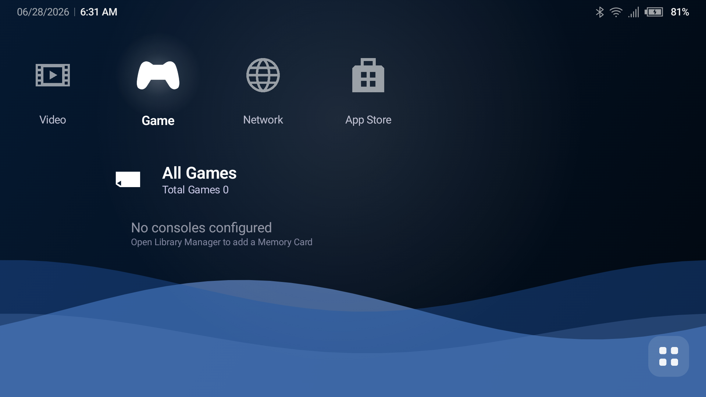

# Play Field Portal (PFP)

An Android game launcher styled after the PlayStation Portable's **XMB (Cross Media Bar)**.
It replaces the Android home screen and acts as a unified front end for ROM emulation, Android
games, PC-layer titles (Winlator), and native apps — all navigated with a controller.

<p align="center">
  
</p>

> **Status:** Active development — **`1.0.0-alpha`**, pre-release. Not yet on the Play Store.
> The custom-theme system is the final stage before a 1.0 launch (see [Roadmap](#roadmap)).

For a developer-oriented overview of the codebase, see **[ARCHITECTURE.md](ARCHITECTURE.md)**.

---

## Table of contents

- [Feature status](#feature-status)
- [Roadmap](#roadmap)
- [Setup & first run](#setup--first-run)
- [Permissions & privacy](#permissions--privacy)
- [Using the launcher](#using-the-launcher)
  - [Navigation & controls](#navigation--controls)
  - [The Game category](#the-game-category)
  - [Setting up a console (Memory Card)](#setting-up-a-console-memory-card)
  - [Emulators](#emulators)
  - [Favorites](#favorites)
  - [Collections](#collections)
  - [Android apps & non-gaming categories](#android-apps--non-gaming-categories)
  - [Artwork](#artwork)
  - [Game & app options (△)](#game--app-options-)
  - [Categories](#categories)
  - [Settings](#settings-reference)
- [Build & install](#build--install)
- [Tech stack](#tech-stack)
- [Module structure](#module-structure)
- [.xmbtheme package format](#xmbtheme-package-format)
- [Credits](#credits)
- [License](#license)

---

## Feature status

| Feature | Status |
|---|---|
| XMB shell — wave background, category bar, item list, status bar, boot sequence (PFP logo) | ✅ Done |
| Branding — PFP app icon + boot logo | ✅ Done |
| Manual Memory Card library — per-console ROM folders, manual scanning | ✅ Done |
| ROM scanning — SAF folder picker, disc-image resolution, SD/USB volume support | ✅ Done |
| Game detail screen — hero banner, metadata, custom artwork, notes | ✅ Done |
| Game icon styles — PSP rectangle, cartridge, Android squircle | ✅ Done |
| Emulator compatibility layer — auto-detected catalog + per-core RetroArch | ✅ Done |
| Custom Emulator Wizard — pick an app, auto-detect launch settings, test-launch, save | ✅ Done |
| SteamGridDB artwork scraping (grids, heroes, logos, icons) | ✅ Done |
| **All Games** aggregate (real games only) + per-console folders | ✅ Done |
| **Favorites** folder under the Game category | ✅ Done |
| User **Collections** — custom many-to-many game folders | ✅ Done |
| Android apps in categories — artwork tiles, Find Games, app shortcuts | ✅ Done |
| Launcher-shortcut harvesting (GameHub/Moonlight, BannerHub, Winlator) | ✅ Done |
| App drawer — All Apps / Games / Emulators / Tools / Recently Used | ✅ Done |
| Category manager — create/rename/reorder/hide, image-based icon picker | ✅ Done |
| Controller mapping — full XMB navigation, remappable | ✅ Done |
| Backup & restore — `.pfpbackup` ZIP including settings | ✅ Done |
| XMB color schemes — PSP-style presets with live preview | ✅ Done |
| Idle wave degradation (FULL → REDUCED → STATIC) + thermal awareness | ✅ Done |
| Background tasks surfaced to the Android notification bar | ✅ Done |
| Theme engine — `.xmbtheme` loader + built-in *Classic PSP Blue* | ✅ Loader done |
| **Custom theme install (in-app)** | 🔜 Next stage (gated "Coming Soon") |
| Theme sound packs & boot-animation override | 🔜 Next stage |
| Smart / manual category builder | 🧭 Backlog |
| Unmatched-ROM assignment UI | 🧭 Backlog |
| Second metadata source (IGDB / TheGamesDB) | 🧭 Backlog |

---

## Roadmap

PFP is feature-complete for day-to-day use; the remaining work is the theme system, then launch.

### ✅ Stage 1 — Alpha (current)
The full launcher: XMB shell, manual Memory Card library, ROM scanning, emulator detection and
launching, artwork scraping, All Games / Favorites / Collections, Android-app integration, the app
drawer, category management, controller mapping, backup & restore, and PFP branding (app icon +
boot logo).

### 🔜 Stage 2 — Theme system *(the next stage of development)*
Everything needed to ship and use custom `.xmbtheme` packages end to end:
- **In-app theme install** — re-enable *Settings → Themes → Install from File* (currently gated
  "Coming Soon"). The loader, manifest parser, and repository are already implemented.
- **Theme sound packs** — navigation / select / back / boot sounds from the package.
- **Boot-animation override** — play a theme's `boot_animation.mp4` in place of the default logo
  sequence.
- Theme browsing/management polish and validation feedback.

### 🎯 Stage 3 — 1.0 Launch
Stability, performance, and polish pass on top of the theme system; release candidate.

### 🧭 Post-launch / backlog
Smart & manual category builders, an unmatched-ROM assignment UI, a missing-ROM indicator, a second
metadata source (IGDB / TheGamesDB), global search, and friends/social (v2).

---

## Setup & first run

### 1. Install
See [Build & install](#build--install) to produce and side-load the debug APK.

### 2. Make PFP your home screen
PFP registers as an Android **HOME** launcher. The first time you press Home, Android asks which
launcher to use — pick **Play Field Portal** and choose **Always** to make it the default. You can
change this later in *Android Settings → Apps → Default apps → Home app*.

> Some features (importing launcher shortcuts from other apps, the modern shortcut-pin capture)
> require PFP to be the **active default launcher**.

### 3. Grant permissions
- **Notifications** (Android 13+) — so background scans/fetches can report progress in the shade,
  and so apps that try to add a game shortcut can ask you to confirm it first.
- **All-files access / storage** — only needed to scan **file-based ROM folders** (disc/multi-file
  games are read by emulators from real paths). PFP asks for it **point-of-need** — a *Grant
  All-Files Access* prompt appears in **Settings → Library** when it's missing. If you only use
  SAF music folders or the app-picker Android library, you never need it.
- **Usage access** (optional) — enables the "Recently Used" app-drawer filter.

See [Permissions & privacy](#permissions--privacy) for the full breakdown.

### 4. Boot sequence
On launch you'll see the **PFP logo** fade in over the XMB wave, then the home screen. (Boot is
shorter on repeat launches.)

### 5. Point PFP at your ROMs
Open **Settings → Library**, choose your ROM **root folder**, then add consoles — see
[Setting up a console](#setting-up-a-console-memory-card). The **Game** category shows an inline
setup prompt on first launch if no library is configured yet.

---

## Permissions & privacy

PFP is a local-first launcher: **your data stays on your device.** There is no analytics, no
telemetry, and no account — PFP only talks to the network when *you* trigger artwork/metadata
scraping, and only over HTTPS.

**What PFP stores, and how:**
- **Stays on-device.** Your library, settings, and artwork live in app storage. **Backup is
  disabled** (`allowBackup=false`), so none of it is uploaded to the cloud or transferred to a new
  phone — re-add folders / re-enter keys after a device move.
- **Your scraper API keys are encrypted at rest.** If you add SteamGridDB / TheGamesDB / IGDB
  keys, they're sealed with a hardware-backed Android Keystore key, not stored in plain text.
- **Network is HTTPS-only.** Cleartext traffic is blocked, and release builds trust only the
  system certificate store.

**Why the broad permissions exist (and how they're minimized):**
- **All-files access** is requested **only when you add a file-based ROM folder** — disc and
  multi-file games (`.cue`+`.bin`, multi-disc, `.m3u`) must be read by emulators from real paths,
  which scoped storage can't provide. Use SAF music + the app-picker Android library and you never
  grant it.
- **Query installed apps** is required to *be* a launcher (showing/launching your apps).
- **Usage access** is optional and only powers the "Recently Used" filter.

**Other apps can't silently change your library.** Apps that broadcast a legacy "install shortcut"
request can no longer add entries on their own — PFP sanitizes the request and asks you to **confirm
each one** via a notification before it appears.

---

## Using the launcher

### Navigation & controls

PFP is built for a controller but works with touch too.

| Action | Controller | Touch |
|---|---|---|
| Move between items | D-Pad / Left Stick | Tap an item |
| Switch category (left/right) | D-Pad ◀ ▶ | Tap the category |
| Select / launch / open | **A / Cross** | Tap |
| Back / close / exit a folder | **B / Circle** | On-screen Back |
| Options (context) menu | **Y / Triangle** (or long-press) | Long-press |
| Switch app-drawer tabs | **L1 / R1** | Tap a tab |
| Confirm in pickers | **Start** | Confirm button |

The **horizontal bar** is your categories — by default **Settings, Photo, Music, Video, Game,
Network, App Store**, plus any custom ones. The **vertical list** under the selected category shows
its items. While any menu, settings screen, picker, or dialog is open, the main XMB is locked —
input only drives the overlay on top. Bindings are remappable in *Settings → Controller*.

### The Game category

Selecting **Game** shows, in order:

1. **All Games** — every real game across all consoles, aggregated (cartridge icon). Only actual
   games appear here; Android / Video / Music apps never show up automatically.
2. **Favorites** — appears directly under All Games **only when you've favorited at least one game**,
   and hides again when you have none.
3. **Your Collections** — user-made folders (see [Collections](#collections)).
4. **Memory Cards** — one row per console you've configured. Open a card to see its games; press **△**
   on a card for *Scan This Console / Refresh / Pin / Hide / Remove*.

Open All Games, Favorites, a collection, or a console to drill in; press **B / Circle** to go back.

### Setting up a console (Memory Card)

Consoles are added manually as **Memory Cards** — a deliberate choice; PFP never auto-scans.

1. **Settings → Library → Library Manager → Add Console.**
2. **Choose Platform** — pick the system (NES, SNES, PSP, PS2, Dreamcast, **Xbox 360**, … ).
3. **Choose its ROM folder** with the folder picker.
4. **Assign Emulator** — pick from the emulators PFP detected for that platform (this becomes the
   console's default).
5. **Scan Now?** — scan immediately, or create the card and scan later.

Manage a card any time from *Library Manager*: change its display name, ROM directory, or emulator;
enable/hide it; **Scan This Console**; or remove it (ROM files on disk are never deleted).

> **Scanning is always manual** — there's no background watcher or polling. Re-scan after adding ROMs.

### Emulators

PFP launches games through **external emulator apps** — install the emulators you want, and PFP
detects them automatically (no manual config for supported ones). Detection runs on startup from a
curated catalog, plus one profile per installed **RetroArch** core.

Supported out of the box (install the app, PFP finds it) — a selection:

| System | Emulators |
|---|---|
| PSP | PPSSPP / PPSSPP Gold |
| PS1 | DuckStation |
| PS2 | NetherSX2 / AetherSX2 |
| GameCube / Wii | Dolphin |
| Nintendo DS | melonDS, DraStic |
| Nintendo 3DS | Azahar, Citra, Lime3DS |
| Switch | Sudachi / Yuzu / Suyu family |
| N64 | Mupen64Plus FZ / AE |
| GB / GBC / GBA | mGBA, My Boy!, GBA.emu, GBC.emu |
| NES / SNES / Genesis / PC Engine / Neo Geo / WonderSwan / Lynx | the `*.emu` family (NES.emu, Snes9x EX+, MD.emu, PCE.emu, NEO.emu, Swan.emu, Lynx.emu) |
| Dreamcast | Flycast, Redream |
| **Xbox 360** | **X360 Mobile** (`emu.x360.mobile`) — handles `.iso` |
| Symbian | EKA2L1 |
| Anything with libretro cores | **RetroArch** (one launch profile per installed core) |

**Which emulator launches a game?** PFP resolves it in priority order:
**per-game override → Memory Card emulator → the platform's default → first available.**
Set a per-game emulator from a game's **△** options; set a console default in *Library Manager*.

**Custom Emulator Wizard** — for anything not in the catalog, *Settings → Emulators → Add Custom
Emulator* runs an assisted setup:
1. **Pick an installed app** from a controller-navigable list.
2. PFP **auto-detects** launch settings (matching the catalog where possible, or inspecting the
   app's `ACTION_VIEW` handlers).
3. The editor opens **pre-filled** with a confidence banner. Every field is editable — intent type,
   activity, action, MIME, URI mode, extras, flags, RetroArch core — and **recommended templates**
   fill common launch shapes in one tap.
4. **Test Launch** with a scanned ROM: preview the exact intent, attempt it, and get an actionable
   error if it fails.
5. **Save** — usable as a platform / Memory Card / per-game emulator.

ROMs on **removable SD cards / USB volumes** (`/storage/<uuid>/…`) launch correctly via FileProvider.

### Favorites

Mark any game as a favorite from its **△** options (*Add to Favorites*). A **Favorites** folder then
appears in the Game category, right under All Games, listing everything you've favorited; it hides
automatically when nothing is favorited. (Android apps can also be favorited — a lightweight shortcut
entry is created.)

### Collections

Collections are custom folders of games (e.g. "RPGs", "Currently Playing", "Best PSP Games"). They
behave like Favorites but are user-defined, and a game can live in several at once.

- **Create:** *Settings → Collections → Create New Collection*, or from a game's **△** options →
  *Add to Collection → Create New Collection* (also on the Game Detail / App Detail screens).
- **Add / remove a game:** open a game's options (**△**), choose **Add to Collection**, and toggle
  the collections (a ✓ marks membership). Viewing a game from inside a collection shows
  **Remove from Collection**.
- **Manage:** *Settings → Collections* (rename, reorder, delete) or press **△** on a collection row.
  A collection belongs to exactly one gaming category and can be pinned to the top.

### Android apps & non-gaming categories

- **App sections** (App Store / Video / Music / Network / custom non-gaming categories): open the
  section and choose **Add Apps** to pick installed apps.
- **App artwork:** apps you place in non-gaming categories show their launcher icon by default. Give
  one custom artwork via **△ → Edit App Details → Icon** (SteamGridDB or a local image) and it then
  renders as the same landscape tile as a game. These stay tagged as apps, so they **never** appear
  in All Games.
- **Android games under Games:** open the Android library card and choose **Find Games**. These are
  tagged as apps — out of All Games, but in their card and addable to any collection.
- **Shortcut any app to Favorites / Collections:** press **△** on an app → *Add to Favorites* or
  *Add to Collection*.

### Artwork

Box art, hero banners, logos and grid icons are fetched **on request** from SteamGridDB (add a free
API key in *Settings → Artwork*). From a game's detail screen you can set the **Icon** (landscape
tile), **Hero** (detail banner) and **Background** art — from SteamGridDB or a local file — or reset
them. *Settings → Artwork* also offers re-scrape (all / missing-only) and cache clearing.

### Game & app options (△)

Press **△** (or long-press) on an item for its options:
- **Games:** Launch, Add/Remove Favorite, Add to Collection, Manage Collections, Refresh
  Metadata/Artwork, choose Emulator, **View File Location** (shows the ROM path on-screen).
- **Android apps:** Launch, Edit App Details, Add to Favorites/Collection, Import Game Shortcuts,
  Move/Add/Remove/Pin to category, Hide, Rename.

The same actions are reachable from the full **Game Detail** / **App Detail** screens.

### Categories

Categories are the horizontal bar. Manage them in *Settings → Categories*:
- **Create** a category, choose a **content type** (Gaming = games & collections, Non-gaming = apps),
  and pick an **icon** from the image-based picker (XMB column glyphs, Favorites, and the full
  console set — all individual images, no sprite sheet).
- **Rename**, **reorder** (move left/right), **hide/show**, or **delete** custom categories. Built-in
  categories are protected from deletion.

### Settings reference

The **Settings** (gear) category covers:

| Screen | What it does |
|---|---|
| Library / Library Manager | Root folder, Add Console wizard, per-console ROM dir / emulator / scan |
| Categories | Create, rename, reorder, hide, icon picker |
| Collections | Create, rename, reorder, delete collections |
| Artwork | SteamGridDB key, re-scrape (all / missing), clear cache |
| Emulators | Detected emulators, Custom Emulator Wizard, profile editor |
| Themes | Color Scheme picker (live preview), active theme, install *(Coming Soon)* |
| Display | Icon style, wave style, custom wallpaper, landscape note |
| Controller | View / remap gamepad bindings, help-bar toggle |
| Backup & Restore | Export / import a `.pfpbackup` (library, settings, play history) |
| Logs | In-app log viewer + export (7-day rolling file log) |
| About / Credits | Version info and attributions |

### Background tasks

ROM scans, artwork fetches and metadata refreshes run in the background and report to the **Android
notification bar** with live progress — pull down the shade to watch them.

---

## Build & install

### Prerequisites
- Android Studio (Hedgehog or newer), JDK 17
- Android SDK 35 · min SDK 29 (Android 10)

### Build & run

```bash
git clone <repo-url>
cd xmbdroid

# Build the debug APK
./gradlew :app:assembleDebug

# Install to a connected device
adb install -r app/build/outputs/apk/debug/app-debug.apk

# Run unit tests
./gradlew test
```

If `adb install` reports `INSTALL_FAILED_UPDATE_INCOMPATIBLE` (debug-signature mismatch), uninstall
first — **note this clears local app data** (library, settings):

```bash
adb uninstall com.playfieldportal.launcher.debug
adb install -r app/build/outputs/apk/debug/app-debug.apk
```

---

## Tech stack

- **Language:** Kotlin
- **UI:** Jetpack Compose (MVVM + state hoisting)
- **DI:** Hilt
- **Database:** Room — **schema v13**, hand-written migrations only (never destructive)
- **Settings:** DataStore Preferences
- **Networking:** Ktor (SteamGridDB)
- **Image loading:** Coil
- **Background tasks:** WorkManager + Android notifications
- **Logging:** Timber (7-day rolling file log + in-app viewer)
- **Serialization:** Kotlinx Serialization
- **Testing:** JUnit 4 + MockK + Turbine

---

## Module structure

Strict dependency direction: **features → core**, and `app` wires everything via Hilt.

```
app/                      — MainActivity (HOME launcher), PFPApplication, Hilt app module
core/
  core-common/            — Shared utilities and extensions
  core-domain/            — Domain models, repository interfaces
  core-data/              — Room DB (v13), DAOs, DataStore, repository impls, seeders, migrations
  core-ui/                — PFPTheme/PFPColors, XMBWave, category-icon catalog (catbar_*/sysicon_*)
feature/
  feature-xmb/            — XMB shell, XMBViewModel, game/app detail, gamepad, boot sequence
  feature-library/        — ROM scanner, disc-image resolver, platform extension map
  feature-launcher/       — Emulator detection + intent resolution
  feature-artwork/        — SteamGridDB client, artwork repository
  feature-themes/         — .xmbtheme loader, ThemeRepository, built-in themes
  feature-settings/       — 14 settings screens + ViewModels
  feature-appbar/         — App drawer, app→category classification, filters
  feature-backup/         — BackupManager, backup/restore workers
```

See **[ARCHITECTURE.md](ARCHITECTURE.md)** for data-flow, launch-pipeline, and state details.

---

## .xmbtheme package format

A `.xmbtheme` file is a renamed ZIP archive. (In-app installation is **gated "Coming Soon"** for the
upcoming theme stage; the format below is final and the loader is implemented.)

### Required — `theme.json`
```json
{
  "format_version": 1,
  "id": "my_unique_theme_id",
  "name": "My Theme",
  "author": "Your Name",
  "version": "1.0",
  "wave_color": "#0055AA",
  "wave_opacity": 0.7,
  "wave_speed": 1.0,
  "wave_amplitude": 1.0,
  "accent_color": "#FFFFFF",
  "text_color": "#FFFFFF",
  "has_background": false,
  "has_boot_animation": false,
  "has_sound_pack": false,
  "font_key": "system_default"
}
```

| Field | Type | Notes |
|---|---|---|
| `format_version` | int | Must be `1`. |
| `id` | string | Unique identifier / asset directory name. No spaces. |
| `wave_color` | string | `#RRGGBB` (opaque) or `#AARRGGBB` (with alpha). |
| `wave_opacity` | float | 0.0–1.0. Default `0.7`. |
| `wave_speed` | float | Multiplier. `1.0` = normal. |
| `wave_amplitude` | float | Multiplier. `1.0` = normal. |
| `accent_color` | string | Selected items / highlighted UI. |
| `text_color` | string | Primary text (secondary derived at 70%). |
| `has_background` | bool | `true` if ZIP contains `background.jpg`. |
| `has_boot_animation` | bool | `true` if ZIP contains `boot_animation.mp4`. |
| `has_sound_pack` | bool | `true` if ZIP contains a `sounds/` directory. |
| `font_key` | string | `"system_default"` only for now. |

### Optional assets

| Path in ZIP | Condition | Notes |
|---|---|---|
| `background.jpg` | `has_background: true` | Displayed behind the XMB wave. |
| `boot_animation.mp4` | `has_boot_animation: true` | Replaces the default boot sequence. |
| `sounds/navigate_h.ogg` | `has_sound_pack: true` | Horizontal navigation. |
| `sounds/navigate_v.ogg` | `has_sound_pack: true` | Vertical navigation. |
| `sounds/select.ogg` | `has_sound_pack: true` | Confirm / select. |
| `sounds/back.ogg` | `has_sound_pack: true` | Back / cancel. |
| `sounds/category_change.ogg` | `has_sound_pack: true` | Category switch. |
| `sounds/boot.ogg` | `has_sound_pack: true` | Boot sequence. |

Assets not declared by a manifest flag are ignored even if present.

---

## Credits

### XMB design — Sony
The look and feel is inspired by the **XMB (XrossMediaBar)**, the interface Sony created for the
PlayStation Portable, PlayStation 3 and other devices. The cross-bar layout, flowing wave
background, navigation model and options-menu behaviour are homages to Sony's original design.

**"XrossMediaBar", "XMB", "PSP", "PlayStation" and related marks are trademarks of Sony Interactive
Entertainment Inc.** Play Field Portal is an independent, non-commercial fan project. It is **not
affiliated with, endorsed by, or sponsored by Sony**, and ships none of Sony's code, firmware, fonts
or proprietary assets.

### System & console artwork
The system, console and category icons come from the
**[XMB Menu for ES-DE](https://github.com/anthonycaccese/xmb-menu-es-de)** theme — a community
recreation of the PSP XMB for ES-DE.

**All rights to this artwork belong to its creators — [Anthony Caccese](https://github.com/anthonycaccese),
building on the original work by InitialDin.** Used here with gratitude; it remains the property of
its respective authors.

- Project: XMB Menu for ES-DE · Authors: Anthony Caccese · InitialDin
- Source: https://github.com/anthonycaccese/xmb-menu-es-de
- Used for: category-bar icons, per-console system icons, the physical-media (cartridge) icon set

### Game artwork & metadata
Fetched at the user's request from third-party providers and remaining the property of their owners:
- **SteamGridDB** — community artwork (grids, heroes, logos, icons)
- **IGDB** and **TheGamesDB** — optional metadata / artwork sources

If you are a rights holder and would like attribution changed or an asset removed, please open an
issue and it will be addressed promptly.

---

## License

Private repository — all rights reserved. Not licensed for redistribution. Third-party artwork
remains the property of its respective authors (see [Credits](#credits)).
