# Play Field Portal (PFP)

**A controller-first Android game launcher inspired by the PSP's XMB (Cross Media Bar).**
A horizontal category bar crosses a vertical item list — the **crossbar** — and replaces your
Android home screen as a single front end for ROM emulation, Android games, PC-layer titles
(Winlator), native apps, and your music, video and photo libraries.

<p align="center">
  
</p>

<p align="center">
  <b>Version 1.1.0</b> &nbsp;·&nbsp; Side-loaded APK (not on the Play Store) &nbsp;·&nbsp;
  <b>Full</b> &amp; <b>Lite</b> editions &nbsp;·&nbsp; Desktop <b>Theme Studio</b> companion
</p>

> This document is the **user manual**. It walks you from install to daily use, feature by
> feature. Building the project from source is covered last, in
> **[For Developers](#for-developers)**. For a deep architectural tour of the codebase, see
> **[ARCHITECTURE.md](ARCHITECTURE.md)**.

---

## Screenshots

*Captured on an AYN Thor. Game artwork and app icons shown belong to their respective owners.*

### Themes

| | |
|:---:|:---:|
| 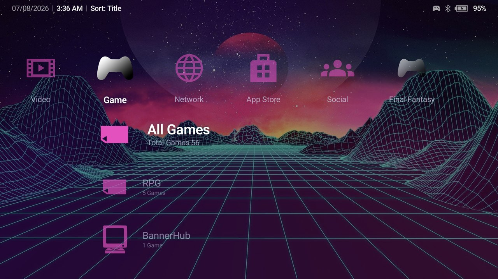 | 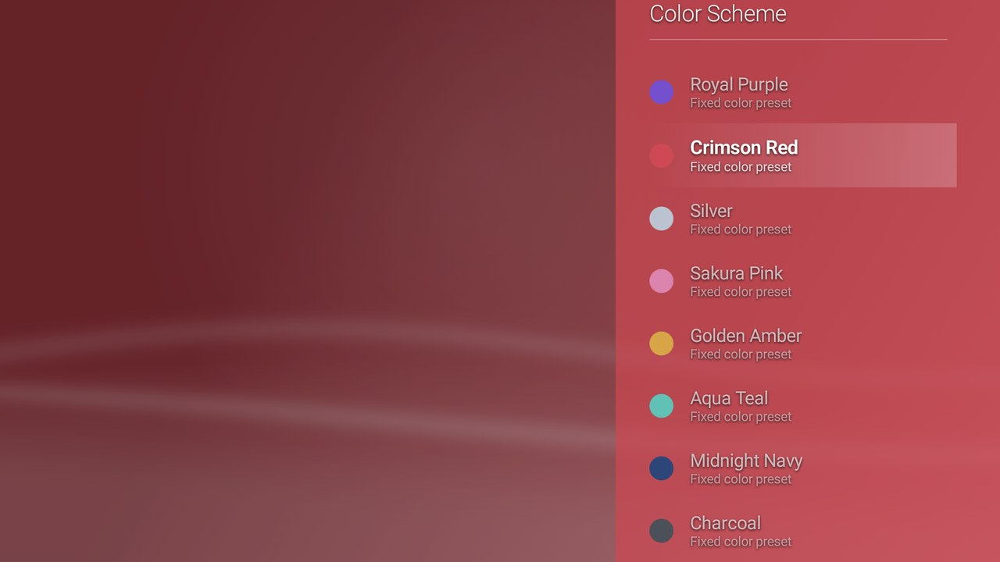 |
| A custom `.pfptheme` — wallpaper + one derived color, icons follow | Color Scheme picker, previewing live on the real crossbar |
| 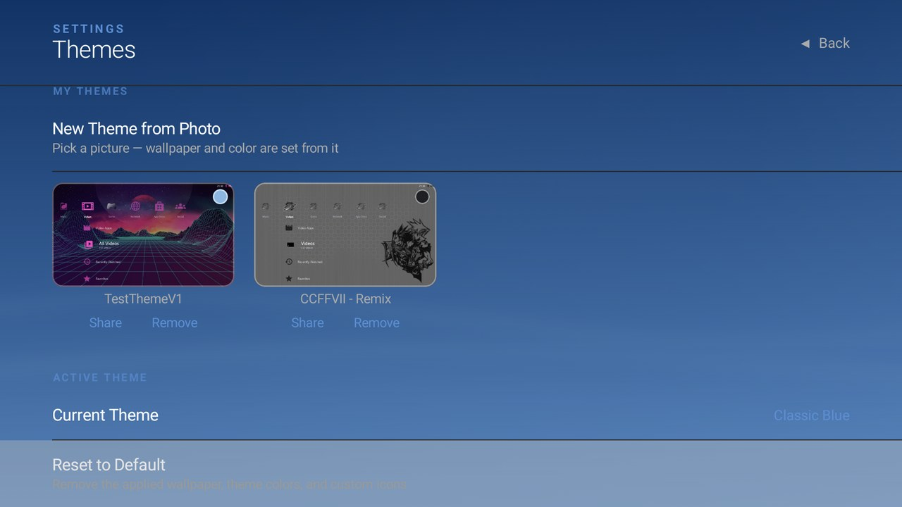 | 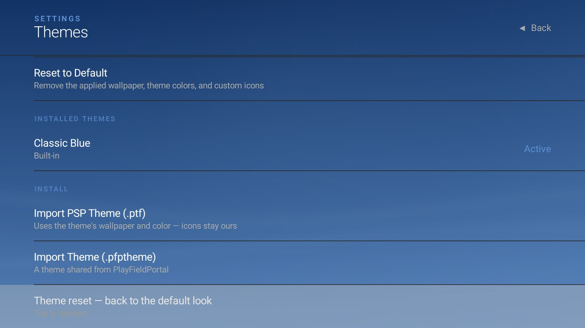 |
| My Themes library — apply, Share, Remove | Theme install (`.ptf` / `.pfptheme`) and one-tap Reset to Default |

### Game library

| | |
|:---:|:---:|
| 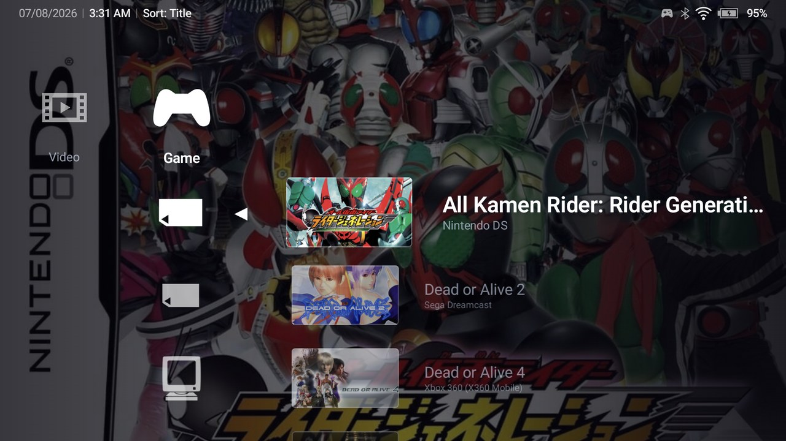 | 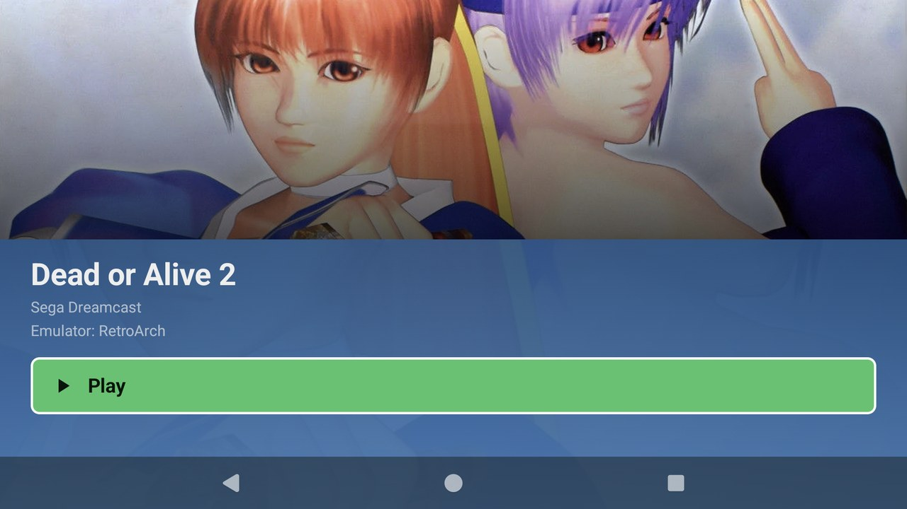 |
| Drilling into a Memory Card — covers, platform subtitles | Game detail — hero art and one-tap Play |
| 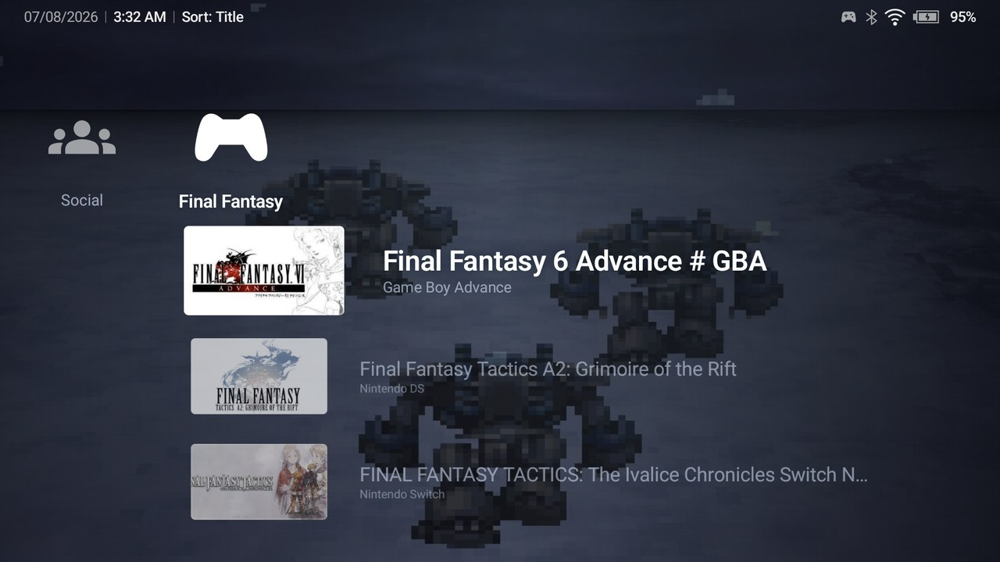 | 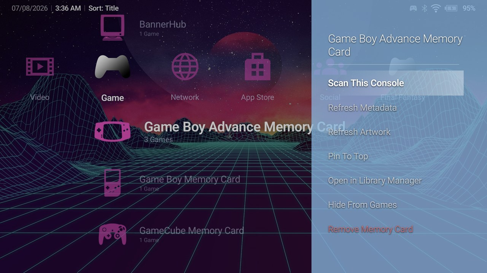 |
| A custom gaming category with its own icon and wallpaper | Memory Card options (△) — scan, refresh, pin, hide |
| 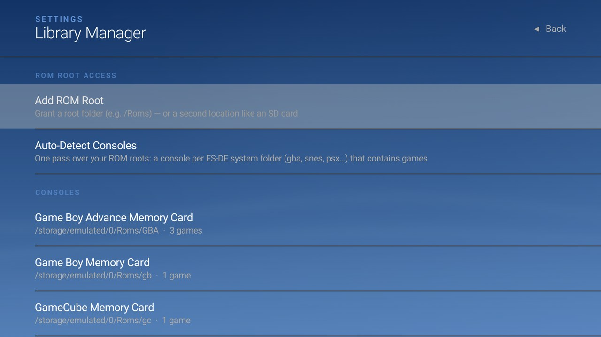 | 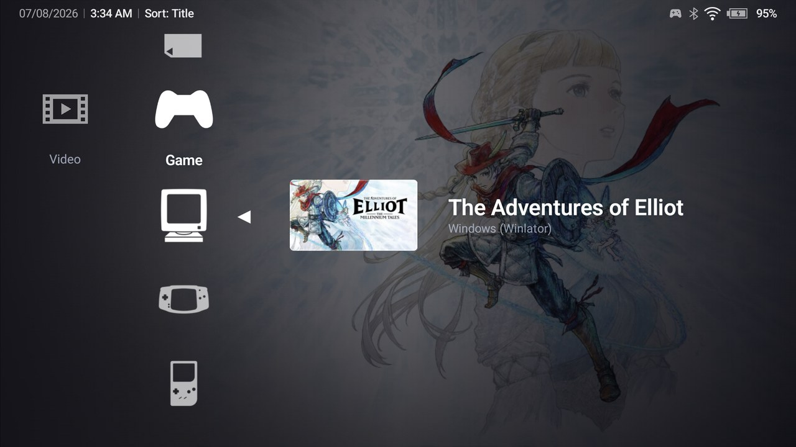 |
| Library Manager — ROM roots, auto-detect, per-console cards | PC-layer titles (Winlator) live next to console games |
| 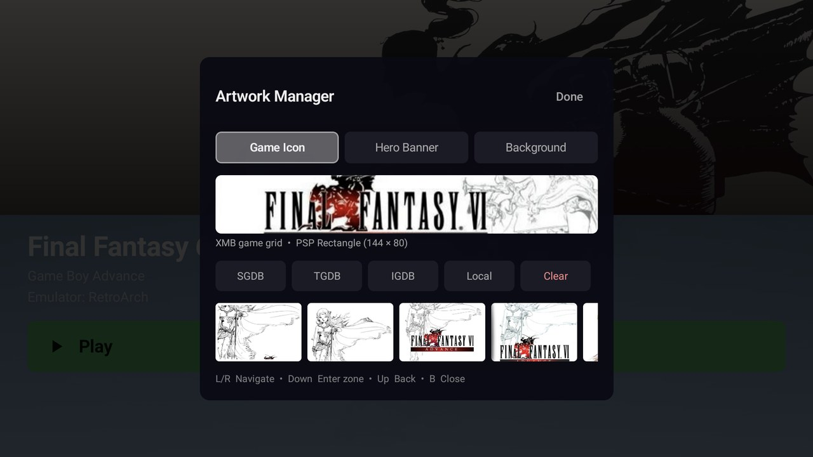 | 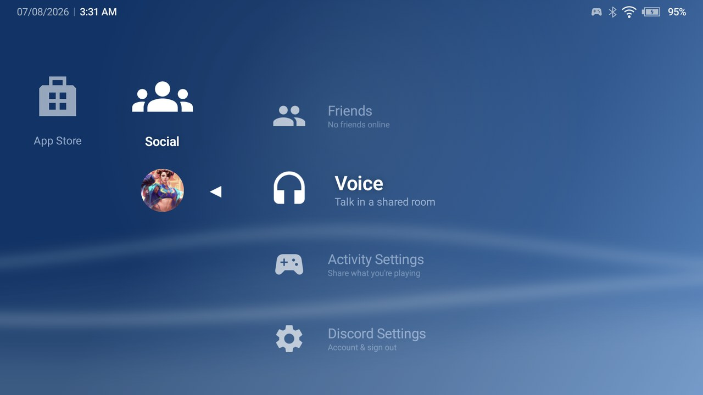 |
| Artwork Manager — SteamGridDB / TheGamesDB / IGDB / local | Social — Discord friends, voice, and activity |

### Media & more

| | |
|:---:|:---:|
| 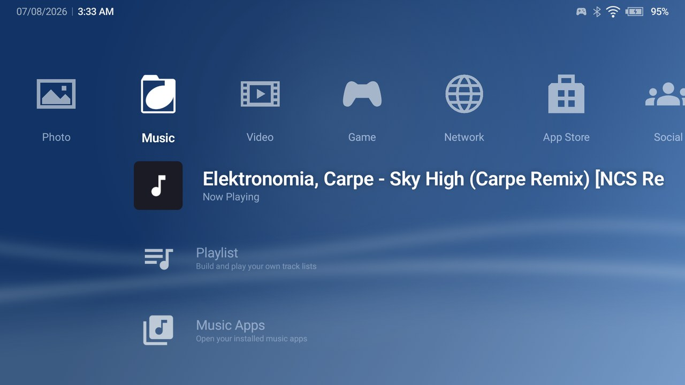 | 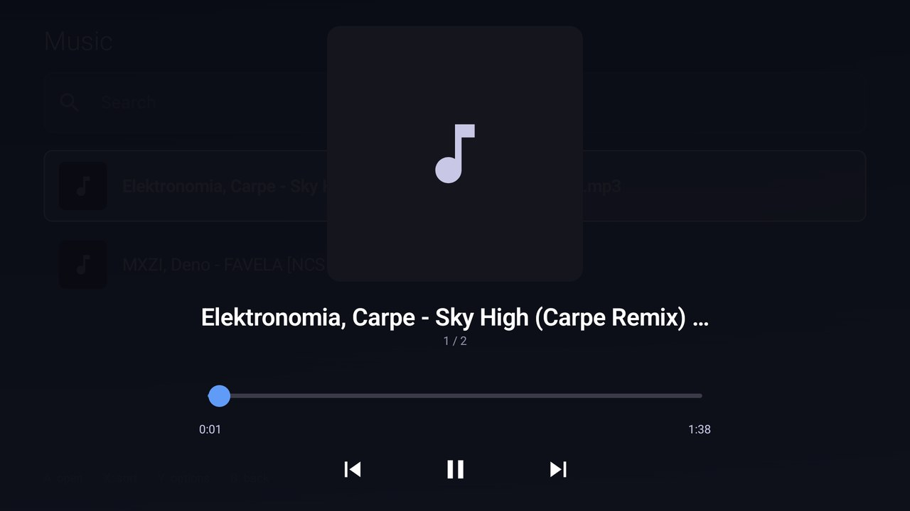 |
| Music section — Now Playing surfaces on the crossbar | The in-app player (background service keeps it going) |
| 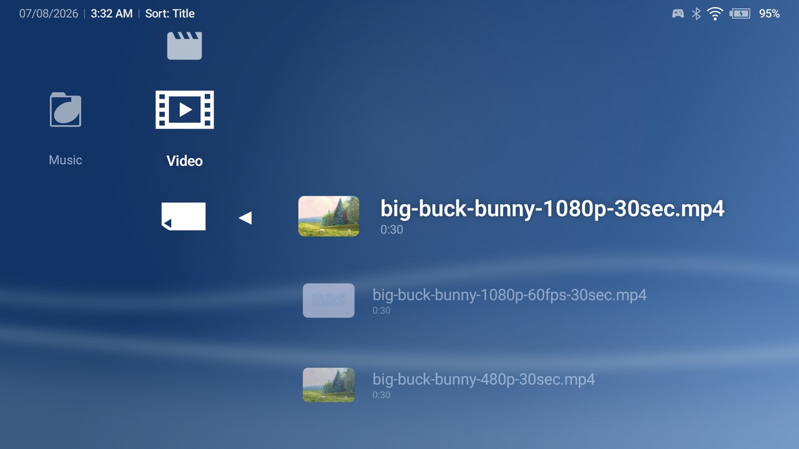 | 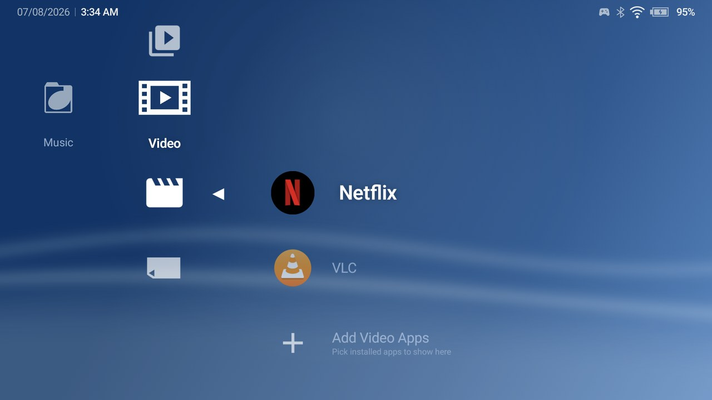 |
| Video library — scanned files with thumbnails | Video Apps — your installed players, one row away |
| 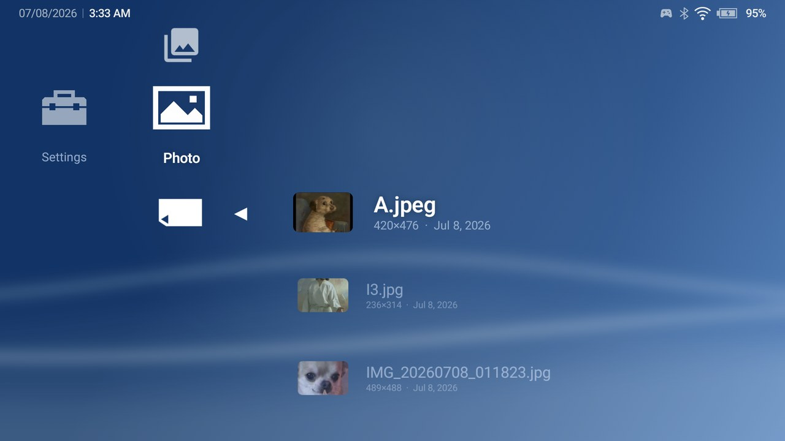 | 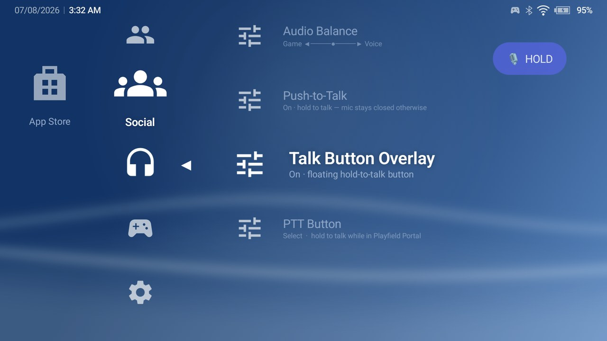 |
| Photo section — albums and a fullscreen viewer | Push-to-talk with the floating Talk button overlay |

---

## Table of contents

1. [What is Play Field Portal?](#1-what-is-play-field-portal)
2. [Getting started](#2-getting-started)
   - [2.1 Requirements](#21-requirements)
   - [2.2 Choose an edition (Full vs Lite)](#22-choose-an-edition-full-vs-lite)
   - [2.3 Install the APK](#23-install-the-apk)
   - [2.4 Set PFP as your home screen](#24-set-pfp-as-your-home-screen)
   - [2.5 Grant permissions](#25-grant-permissions)
   - [2.6 Add your first console](#26-add-your-first-console)
3. [Navigation & controls](#3-navigation--controls)
4. [Feature guide](#4-feature-guide)
   - [4.1 The Game library](#41-the-game-library)
   - [4.2 Setting up a console (Memory Card)](#42-setting-up-a-console-memory-card)
   - [4.3 Emulators](#43-emulators)
   - [4.4 Favorites & Collections](#44-favorites--collections)
   - [4.5 Game & app options (△)](#45-game--app-options-)
   - [4.6 Artwork & the Artwork Studio](#46-artwork--the-artwork-studio)
   - [4.7 Icon display modes & video snaps](#47-icon-display-modes--video-snaps)
   - [4.8 Android apps & non-gaming categories](#48-android-apps--non-gaming-categories)
   - [4.9 The App Drawer](#49-the-app-drawer)
   - [4.10 Music, Video & Photo](#410-music-video--photo)
   - [4.11 Categories](#411-categories)
   - [4.12 Themes & personalization](#412-themes--personalization)
   - [4.13 Discord Social (Full edition)](#413-discord-social-full-edition)
   - [4.14 Adjusting the layout for your screen](#414-adjusting-the-layout-for-your-screen)
   - [4.15 Backup & restore](#415-backup--restore)
   - [4.16 Shiba Coins (achievements)](#416-shiba-coins-achievements)
   - [4.17 Tracking local (Steam-emulated) PC games](#417-tracking-local-steam-emulated-pc-games)
   - [4.18 Settings reference](#418-settings-reference)
5. [Permissions & privacy](#5-permissions--privacy)
6. [Troubleshooting](#6-troubleshooting)
7. [For Developers](#for-developers)
   - [7.1 Tech stack](#71-tech-stack)
   - [7.2 Prerequisites](#72-prerequisites)
   - [7.3 Get the code & open it in Android Studio](#73-get-the-code--open-it-in-android-studio)
   - [7.4 Build variants & flavors](#74-build-variants--flavors)
   - [7.5 Run & debug from Android Studio](#75-run--debug-from-android-studio)
   - [7.6 Release signing](#76-release-signing)
   - [7.7 Command-line builds & the `dist` task](#77-command-line-builds--the-dist-task)
   - [7.8 The Theme Studio desktop app](#78-the-theme-studio-desktop-app)
   - [7.9 Module structure](#79-module-structure)
   - [7.10 Testing](#710-testing)
8. [Credits](#8-credits)
9. [License](#9-license)

---

## 1. What is Play Field Portal?

Play Field Portal is a **home-screen replacement** for Android handhelds, tablets and phones that
gives your whole library the look and feel of a PlayStation Portable. Everything is one crossbar
away and fully controller-navigable:

- **Games** — ROMs launched through the emulators you already have installed, Android games, and
  PC-layer titles (Winlator and friends), unified under one **Game** category.
- **Media** — Music, Video and Photo sections that scan folders you choose.
- **Apps** — your installed apps, organized into categories you design.
- **Personalization** — a deep theme system (custom wallpapers, one-color palettes, imported PSP
  themes) plus a desktop **Theme Studio** for authoring.

It is **local-first**: no account, no telemetry, and the network is only touched when *you* ask it
to fetch artwork. See [Permissions & privacy](#5-permissions--privacy).

---

## 2. Getting started

### 2.1 Requirements

| | |
|---|---|
| **Android version** | 10 (API 29) or newer |
| **Form factor** | Phones, handhelds, tablets, and foldables (the layout adapts to each) |
| **Input** | A game controller is recommended; full touch navigation is also supported |
| **Emulators** | Installed separately — PFP launches them, it does not emulate anything itself |

### 2.2 Choose an edition (Full vs Lite)

PFP ships in two editions. You can tell which one is installed under **Settings ▸ About ▸ Edition**.

| Edition | Includes | Download size |
|---|---|---|
| **Full** | Everything, including the **Discord Social** section (friends, presence, voice chat) | Larger |
| **Lite** | Everything **except** Discord Social (the Social column is hidden) | ~44 MB smaller |

Choose **Lite** if you do not want Discord integration or want the smallest download.

### 2.3 Install the APK

PFP is distributed as a **side-loaded APK** (it is not on the Google Play Store).

1. Download the APK for your chosen edition (`PlayFieldPortal-<version>-full.apk` or
   `-lite.apk`).
2. Open the file on your device. Android will ask you to allow installs from your browser or file
   manager the first time — approve it.
3. Tap **Install**.

> Building the APK yourself instead? See [For Developers](#for-developers).

### 2.4 Set PFP as your home screen (Optional)

PFP registers as an Android **HOME** launcher.

1. Press the **Home** button.
2. When Android asks which launcher to use, pick **Play Field Portal** and choose **Always**.

You can change this later under *Android Settings ▸ Apps ▸ Default apps ▸ Home app*.

> A few features (importing game shortcuts from other launchers, capturing pinned shortcuts)
> require PFP to be the **active default launcher**.

### 2.5 Grant permissions

PFP asks for permissions **only when a feature needs them**:

- **Notifications** (Android 13+) — lets background scans and artwork fetches report progress, and
  lets other apps ask you to confirm a game shortcut before it is added.
- **Usage access** (optional) — powers the "Recently Used" filter in the App Drawer.

Full detail in [Permissions & privacy](#5-permissions--privacy).

### 2.6 First-run setup

On a fresh install PFP opens a guided **setup wizard** with four pages:

1. **Welcome** — what the wizard will set up.
2. **Root Folders** — pick your ROM root plus the Music, Video, Photo and Artwork
   folders (each optional).
3. **Online Services** — connect SteamGridDB, IGDB, ScreenScraper, RetroAchievements
   and Steam (each optional; IGDB and ScreenScraper credentials are tested live).
4. **Finish.**

Every step can be skipped and everything it configures is the same setting you can reach
later in Settings — the wizard is just a shortcut. You can re-run it any time from
**Settings ▸ Re-Run Setup Wizard**. Upgrading installs that are already configured never
see it.

With a ROM root set, the fastest way to load your library is
**Settings ▸ Library ▸ Library Manager ▸ Auto-Detect from ROM Root** — it walks the
root's ES-DE system folders and creates a Memory Card for every console that contains
games (including a **Windows Memory Card** for PC games). Full detail in
[Setting up a console](#42-setting-up-a-console-memory-card).

---

## 3. Navigation & controls

PFP is built for a controller but works fully with touch.

| Action | Controller | Touch |
|---|---|---|
| Move between items | D-Pad / Left Stick | Tap an item |
| Switch category (left / right) | D-Pad ◀ ▶ | Tap the category |
| Select / launch / open | **A / ✕** | Tap |
| Back / close / exit a folder | **B / ◯** | On-screen Back / left-edge swipe |
| Options (context) menu | **Y / △** (or long-press) | Long-press |
| Switch App-Drawer tabs | **L1 / R1** | Tap a tab |
| Confirm in pickers | **Start** | Confirm button |

The **horizontal bar** is your categories — by default **Settings, Photo, Music, Video, Game,
Network, App Store**, plus any custom ones. The **vertical list** under the selected category is its
items. While any menu, settings screen, picker or dialog is open, the crossbar is locked — input
only drives the overlay on top. Every binding is remappable in *Settings ▸ Controller*.

---

## 4. Feature guide

### 4.1 The Game library

Selecting **Game** shows, in order:

1. **All Games** — every real game across all consoles, aggregated. Only actual games appear here;
   Android / Video / Music apps never show up automatically.
2. **Favorites** — appears directly under All Games **only when you have favorited at least one
   game**, and hides again when you have none.
3. **Your Collections** — user-made folders (see [4.4](#44-favorites--collections)).
4. **Memory Cards** — one row per console you have configured.

Open All Games, Favorites, a collection, or a console to drill in; press **B / ◯** to go back. On
wide and foldable screens the crossbar slides to the left edge while drilled in, giving the game
list and its artwork the center-right of the screen.

### 4.2 Setting up a console (Memory Card)

Consoles are added as **Memory Cards** and managed entirely through your **ROM Root** —
one folder grant covers every console; there is no per-console folder picking. PFP never
auto-scans your whole device.

**The fast path — Auto-Detect.** *Library Manager ▸ Auto-Detect from ROM Root* walks the
root's ES-DE system folders (`gba`, `snes`, `psx`, …), creates a Memory Card for every
folder that actually contains games, and loads them in one scan. It also sets up the
**Windows Memory Card** (wiring `<root>/windows` and its `import/` drop folder, and
importing any exported PC games).

**Adding one console by hand:**

1. **Settings ▸ Library ▸ Library Manager ▸ Add Console** (requires a ROM Root).
2. **Choose Platform** (NES, SNES, PSP, PS2, Dreamcast, Xbox 360, …). The console's
   folder is derived from the root automatically — an existing recognized subfolder if
   one is there, otherwise the standard ES-DE folder name.
3. **Assign Emulator** — this becomes the console's default. (Windows skips this step;
   PC games go through your installed PC launchers instead.)
4. **Scan Now**, or create the card and scan later.

Manage a card any time from *Library Manager*: rename it, change its emulator, hide/show
it, **Scan This Console**, or remove it (ROM files on disk are never deleted). Each root's
row lists the consoles homed under it. Library-wide passes live here too: **Scan All
Consoles** (add-only) and **Re-Scan All (Remove Missing)**, which additionally removes
entries whose ROM file has vanished — behind a confirm step, and skipped for any console
whose folder cannot be read, so an unmounted SD card never wipes a library.

> **Scanning is always manual** — there is no background watcher. Re-scan after adding ROMs.
> ROMs on removable SD cards / USB volumes are supported.

### 4.3 Emulators

PFP launches games through **external emulator apps** — install the emulators you want and PFP
detects them automatically on startup from a curated catalog, plus one profile per installed
**RetroArch** core. A selection of what is recognized out of the box:

| System | Emulators |
|---|---|
| PSP | PPSSPP / PPSSPP Gold |
| PS1 | DuckStation |
| PS2 | NetherSX2 / AetherSX2 |
| GameCube / Wii | Dolphin |
| Nintendo DS / 3DS | melonDS, DraStic / Azahar, Citra, Lime3DS |
| Switch | Sudachi / Yuzu / Suyu family |
| N64 | Mupen64Plus FZ / AE |
| GB / GBC / GBA | mGBA, My Boy!, GBA.emu, GBC.emu |
| NES / SNES / Genesis / PC Engine / Neo Geo / WonderSwan / Lynx | the `*.emu` family |
| Dreamcast | Flycast, Redream |
| Xbox 360 | X360 Mobile (`.iso`) |
| Anything with libretro cores | RetroArch (one profile per installed core) |

**Which emulator launches a game?** PFP resolves it in priority order:
**per-game override → Memory Card emulator → the platform default → first available.** Set a
per-game emulator from a game's **△** options; set a console default in *Library Manager*.

**Custom Emulator Wizard** — for anything not in the catalog, *Settings ▸ Emulators ▸ Add Custom
Emulator* walks you through it: pick an installed app, let PFP auto-detect its launch settings,
edit any field, **Test Launch** with a real ROM, then **Save**. The result is usable as a platform,
Memory Card, or per-game emulator.

### 4.4 Favorites & Collections

- **Favorites** — mark any game from its **△** options (*Add to Favorites*). A **Favorites** folder
  appears under All Games and hides automatically when empty.
- **Collections** — custom folders (e.g. "RPGs", "Currently Playing"). A game can live in several at
  once. Create one from *Settings ▸ Collections* or a game's **△ ▸ Add to Collection**; toggle
  membership with a ✓. Manage (rename, reorder, delete) from *Settings ▸ Collections*.

### 4.5 Game & app options (△)

Press **Y / △** (or long-press) on any item for its context menu.

- **Games** — Launch Game, Edit Title, Edit Note. Everything else (favorites,
  collections, artwork, emulator choice, icon display, file location) lives on the
  **Game Detail** screen and its Options menu.
- **Memory Cards** — Scan This Console, **Update Metadata** (text-only pass, artwork
  untouched), **Scrape Missing Artwork** (fills only games missing primary art), pin,
  hide, rename. The Windows card adds **Import PC Games**.
- **All Games** — sorting plus **Manage Library**, which opens the Library settings.
- **Android apps** — Launch, Edit App Details, Add to Favorites/Collection,
  Move/Pin/Hide/Rename.

The full **Game Detail** and **App Detail** screens also show hero art, metadata,
screenshots, publisher, and total play time.

### 4.6 Artwork & the Artwork Studio

Box art, hero banners, logos, screenshots and icons are fetched **on request**. Add a free
**SteamGridDB** key (and optionally ScreenScraper / TheGamesDB / IGDB) in *Settings ▸ Artwork*.

- **Quick scrape** — *Settings ▸ Artwork* offers scrape-all, scrape-missing-only, and cache
  clearing. "Scrape Missing" fills only the gaps and never overwrites existing art.
- **Artwork Studio** — from a game's **Artwork** button, a full-screen, controller-first editor with
  a tab per artwork kind (ICON0, ICON1, Box Art, 3D Box, Physical Media, Hero, Background, Logo,
  Screenshot, Manual, Video). Each tab can pull from **ScreenScraper, SteamGridDB** (with an NSFW
  filter), **TheGamesDB, IGDB,** and **Local File**. Preview a candidate before applying (videos
  play a muted loop, manuals page through), then commit. Press **Start** for per-slot actions:
  Adjust Crop, Restore Previous, Reset to Scraped Default, Clear, and File Info.
- **Crop / position editor** — an aspect-locked frame per kind with the image panning and scaling
  behind it. Crops bake into the displayed file while the untouched original is kept for lossless
  re-crops.

**Portable artwork library** — in *Settings ▸ Artwork ▸ Artwork Folder & Import* you can point PFP
at a folder it keeps in an **ES-DE-compatible** layout, so your art is user-owned and readable by
other frontends with no export step. The same screen imports ES-DE `downloaded_media` (and
`gamelist.xml` metadata), relinks moved files, and exports for ES-DE.

#### Folder layout

The library is a clean two-folder root. Everything under `Artwork/` is a standard ES-DE
`downloaded_media` tree, so you can point ES-DE (or any frontend) straight at
`{Artwork Folder}/Artwork` with no export step.

```text
{Artwork Folder}/
├─ pfp-artwork-library.json        manifest — marks this folder as a PFP library
├─ Import/                         drop zone for other launchers' media (see below)
│   └─ {Launcher}/ …               an ES-DE downloaded_media tree
└─ Artwork/                        the library — ES-DE downloaded_media shape
    └─ {platformId}/               e.g. ps2, snes, psp
        ├─ covers/                 box art        →  {PortableName}.{ext}
        ├─ miximages/              hero
        ├─ fanart/                 background
        ├─ marquees/               logo
        ├─ screenshots/            screenshot
        ├─ titlescreens/           title screen
        ├─ physicalmedia/          cartridge / disc
        ├─ 3dboxes/                3D box
        ├─ manuals/                PDF manual
        ├─ videos/                 video
        └─ pfp/                    PFP-only namespace (skipped by scan & export)
            ├─ icon0/              144:80 ICON art
            ├─ icon1/              icon video snap
            ├─ originals/{kind}/   untouched pre-crop copies (lossless re-crop)
            └─ versions/{kind}/    one-previous backup ("Restore Previous")
```

The `pfp/` namespace holds PFP-only assets that are not ES-DE media types; `versions/` and
`originals/` are nested per `{kind}` so a game's box-art and icon backups (same filename) never
collide. Incoming **videos** are transcoded locally into a 60-second `icon1/` snap — the full-size
file is never stored.

#### How import works

1. **Drop** another launcher's media under `Import/{Launcher}/` in an ES-DE `downloaded_media`
   shape.
2. **Match** — PFP detects it by structure and links each file to a game in three passes: exact ROM
   filename → display title → tag-stripped title. Ambiguities are reviewed, never guessed.
3. **File** into `Artwork/{platform}/{mediaDir}/{PortableName}.{ext}`. Same-volume transfers move
   with zero bytes copied; otherwise they copy. Existing or locked artwork is never overwritten.

| ES-DE folder | Imports as (PFP kind) |
|---|---|
| `covers` | Box Art |
| `miximages` | Hero |
| `fanart` | Background |
| `marquees` | Logo |
| `screenshots` | Screenshot |
| `titlescreens` | Title Screen |
| `physicalmedia` | Physical Media |
| `3dboxes` | 3D Box |
| `manuals` | Manual (PDF) |
| `videos` | Video → transcoded to an ICON1 snap |
| `backcovers` | Recognized as library structure, not imported |

### 4.7 Icon display modes & video snaps

Every game tile can be drawn four ways — set a global default in *Settings ▸ Artwork ▸ Game Icon
Display*, per Memory Card, or per game via its **△** menu:

- **Custom Icon** — the PSP-authentic 144:80 ICON0 fill.
- **Box Art** — the game's cover at its natural aspect.
- **Physical Media** — the platform's cartridge/disc shot.
- **3D Box Art** — a rendered 3D box.

In **Custom Icon** mode, resting on a game plays its **video snap** inside the icon (muted, capped at
60 seconds, then fading back to the still) — the PSP's ICON1.PMF revived. It is battery-conscious:
one shared player, skipped under Battery Saver, low battery, or thermal pressure, and gated by an
**Animated Icons** master toggle in Settings.

### 4.8 Android apps & non-gaming categories

- **Add apps** to a section (App Store / Video / Music / Network / custom) via its **Add Apps** row.
- **App artwork** — apps show their launcher icon by default; give one custom art via
  **△ ▸ Edit App Details ▸ Icon** and it renders as a landscape tile. Apps stay tagged as apps, so
  they never appear in All Games.
- **Android games** — open the Android library card and choose **Find Games**; these are addable to
  collections but stay out of All Games.

### 4.9 The App Drawer

A bottom-right button (shown while using touch, or bound on a controller) opens the **App Drawer**:
all your apps with quick filters — **All Apps / Games / Emulators / Tools / Recently Used** —
switchable with **L1 / R1**.

### 4.10 Music, Video & Photo

Each media section is driven by **one root folder** you set in its Settings screen (SAF folder
picker — no storage permission):

- **Music** — scan folders, browse `[cover] title / artist`, and play in a full-screen player with a
  **background service** and media-notification controls. Create and manage **playlists**.
- **Video** — scanned libraries with thumbnails, Recently Watched / Favorites / Playlists, and a
  built-in player or your chosen external app.
- **Photo** — scanned albums, a fullscreen viewer (zoom, pan, rotate, L1/R1 paging), and
  **Set as Launcher Wallpaper** (EXIF-stripped; location data is never read).

Each section shows a single "＋ Add" getting-started row until a root has been added and scanned.

### 4.11 Categories

Categories are the horizontal bar. Manage them in *Settings ▸ Categories*:

- **Create** a category, choose a **content type** (Gaming = games & collections, Non-gaming =
  apps), and pick an **icon** from the image-based picker.
- **Rename, reorder** (move left/right), **hide/show,** or **delete** custom categories. Built-in
  categories are protected from deletion.

### 4.12 Themes & personalization

Everything lives in **Settings ▸ Themes**, built around one idea: *pick a background and one
color — the whole crossbar follows* (wave, gradient, cursor and icons all derive from it).

- **Color Scheme** — 12 PSP-style presets, previewed live on the real crossbar (including the
  month-cycling *Original*).
- **Icon Color** — one tint across every crossbar glyph: 8 curated swatches (*Default* is the
  native white) plus a **Custom** swatch that opens an HSV picker (Hue / Saturation /
  Brightness bars, adjustable by D-pad or touch). Game art, covers and app icons are never
  tinted.
- **New Theme from Photo** — any picture becomes the wallpaper; the theme color is auto-derived from
  its dominant hue.
- **Import PSP Theme (`.ptf`)** — convert an official PSP theme you own (wallpaper + derived color).
  CXMB firmware files are safely declined.
- **My Themes** — your saved themes as cards: apply, **Share** (`.pfptheme`), or Remove.

**Theme Studio** is a desktop companion (Windows / Linux / macOS) for authoring themes with a live
crossbar preview, an icon editor, wallpaper crop presets, crossbar alignment assist, and batch
`.ptf → .pfptheme` conversion. See [7.8](#78-the-theme-studio-desktop-app).

### 4.13 Discord Social (Full edition)

**Full edition only.** A **Social** column adds Discord integration:

- **Sign in by QR** — scan with your phone (OAuth device grant; no password typed on the handheld).
  Tokens are stored **encrypted** in the Android Keystore and refreshed automatically.
- **Friends** — avatars, presence, and what they are playing in PFP.
- **Activity sharing** — opt-in (default **off**), with a Generic Mode that shows only "a game".
- **Voice chat** — join rooms by code, invite friends, with noise cancellation, a Game↔Voice
  balance, and **push-to-talk** (a floating hold-to-talk button or a controller button you map).

Everything is inert until you connect, and presence is limited to this app.

### 4.14 Adjusting the layout for your screen

PFP scales itself to fit your device automatically, including near-square foldable inner displays.
To fine-tune it, open **Settings ▸ Display ▸ Adjust XMB Layout** — a live editor over the real
crossbar:

- **Scale** the whole interface, and **shift the crossbar** up/down and left/right.
- Drive it with the **D-Pad** (move), **L1 / R1** (scale), **Y** (reset), **A** (save), **B**
  (cancel) — or an on-screen **slider** panel.
- Each screen size keeps its **own** tuning, so a handheld and a foldable never share (and distort)
  one layout.

### 4.15 Backup & restore

*Settings ▸ Backup & Restore* writes a `.pfpbackup` archive (library + settings) into a folder you
pick, and restores from one. Because on-device cloud backup is disabled for privacy, this is how you
move your setup to a new device or recover after a reinstall. Restoring re-links your ROM/media
folders via *Library ▸ Root Access*.

### 4.16 Shiba Coins (achievements)

**Shiba Coins** turn achievements into a coin economy across your whole library. Enable it
under **Settings ▸ Shiba Coins** and connect one or more providers:

| Provider | What it tracks | You supply |
|---|---|---|
| **RetroAchievements** | Retro console games with RA sets | RA username + Web API key |
| **Steam** | Games on your own Steam account | SteamID64 (or vanity name) + Steam Web API key |
| **Local Steam** | Steam-emulated PC games run through Wine emulators | Steam Web API key (see [4.17](#417-tracking-local-steam-emulated-pc-games)) |

Each achievement earns a **bronze, silver, gold or platinum** coin by rarity; coins feed an
account-wide wallet with **levels and ranks** shown on the **Player Card**.

- **Player Card** — on the XMB and at the top of Settings ▸ Shiba Coins. Its menu holds
  **Sync All Coins**, which refreshes every tracked game in one pass. Confirm on the card
  opens the fullscreen **Player Status** view: level, rank and XP, Recent Achievements,
  your coin wallet, and your Rarest Achievement Unlocked — a recent unlock from a library
  game jumps straight to that game's coins screen.
- **Per-game coins screen** — from a game's Shiba Coins strip on Game Detail. Lists every
  achievement with its coin tier and unlock state; **X** cycles sorting, **Y** cycles the
  earned/unearned filter.
- **Auto-Match** — if a game is not linked yet, the coins screen offers one button that
  asks whether your copy is a legitimate Steam one: *Yes* matches it against Steam
  (embedded appid, SteamGridDB, title variants); *No* scans your windows game folders for
  Steam-emu data and links it as Local Steam. When nothing links, the screen tells you
  exactly what to fix.
- **Shiba Library** — a hub with an **All Tracked** view (filter by provider with **Y**,
  sort by Title / Progress / Console with **X**) and an **Untracked** view of games you
  could still link. Android games are excluded — they can never have achievements.

### 4.17 Tracking local (Steam-emulated) PC games

PFP can track achievements for Windows games run through Wine emulators (GameHub, Winlator,
GameNative and friends) whose bundled Steam emulator (GSE / Goldberg) records unlocks in local
files. Tracking is display-only: PFP reads what the game already wrote, joins it with the Steam
schema, and shows the result in Shiba Coins — run *Sync All Coins* from the Player Card to load
every tracked game.

> **Warning Note — back up your save files first.** This is opt-in behind
> *Settings ▸ Shiba Coins ▸ Track Local Steam Games (Emulated)*, and enabling it shows the
> same reminder. Turning it on lets a sync bring each emulator game up to the current setup:
> it rewrites the game's `steam_settings` config and replaces its `steam_api` DLL so unlocks
> can be recorded. A game you set up and played *before* this feature could lose access to its
> existing save data once the emulator starts reading from the new save location. Open your
> Windows emulator, back up the save files for those games, and only then enable the toggle and
> run *Sync All*.
>
> **Use your own Steam Web API key at your own risk.** This feature reads achievement data with
> the Steam Web API key you supply. Steam tracking is entirely optional — you do not have to
> enable it, and should only do so if you accept the risks that come with using your own key.

For a game folder to be tracked it must live under your windows library and carry the Steam-emu
config; achievement progress is read from the emu's own save redirect, or from a `saves` folder
you keep in the game directory:

```
<ROM Root>/windows/
├── import/                          ← exported launch files (.steam / .desktop / …)
└── <Game>/
    ├── steam_settings/
    │   └── steam_appid.txt          ← REQUIRED: marks the game and names its Steam appid
    ├── saves/
    │   └── [<appid>/]achievements.json   ← unlock progress (either level works)
    └── ...game files
```

To make the emulator RECORD unlocks into that folder (instead of its app-private global
location, which PFP cannot read), set the GSE save redirect once per game — create or edit
`steam_settings/configs.user.ini` and add:

```ini
[user::saves]
local_save_path=./saves
```

The path is relative to the folder holding the steam_api `.dll`/`.so`; with it set the emu
ignores its global save folder entirely (fully portable) and writes
`saves/<appid>/achievements.json` after each play session.

Notes:

- `steam_settings/steam_appid.txt` may sit a few folders deep (Unity games keep it under
  `<Game>_Data/Plugins/x86_64/`); PFP finds it automatically.
- PFP follows whatever `local_save_path` the game already uses first (e.g. `./GSE Saves`) —
  the `saves/` folder is the fallback convention for hand-arranged files.
- A game is tracked only once its save location exists (the redirect's target folder, or the
  `saves/` folder). Before any unlocks it tracks at 0%; a game with `steam_settings` but no
  save location at all stays untracked.
- Reading the schema needs your Steam Web API key (*Settings ▸ Shiba Coins*).
- Tracking is off until you enable *Track Local Steam Games (Emulated)* (see the Warning Note
  above); with it off, no discovery, generation, DLL swap, or syncing runs.
- A game folder with `steam_settings` but no `achievements.json` can't record unlocks —
  the emulator needs that schema file. When a PC scan finds one missing, PFP offers to bring
  the game up to the current emulator setup (per game: No / Yes / Yes to All for that scan):
  it writes the schema and stat files from the Steam Web API, sets the save redirect, and
  installs the bundled emulator over the game's original `steam_api` DLL (backed up alongside
  it). This is the step the Warning Note's backup protects against.

### 4.18 Settings reference

| Section | What it covers |
|---|---|
| **Library** | ROM roots, Library Manager (consoles, Auto-Detect, scan-all passes), Import PC Games, Root Access |
| **Emulators** | Detected emulators, Custom Emulator Wizard |
| **Artwork** | API keys, scrape all/missing, Game Icon Display, Artwork Folder & Import |
| **Shiba Coins** | Player Card, enable toggle, RetroAchievements / Steam accounts, Track Local Steam Games (Emulated) |
| **Themes** | Color scheme, icon color (presets + Custom HSV), wallpaper, New Theme from Photo, PSP import, My Themes |
| **Display** | Wave style, wallpaper, boot sequence, Adjust XMB Layout, Animated Icons |
| **Music / Video / Photo** | Root folder, rescan, default player, thumbnail cache |
| **Controller** | Remap every binding, scroll speed, touch navigation button |
| **Collections / Categories** | Create, rename, reorder, hide |
| **Backup & Restore** | Export / import `.pfpbackup` |
| **Logs** | Open a rolling, redacted log in an external viewer; Share for bug reports |
| **Re-Run Setup Wizard** | Replays the first-run wizard (see [2.6](#26-first-run-setup)) |
| **About / Credits** | Version, **Edition (Full / Lite)**, attributions |

---

## 5. Permissions & privacy

PFP is a **local-first** launcher: your data stays on your device. There is no analytics, no
telemetry, and no account. PFP only reaches the network when *you* trigger artwork/metadata
scraping, and only over HTTPS.

**What PFP stores, and how**
- **On-device only.** Your library, settings and artwork live in app storage. **Backup is disabled**
  (`allowBackup=false`), so nothing is uploaded or transferred automatically — use
  [Backup & restore](#415-backup--restore) to move devices.
- **Scraper API keys are encrypted at rest** with a hardware-backed Android Keystore key.
- **Network is HTTPS-only.** Cleartext is blocked, and release builds trust only the system
  certificate store.
- **Logs are redacted at write time** — credentials, tokens, account names and emails never reach
  disk.

**Why the broad permissions exist (and how they are minimized)**
- **All-files access** is requested only when you add a **file-based ROM folder** (disc/multi-file
  games need real paths). Use SAF libraries and you never grant it.
- **Query installed apps** is required to *be* a launcher.
- **Usage access** is optional and only powers "Recently Used".

**Other apps can't silently change your library.** Legacy "install shortcut" broadcasts are
sanitized and require you to **confirm each one** before it appears.

---

## 6. Troubleshooting

| Symptom | Fix |
|---|---|
| Home button doesn't open PFP | Set it as default: *Android Settings ▸ Apps ▸ Default apps ▸ Home app*. |
| A console shows no games after adding ROMs | Scanning is manual — open the card's **△ ▸ Scan This Console**. |
| A game won't launch | Confirm the emulator app is installed; check the per-game/console emulator in **△** / Library Manager. |
| Disc/multi-file game not found | These need real-path access — grant All-Files when prompted in *Settings ▸ Library*. |
| Artwork won't download | Add a SteamGridDB (or other) API key in *Settings ▸ Artwork* and check your connection. |
| Interface too big/small or off-center | Tune it in *Settings ▸ Display ▸ Adjust XMB Layout*. |
| Which edition am I on? | *Settings ▸ About ▸ Edition* shows **Full** or **Lite**. |

If something looks like a bug, grab the log from *Settings ▸ Logs ▸ Share* — it is redacted and safe
to send.

---

# For Developers

> This section is for building PFP from source. It assumes familiarity with Android development.

### 7.1 Tech stack

- **Language:** Kotlin `2.0.0`
- **UI:** Jetpack Compose (Compose BOM `2024.06.00`), MVVM + state hoisting
- **DI:** Hilt
- **Database:** Room — **schema v35**, hand-written migrations only (never destructive)
- **Settings:** DataStore Preferences
- **Networking:** Ktor (artwork / metadata scrapers)
- **Media:** Media3 (video snaps + in-app player)
- **Image loading:** Coil
- **Background work:** WorkManager + Android notifications
- **Serialization:** Kotlinx Serialization
- **Native:** an NDK/CMake bridge to the Discord Social SDK (**full flavor only**)
- **Desktop companion:** Compose Multiplatform Desktop (`:studio`)
- **Testing:** JUnit 4 + MockK + Turbine
- **Build:** Gradle `8.14.5` (Kotlin DSL), AGP `8.10.1`

### 7.2 Prerequisites

- **Android Studio** — a recent stable release (Ladybug or newer recommended). Use the **bundled
  JetBrains Runtime (JBR 17/21)** as the IDE boot runtime.
- **JDK 17** for command-line Gradle (`JAVA_HOME` pointing at a JDK 17). The desktop `:studio`
  module targets a JVM 17 toolchain.
- **Android SDK 35** installed, with **NDK + CMake** (required to build the full flavor's native
  Discord bridge). Minimum supported device API is **29** (Android 10).

### 7.3 Get the code & open it in Android Studio

```bash
git clone <repo-url>
cd PlayFieldPortal
```

1. In Android Studio choose **Open** and select the project root (the folder with
   `settings.gradle.kts`).
2. Let Gradle sync finish. Android Studio downloads the wrapper (`8.14.5`) and the declared
   plugins/dependencies automatically.
3. If prompted, install the matching **Android SDK 35**, **NDK,** and **CMake** from the SDK
   Manager.

### 7.4 Build variants & flavors

The app has two dimensions:

- **Flavor (`distribution`):** `full` (ships the Discord Social SDK + native libs) and `lite`
  (omits them; smaller download, Social section hidden). `lite` uses the `.lite` application-id
  suffix, so both editions can be installed side by side.
- **Build type:** `debug` (`.debug` suffix) and `release` (R8 + signing).

That yields `fullDebug`, `fullRelease`, `liteDebug`, `liteRelease`. Switch the active variant in the
**Build Variants** tool window.

> The native Discord bridge is built for **arm64-v8a** and **armeabi-v7a** only. The **full** flavor
> therefore cannot run on an **x86_64 emulator** — use the **lite** flavor for emulator testing.

### 7.5 Run & debug from Android Studio

1. Open **Build Variants** and select **`liteDebug`** (recommended for emulators and quick
   iteration).
2. Pick your device/emulator and press **Run** (or **Debug**).

Two shareable run configurations are checked in under `.run/`:

- **`app (lite)`** — an Android App configuration (full debugger + logcat). Pair it with the
  `liteDebug` build variant.
- **`Install Lite (emulator)`** — a Gradle configuration that runs `:app:installLiteDebug`, which
  always installs the lite flavor regardless of the selected variant.

### 7.6 Release signing

Release builds are signed from a **gitignored** `keystore.properties` at the repo root. Without it,
release builds still assemble but stay **unsigned**.

```properties
# keystore.properties (do not commit)
storeFile=/absolute/path/to/release.keystore
storePassword=…
keyAlias=…
keyPassword=…
```

### 7.7 Command-line builds & the `dist` task

```bash
# Debug (lite) APK
./gradlew :app:assembleLiteDebug

# Both release APKs (full + lite); signed if keystore.properties is present
./gradlew :app:assembleFullRelease :app:assembleLiteRelease

# Unit tests
./gradlew test
```

**One command for everything shippable:**

```bash
./gradlew dist
```

`dist` builds the full + lite release APKs and the Theme Studio installer for the current OS and
collects them, cleanly named, into the gitignored **`dist/`** folder:

```
dist/
├── PlayFieldPortal-<version>-full.apk
├── PlayFieldPortal-<version>-lite.apk
└── PlayField-Theme-Studio-<version>.msi   (or .dmg / .deb per OS)
```

Every individual release build also finalizes a copy into `dist/`.

### 7.8 The Theme Studio desktop app

`:studio` is a Compose Multiplatform Desktop app that shares `:core:theme-kit` with the launcher
(and must never grow an Android dependency).

```bash
# Run it
./gradlew :studio:run          # or run-theme-studio.bat on Windows

# Package a native installer for the current OS (MSI / DMG / DEB)
./gradlew :studio:packageReleaseDistributionForCurrentOS
```

### 7.9 Module structure

Strict dependency direction: **features → core**; `app` wires everything via Hilt.

```
app/                      MainActivity (HOME launcher), PFPApplication, Hilt app module
studio/                   Theme Studio — Compose Desktop companion (Win/Linux/macOS)
core/
  theme-kit/              Pure-JVM theme core shared with Theme Studio: PTF/BMP/GIM/LZR parsers,
                          .pfptheme codec, color cascade, icon-slot registry, layout spec + adjust
  core-common/            Shared utilities and extensions
  core-domain/            Domain models, repository interfaces
  core-data/              Room DB (v35), DAOs, DataStore, repository impls, migrations
  core-ui/                PFPTheme/PFPColors, WaveStyle, PortalIcon, category-icon catalog
discord/
  discord-native/         NDK/CMake bridge to the Discord Social SDK (full flavor only)
feature/
  feature-xmb/            Crossbar shell, XMBViewModel, game/app detail, Artwork Studio, boot
  feature-library/        ROM scanner, disc-image resolver, platform map
  feature-launcher/       Emulator detection + intent resolution
  feature-artwork/        Scraper clients, portable artwork library, ES-DE import/export
  feature-achievements/   Shiba Coins: RA / Steam / Local Steam providers, wallet, sync
  feature-themes/         Theme loader/repository, built-in themes
  feature-settings/       Settings screens + ViewModels
  feature-appbar/         App drawer, app→category classification, filters
  feature-backup/         BackupManager, backup/restore workers
  feature-social/         Discord Social UI (full flavor)
```

See **[ARCHITECTURE.md](ARCHITECTURE.md)** for data-flow, launch-pipeline, and state detail.

### 7.10 Testing

```bash
./gradlew test                     # all unit tests
./gradlew :feature:feature-xmb:test  # a single module
```

Unit tests use JUnit 4 + MockK + Turbine; `:core:theme-kit` additionally ships golden tests against
Sony's own example PSP themes.

---

## 8. Credits

### Interface design — inspired by Sony's XMB
The look and feel is inspired by the **XMB (XrossMediaBar)**, the interface Sony created for the
PlayStation Portable, PlayStation 3 and other devices. The crossbar layout, flowing wave
background, navigation model and options-menu behaviour are homages to Sony's original design.

**"XrossMediaBar", "XMB", "PSP", "PlayStation" and related marks are trademarks of Sony Interactive
Entertainment Inc.** Play Field Portal is an independent, non-commercial fan project. It is **not
affiliated with, endorsed by, or sponsored by Sony**, and ships none of Sony's code, firmware or
fonts. The bundled UI artwork and menu sounds come from the community *XMB Menu for ES-DE* theme
(see below) and remain the property of their respective authors.

### App icon & logo
The Play Field Portal **app icon and logo** were created by **johakovi**
([u/silverloc96](https://www.reddit.com/user/silverloc96) on Reddit), who generously volunteered
their time to make them. The work is amazing — please go check out their work.

### System & console artwork
The system, console and category icons come from the
**[XMB Menu for ES-DE](https://github.com/anthonycaccese/xmb-menu-es-de)** theme — a community
recreation of the PSP's crossbar interface for ES-DE.

**All rights to this artwork belong to its creators — [Anthony Caccese](https://github.com/anthonycaccese),
building on the original work by InitialDin.** Used here with gratitude; it remains the property of
its respective authors.

- Project: XMB Menu for ES-DE · Authors: Anthony Caccese · InitialDin
- Source: https://github.com/anthonycaccese/xmb-menu-es-de
- Used for: category-bar icons, per-console system icons, the physical-media (cartridge) icon set

### Menu sounds
The navigation, select, back and launch **sound effects** are bundled from the same
**[XMB Menu for ES-DE](https://github.com/anthonycaccese/xmb-menu-es-de)** theme and remain the
property of their respective authors. Used here with gratitude.

- Project: XMB Menu for ES-DE
- Source: https://github.com/anthonycaccese/xmb-menu-es-de
- Used for: the crossbar menu sound effects (scroll, select, back, launch, favorite, system browse)

### Game artwork & metadata
Fetched at the user's request from third-party providers and remaining the property of their owners:
- **SteamGridDB** — community artwork (grids, heroes, logos, icons)
- **IGDB** and **TheGamesDB** — optional metadata / artwork sources

### Achievement data (Shiba Coins)
- **RetroAchievements** — community-made achievement sets and unlock data for retro games,
  fetched via the official RetroAchievements Web API and the official
  [api-kotlin](https://github.com/RetroAchievements/api-kotlin) client. Achievement sets are
  the work of the RetroAchievements community. https://retroachievements.org
- **Steam** — achievement schemas and unlock data are fetched from the **Steam Web API**
  using the user's own API key. **Powered by Steam.** Steam and the Steam logo are
  trademarks and/or registered trademarks of **Valve Corporation**. Play Field Portal is
  not affiliated with or endorsed by Valve. https://steampowered.com

### Goldberg Steam Emulator (gbe_fork)
Local achievement tracking for Steam-emulated PC games ([4.17](#417-tracking-local-steam-emulated-pc-games))
bundles the **Goldberg Steam Emulator** — specifically **gbe_fork**, the community fork
maintained by **Detanup01** and contributors, building on the original **Goldberg Emulator**
by **Mr. Goldberg**.

- Project: [gbe_fork](https://github.com/Detanup01/gbe_fork) · Original:
  [Goldberg Emulator](https://gitlab.com/Mr_Goldberg/goldberg_emulator)
- License: **GNU Lesser General Public License v3.0 (LGPL-3.0)** —
  [full text](https://www.gnu.org/licenses/lgpl-3.0.html)
- What PFP ships: an **unmodified** build of the emulator's `steam_api64.dll`, bundled as an
  app asset and installed into a game folder only when you opt in and confirm (see the
  Warning Note in [4.17](#417-tracking-local-steam-emulated-pc-games)). The original DLL is
  always backed up alongside, so the emulator build can be freely replaced with your own —
  as the LGPL requires. The complete corresponding source code is available from the
  project links above.

If you are a rights holder and would like attribution changed or an asset removed, please open an
issue and it will be addressed promptly.

## 9. License

See [LICENSE](LICENSE).
