# Play Field Portal (PFP)

**A controller-first Android game launcher inspired by the PSP's XMB (Cross Media Bar).**

A horizontal category bar crosses a vertical item list — the **crossbar** — and replaces your
Android home screen as a single front end for ROM emulation, Android games, PC-layer titles
(Winlator), native apps, and your music, video and photo libraries.

<p align="center">
  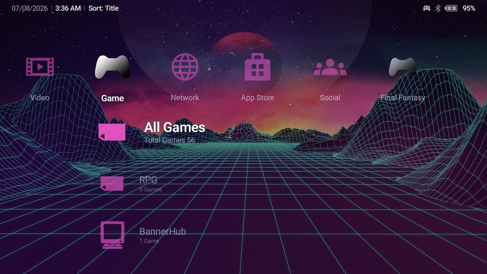
</p>

<p align="center">
  <b>Version 1.3.0</b> &nbsp;·&nbsp; Side-loaded APK (not on the Play Store) &nbsp;·&nbsp;
  <b>Full</b> &amp; <b>Lite</b> editions &nbsp;·&nbsp; Desktop <b>Theme Studio</b> companion
</p>

> **This is a living manual.** It describes the app as it is built from this repository today, and
> it is updated in the same change as the feature it describes.
>
> **Last updated:** 2026-10-04 · **Describes:** 1.3.0 (`versionCode` 11). What changed and when is in
> **[CHANGELOG.md](CHANGELOG.md)**; how the code is put together is in
> **[ARCHITECTURE.md](ARCHITECTURE.md)**. Building from source is covered in
> **[For Developers](#for-developers)**, which also explains
> [how to keep this manual current](#77-keeping-this-manual-current).

### How to read a feature section

Most feature sections open with the same short block, so you can find a setting without reading
the prose:

| Line | Meaning |
|---|---|
| **Where** | The exact path as the app shows it. `Settings › Library › Library Manager` means: the **Settings** category on the crossbar, its **Library** section, then the **Library Manager** item. |
| **Controls** | Controller and touch input specific to the feature (the global controls are in [§3](#3-navigation--controls)). |
| **Network** | Every server the feature talks to, or *None*. |
| **Default** | Whether it is on out of the box, and any opt-in it needs. |

---

## Screenshots

*Captured on an AYN Thor. Game artwork and app icons shown belong to their respective owners.*

### Themes

| | |
|:---:|:---:|
|  | 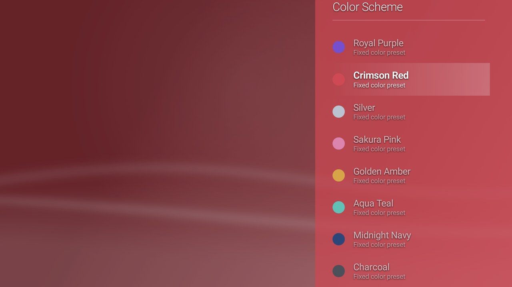 |
| A custom `.pfptheme` — wallpaper + one derived color, icons follow | Color Scheme picker, previewing live on the real crossbar |
| 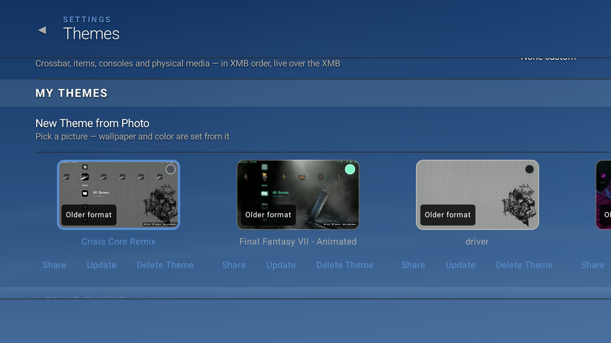 | 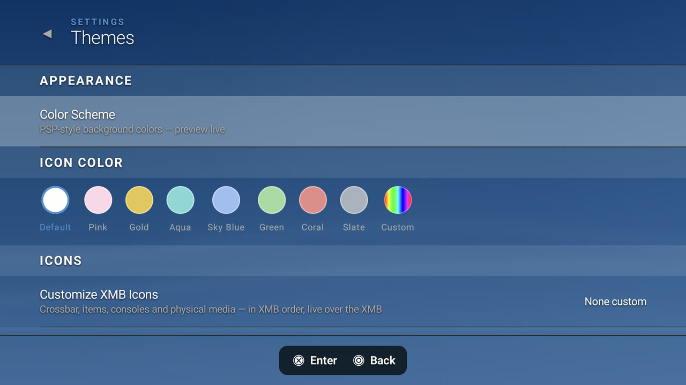 |
| My Themes library — apply, Share, Remove | Theme install (`.ptf` / `.pfptheme`) and one-tap Reset to Default |

### Game library

| | |
|:---:|:---:|
| 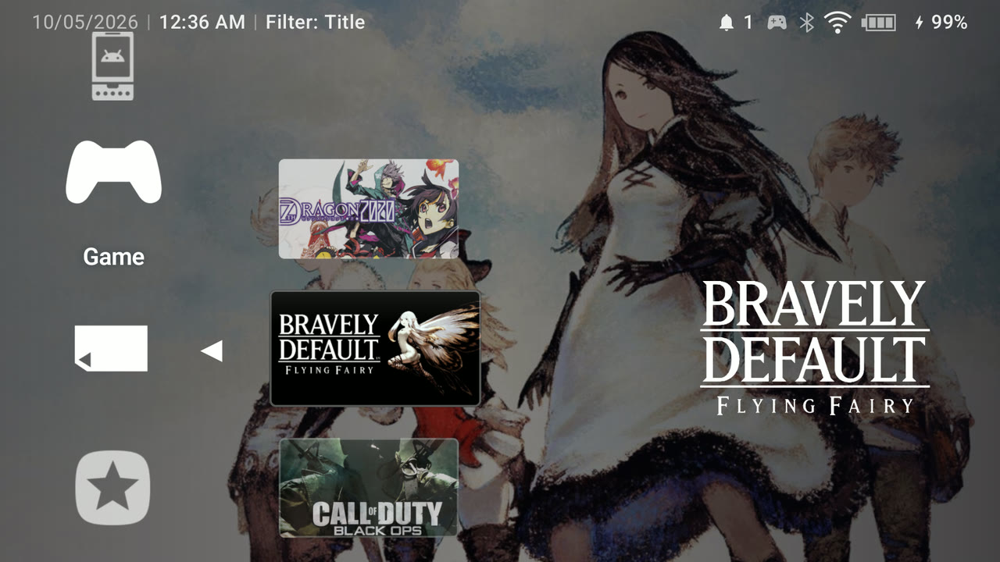 | 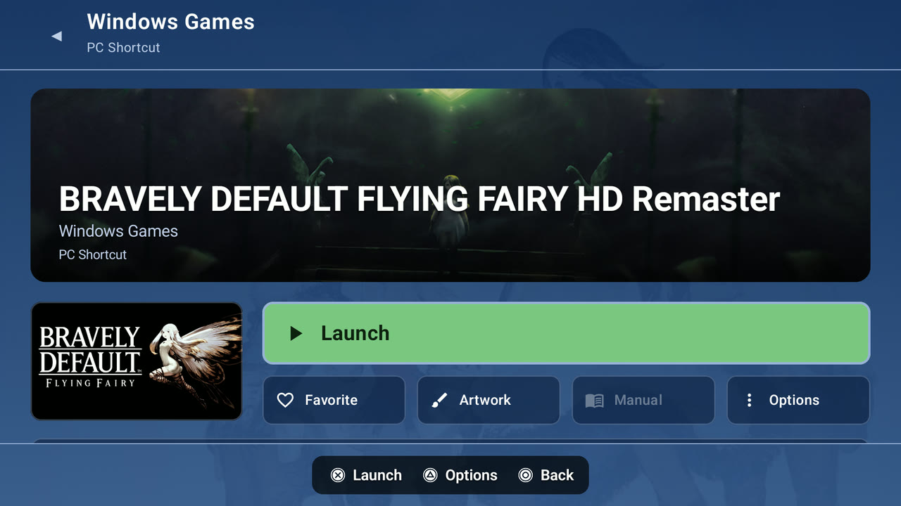 |
| Drilling into a Memory Card — covers, platform subtitles | Game detail — hero art and one-tap Play |
| 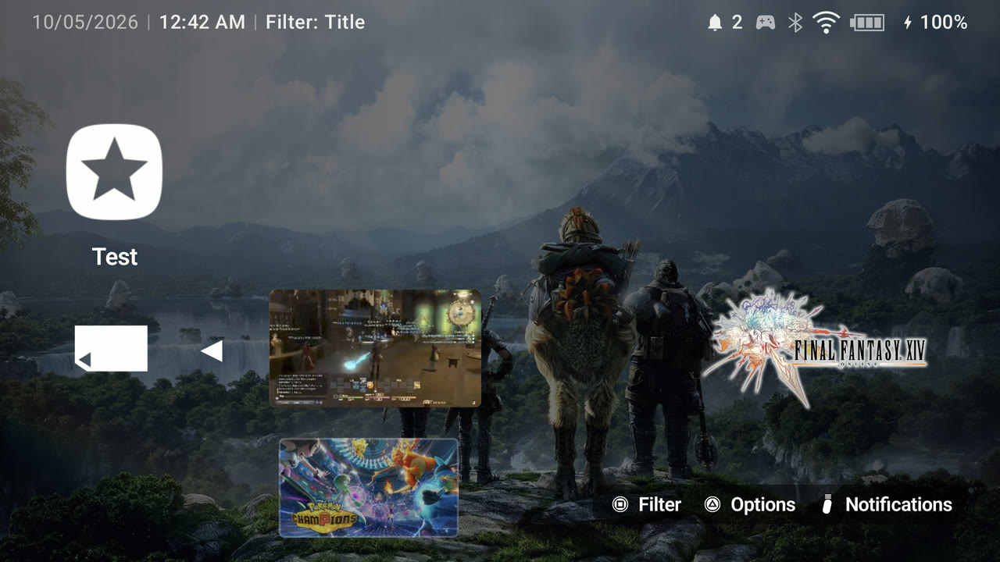 | 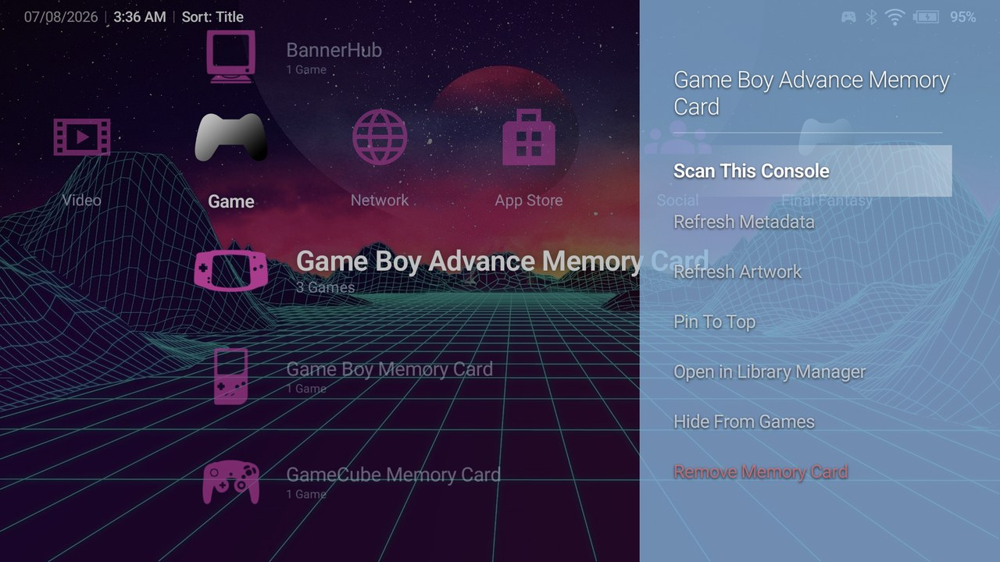 |
| A custom gaming category with its own icon and wallpaper | Memory Card options (△) — scan, refresh, pin, hide |
| 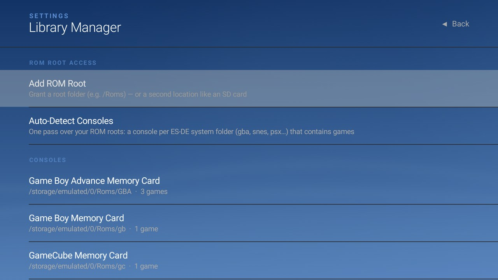 | 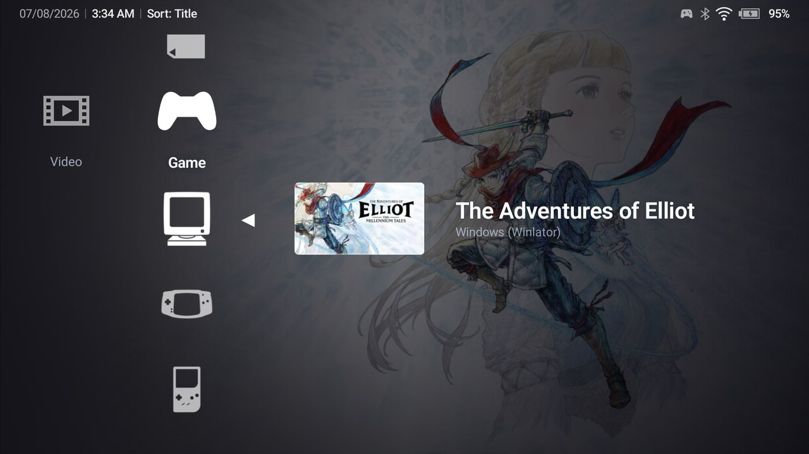 |
| Library Manager — ROM roots, per-console cards | PC-layer titles (Winlator) live next to console games |
| 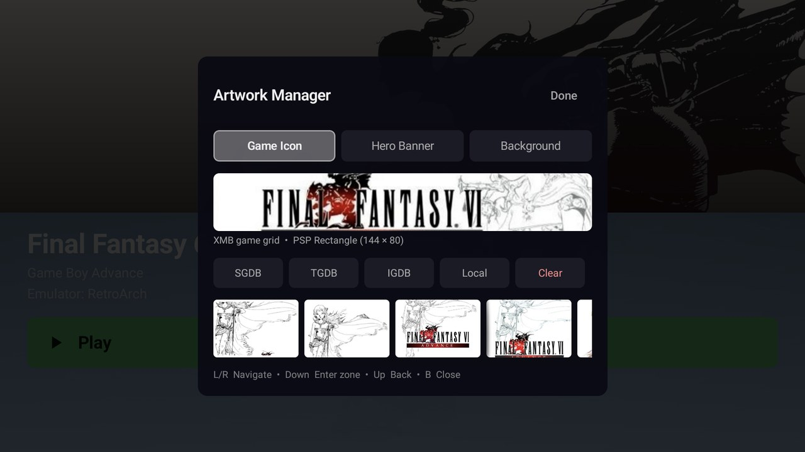 | 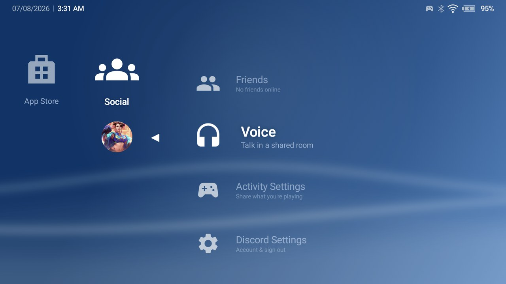 |
| Artwork Manager — SteamGridDB / TheGamesDB / IGDB / local | Social — Discord friends, voice, and activity |

### Media & more

| | |
|:---:|:---:|
| 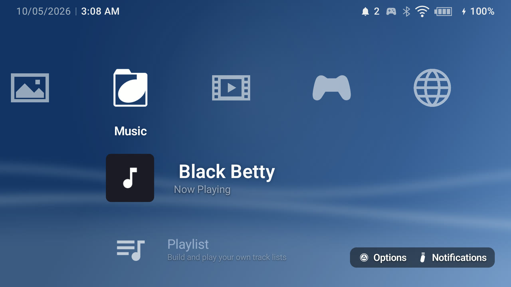 | 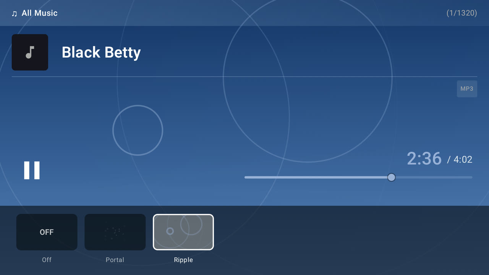 |
| Music section — Now Playing surfaces on the crossbar | The in-app player (background service keeps it going) |
| 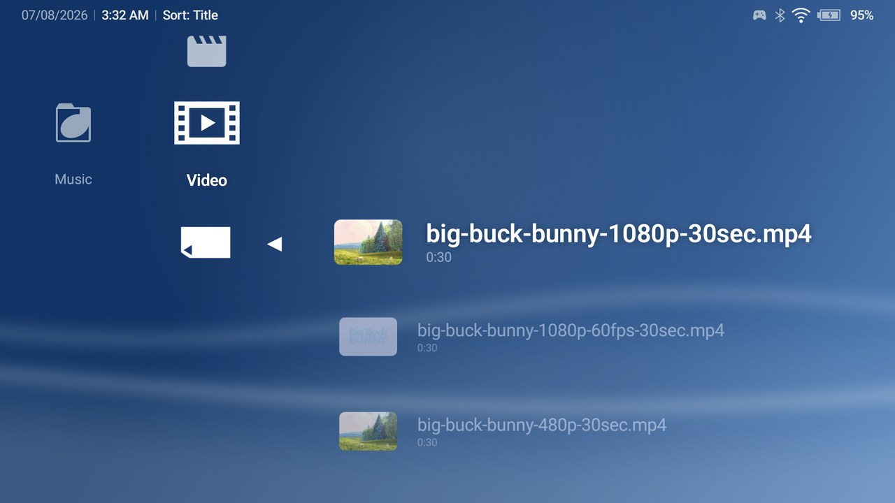 | 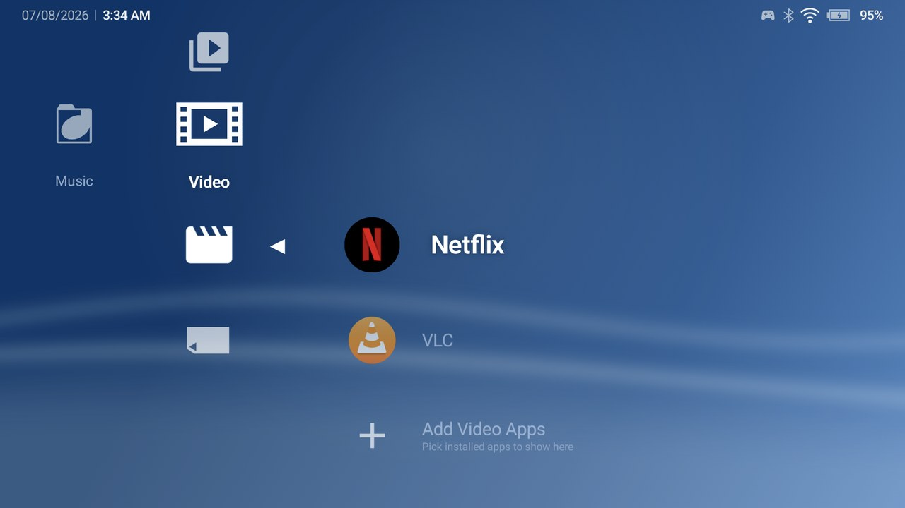 |
| Video library — scanned files with thumbnails | Video Apps — your installed players, one row away |
| 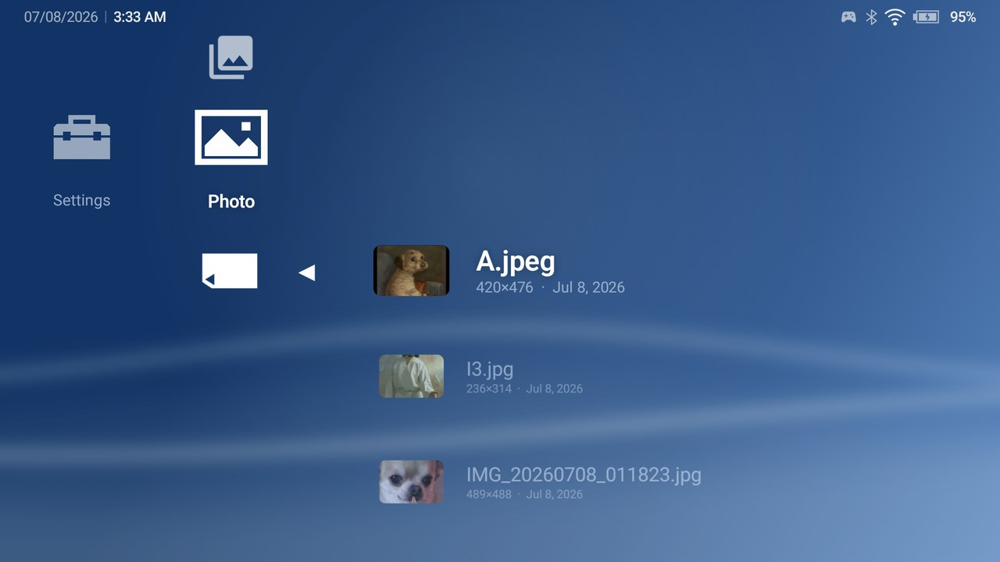 | 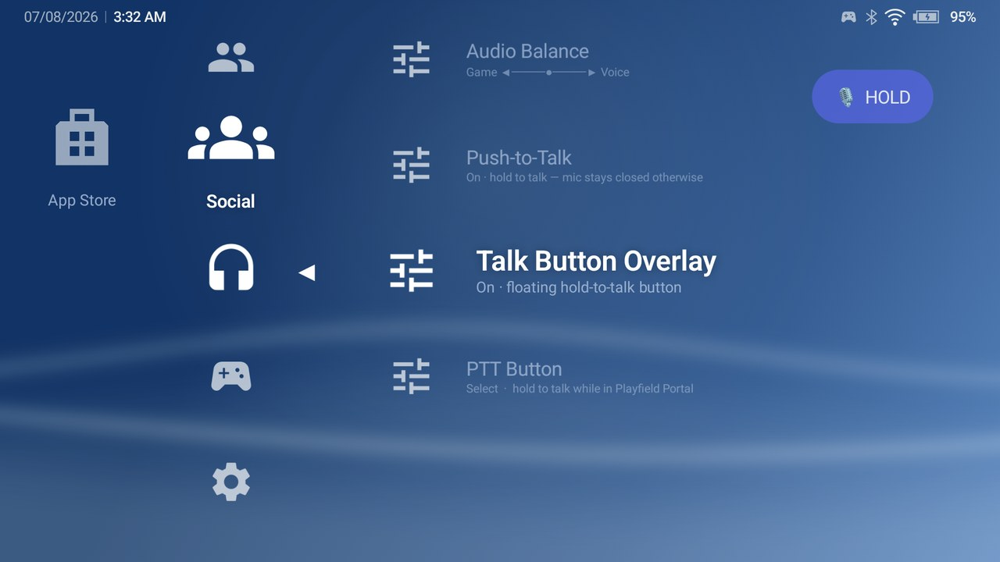 |
| Photo section — albums and a fullscreen viewer | Push-to-talk with the floating Talk button overlay |

*Screenshots predate 1.3.0; some Settings screens have since been reorganized (see
[§4.25](#425-settings-reference)).*

---

## Table of contents

1. [What is Play Field Portal?](#1-what-is-play-field-portal)
2. [Getting started](#2-getting-started)
   - [2.1 Requirements](#21-requirements)
   - [2.2 Choose an edition (Full vs Lite)](#22-choose-an-edition-full-vs-lite)
   - [2.3 Install the APK](#23-install-the-apk)
   - [2.4 Set PFP as your home screen (Optional)](#24-set-pfp-as-your-home-screen-optional)
   - [2.5 Permissions](#25-permissions)
   - [2.6 First-run setup](#26-first-run-setup)
3. [Navigation & controls](#3-navigation--controls)
4. [Feature guide](#4-feature-guide)
   - [4.1 The Game library](#41-the-game-library)
   - [4.2 Setting up a console (Memory Card)](#42-setting-up-a-console-memory-card)
   - [4.3 Emulators](#43-emulators)
   - [4.4 Emulator knowledge (updates, import, export)](#44-emulator-knowledge-updates-import-export)
   - [4.5 Favorites & Custom Memory Cards](#45-favorites--custom-memory-cards)
   - [4.6 Game & app options (△)](#46-game--app-options-)
   - [4.7 Artwork & the Artwork Studio](#47-artwork--the-artwork-studio)
   - [4.8 Icon display modes & video snaps](#48-icon-display-modes--video-snaps)
   - [4.9 Android apps & non-gaming categories](#49-android-apps--non-gaming-categories)
   - [4.10 The App Drawer](#410-the-app-drawer)
   - [4.11 Music, Video & Photo](#411-music-video--photo)
   - [4.12 Categories](#412-categories)
   - [4.13 Themes & personalization](#413-themes--personalization)
   - [4.14 Custom XMB icons](#414-custom-xmb-icons)
   - [4.15 Motion wallpapers](#415-motion-wallpapers)
   - [4.16 Sound, ambience & boot videos](#416-sound-ambience--boot-videos)
   - [4.17 The notification panel](#417-the-notification-panel)
   - [4.18 Discord Social (Full edition)](#418-discord-social-full-edition)
   - [4.19 Adjusting the layout for your screen](#419-adjusting-the-layout-for-your-screen)
   - [4.20 Backup & Restore (temporarily unavailable)](#420-backup--restore-temporarily-unavailable)
   - [4.21 Shiba Coins (achievements)](#421-shiba-coins-achievements)
   - [4.22 Tracking local (Steam-emulated) PC games](#422-tracking-local-steam-emulated-pc-games)
   - [4.23 Tracking PS3 trophies (ARMSX3)](#423-tracking-ps3-trophies-armsx3)
   - [4.24 Tracking Xbox 360 achievements](#424-tracking-xbox-360-achievements)
   - [4.25 Settings reference](#425-settings-reference)
5. [Permissions & privacy](#5-permissions--privacy)
6. [Troubleshooting](#6-troubleshooting)
7. [For Developers](#for-developers)
   - [7.1 Tech stack](#71-tech-stack)
   - [7.2 Prerequisites](#72-prerequisites)
   - [7.3 Get the code & open it in Android Studio](#73-get-the-code--open-it-in-android-studio)
   - [7.4 Build variants & flavors](#74-build-variants--flavors)
   - [7.5 Run & debug from Android Studio](#75-run--debug-from-android-studio)
   - [7.6 Release signing](#76-release-signing)
   - [7.7 Keeping this manual current](#77-keeping-this-manual-current)
   - [7.8 Command-line builds & the `dist` task](#78-command-line-builds--the-dist-task)
   - [7.9 The Theme Studio desktop app](#79-the-theme-studio-desktop-app)
   - [7.10 Module structure](#710-module-structure)
   - [7.11 Testing](#711-testing)
   - [7.12 Emulator knowledge releases](#712-emulator-knowledge-releases)
   - [7.13 Parked features](#713-parked-features)
8. [Credits](#8-credits)
9. [License](#9-license)

---

## 1. What is Play Field Portal?

Play Field Portal is a **home-screen replacement** for Android handhelds, tablets and phones that
gives your whole library the look and feel of a PlayStation Portable. It is a unified game
frontend: ROM emulation, Android games, PC-layer titles and native apps brought together under one
cohesive interface that feels like the golden era of handheld gaming. Everything is one crossbar
away and fully controller-navigable:

- **Games** — ROMs launched through the emulators you already have installed, Android games, and
  PC-layer titles (Winlator and friends), unified under one **Game** category.
- **Media** — Music, Video and Photo sections that scan folders you choose.
- **Apps** — your installed apps, organized into categories you design.
- **Achievements** — **Shiba Coins**, one coin wallet across RetroAchievements, Steam, emulated
  Steam PC games and ARMSX3 PS3 trophies.
- **Personalization** — a deep theme system (custom wallpapers, one-color palettes, imported PSP
  themes), replaceable icons, sounds and boot videos, plus a desktop **Theme Studio** for authoring.

It is **local-first**: no account, no telemetry, and the network is only touched by features you
turn on or connect. Every destination is listed in [Permissions & privacy](#5-permissions--privacy).

---

## 2. Getting started

### 2.1 Requirements

| | |
|---|---|
| **Android version** | 10 (API 29) or newer |
| **Form factor** | Phones, handhelds, tablets, and foldables (the layout adapts to each) |
| **Input** | A game controller is recommended; full touch navigation is also supported |
| **Emulators** | Installed separately — PFP launches them, it does not emulate anything itself |

### 2.2 Choose an edition (Full vs Lite)

PFP ships in two editions. You can tell which one is installed under
**Settings › System › About › Edition**.

| Edition | Includes | Download size |
|---|---|---|
| **Full** | Everything, including the **Discord Social** section (friends, presence, voice chat) | Larger |
| **Lite** | Everything **except** Discord Social (the Social column is hidden) | ~44 MB smaller |

Choose **Lite** if you do not want Discord integration or want the smallest download.

### 2.3 Install the APK

PFP is distributed as a **side-loaded APK** (it is not on the Google Play Store).

1. Download the APK for your chosen edition (`PlayFieldPortal-<version>-full.apk` or
   `-lite.apk`).
2. Open the file on your device. Android will ask you to allow installs from your browser or file
   manager the first time — approve it.
3. Tap **Install**.

> Building the APK yourself instead? See [For Developers](#for-developers).

### 2.4 Set PFP as your home screen (Optional)

PFP registers as an Android **HOME** launcher.

1. Press the **Home** button.
2. When Android asks which launcher to use, pick **Play Field Portal** and choose **Always**.

You can change this later under *Android Settings › Apps › Default apps › Home app*. The setup
wizard also offers a **Home App** page when PFP is not the default yet.

> A few features (importing game shortcuts from other launchers, capturing pinned shortcuts)
> require PFP to be the **active default launcher**.

### 2.5 Permissions

PFP does **not** ask for a runtime permission at first start. Its notifications are launcher-only
(see [§4.17](#417-the-notification-panel)); the one Android-shade item left, music playback, is a
media-session notification that needs no notification permission.

Optional permissions, requested only when you use the feature that needs them:

- **Usage access** — powers the *Recently Used* filter in the App Drawer.
- **Display over other apps** (Full edition) — only for the floating push-to-talk button during
  Discord voice chat.
- **Media access** on older Android versions — only for a handful of legacy raw-path libraries.

Folders (ROMs, media, artwork, themes) are always granted one at a time through Android's folder
picker. Full detail in [Permissions & privacy](#5-permissions--privacy).

### 2.6 First-run setup

On a fresh install PFP opens a guided **setup wizard**. Pages, in order (optional pages appear only
when they apply):

1. **Welcome** — what the wizard will set up.
2. **Controller** — button layout and prompt style.
3. **ROM folders** — grant one or more root folders; consoles live in subfolders under them.
   Picking a root starts the same auto-detect scan Library Manager runs (see [§4.2](#42-setting-up-a-console-memory-card)).
4. **Music / Video / Photo** — one optional root per media section (multi-root supported).
5. **Artwork** — the artwork library folder, with an embedded import offer.
6. **Online Services** — connect SteamGridDB and IGDB, plus the ScreenScraper *user* account
   (each optional; IGDB and ScreenScraper credentials are tested live).
7. **Achievement Services** — RetroAchievements and Steam accounts.
8. **Local Achievements** — the data folders of the emulators PFP reads achievements from (Vita3K,
   the ARMSX3 PS3 folder, X360 Mobile, XenDroid), shown only when at least one of them is installed.
9. **RetroArch** — shown only when RetroArch is installed.
10. **Emulators** — shown only when a standalone emulator PFP knows is installed.
11. **Windows Games** — shown only when a recognized PC launcher is installed.
12. **Hints & Touch**.
13. **Home App** — shown only when PFP is not already the default launcher.
14. **Finish** — a summary of what was set.

Every page can be skipped, and everything it configures is the same setting you can reach later in
Settings — the wizard is just a shortcut. Run it again any time from
**Settings › System › Setup Wizard**.

> ScreenScraper additionally requires a **developer ID/password** pair. PFP ships with an
> obfuscated built-in pair, so scraping works out of the box — nothing to enter or configure.

---

## 3. Navigation & controls

PFP is built for a controller but works fully with touch.

| Action | Controller | Touch |
|---|---|---|
| Move between items | D-Pad / Left Stick | Tap an item |
| Switch category (left / right) | D-Pad ◀ ▶ | Tap the category |
| Select / launch / open | **A / ✕** | Tap |
| Back / close / exit a folder | **B / ◯** (and D-Pad ◀ in XMB folders and flyouts — see below) | On-screen Back / left-edge swipe / swipe left in a folder or flyout |
| Options (context) menu | **Y / △** (or long-press) | Long-press |
| Switch App-Drawer tabs | **L1 / R1** | Tap a tab |
| Notification panel | **Start** on the crossbar | The bell in the status bar |
| Confirm in pickers | **Start** | Confirm button |

**D-Pad ◀ backs out of XMB folders and flyouts.** Inside a crossbar folder or a flyout (including
the Settings section flyouts on the crossbar), LEFT leaves one level — but only where LEFT is not
already doing something, so nothing it used to do is taken away. Turn it off in
*Settings › Interface › Controller › Left Backs Out*. The touch equivalent — a leftward swipe
inside a folder or flyout — is always on, like the left-edge pull.

**LEFT never leaves a Settings screen or a wizard page.** On those screens LEFT only steps into a
row's inline buttons or adjusts a slider; use **B / ◯** (or Back) to leave. On a Settings screen or
a wizard page, a drag anywhere scrolls the page, including on the header and the footer.

The **horizontal bar** is your categories — by default **Settings, Photo, Music, Video, Game,
Network, App Store** (plus **Social** in the Full edition) and any custom ones. The **vertical list**
under the selected category is its items. While any menu, settings screen, picker or dialog is open,
the crossbar is locked — input only drives the overlay on top.

*Settings › Interface › Controller* holds **A / B Swap**, **X / Y Swap**, the controller **Type**
(which button icons the prompts show), **Scroll Speed**, **Left Backs Out**, the controller
**Virtual Keyboard**, and **Reset All Controller Settings**.

---

## 4. Feature guide

### 4.1 The Game library

**Where:** the **Game** category on the crossbar.

Selecting **Game** shows, in order:

1. **The UMD slot** — one game, like a disc in a PSP's drive. It shows the UMD icon until you
   focus it, when it becomes the game's own icon over the game's artwork. Put a game in it with
   **△ › Insert as UMD** and take it out with **Eject UMD**. What it shows when nothing is
   inserted is set by *Settings › Interface › Display › UMD Slot* (Off / Inserted /
   Inserted & Recent).
2. **All Games** — every real game across all consoles, aggregated. Only actual games appear here;
   Android / Video / Music apps never show up automatically.
3. **Favorites** — appears directly under All Games **only when you have favorited at least one
   game**, and hides again when you have none.
4. **Your Custom Memory Cards** — cards you make yourself (see
   [4.5](#45-favorites--custom-memory-cards)).
5. **Memory Cards** — one row per console you have configured.

That is the default order. Press **X / □ › Custom** to arrange the rows yourself (see
[Sorting and arranging lists](#sorting-and-arranging-lists)).

Open All Games, Favorites, a custom card, or a console to drill in; press **B / ◯** to go back. On
wide and foldable screens the crossbar slides to the left edge while drilled in, giving the game
list and its artwork the center-right of the screen.

### 4.2 Setting up a console (Memory Card)

**Where:** *Settings › Library › Library Manager* · **Network:** None · **Default:** nothing is
scanned until you add a ROM root.

Consoles are added as **Memory Cards** and managed entirely through your **ROM Root** —
one folder grant covers every console; there is no per-console folder picking. PFP never
scans your whole device.

**The fast path — add a ROM root.** *Library Manager › Add ROM Root* grants the folder and
immediately auto-detects it (relinking a root does the same): PFP walks the root's ES-DE system folders (`gba`, `snes`, `psx`, …),
creates a Memory Card for every folder that actually contains games, and loads them in one scan. It
also sets up the **Windows Memory Card** (wiring `<root>/windows` and its `import/` drop folder, and
importing any exported PC games). The first-run wizard's ROM-folders page runs the same pass.

Starting from an empty folder? **Set Up ROM Folders (ES-DE)** creates the standard ES-DE system
folders inside a folder you pick and makes it your ROM root; copy your games in and the next scan
picks them up.

**Adding one console by hand:**

1. *Library Manager › Add Console* (requires a ROM root).
2. **Choose Platform** (NES, SNES, PSP, PS2, Dreamcast, Xbox 360, …). The console's
   folder is derived from the root automatically — an existing recognized subfolder if
   one is there, otherwise the standard ES-DE folder name.
3. **Assign Emulator** — this becomes the console's default. (Windows skips this step;
   PC games go through your installed PC launchers instead.)
4. **Scan Now**, or **Add Without Scanning** and scan later.

Manage a card any time from *Library Manager* by selecting it: rename it, change its emulator,
edit its supported file extensions, hide/show it, **Scan This Console**, or remove it (ROM files on
disk are never deleted). Library-wide passes live here too: **Scan All Consoles** (add-only) and
**Re-Scan All (Remove Missing)**, which additionally removes entries whose ROM file has vanished —
behind a confirm step, and skipped for any console whose folder cannot be read, so an unmounted SD
card never wipes a library.

> **When scans happen.** There is no filesystem watcher. Besides the manual actions above, PFP
> runs an incremental rescan (including auto-detect of new console folders) when the app resumes —
> at most once every 5 minutes — and shortly after storage is mounted or a USB device is
> disconnected. ROMs on removable SD cards / USB volumes are supported.

### 4.3 Emulators

**Where:** *Settings › Emulators* (**Installed**, **Custom Emulators**, **RetroArch**,
**Per-System Defaults**, **Emulator knowledge**) · **Network:** None (see [§4.4](#44-emulator-knowledge-updates-import-export)
for knowledge updates) · **Default:** detection runs on every start.

PFP launches games through **external emulator apps** — install the emulators you want and PFP
detects them automatically on startup from its **emulator knowledge base** (84 emulators built in),
plus one profile per installed **RetroArch** core. A selection of what is recognized out of the box:

| System | Emulators |
|---|---|
| PSP | PPSSPP (including Gold) |
| PS1 | DuckStation, ePSXe, FPse, ARMSX1 |
| PS2 | NetherSX2 / AetherSX2, ARMSX2, Play! |
| PS3 | aPS3e, ARMSX3 |
| PS Vita | Vita3K |
| GameCube / Wii | Dolphin (and the MMJR / PrimeHack builds) |
| Wii U | Cemu |
| Nintendo DS | melonDS, DraStic, NooDS |
| Nintendo 3DS | Azahar, Citra, Lime3DS, Mandarine, Borked3DS, Panda3DS |
| Switch | Eden, Yuzu, Sudachi, Citron, Suyu and related builds, Skyline |
| N64 | M64Plus FZ, Mupen64Plus-AE |
| GB / GBC / GBA | mGBA, My Boy!, My OldBoy!, Pizza Boy, GBA.emu, GBC.emu |
| NES / SNES / Genesis / Saturn / PC Engine / Neo Geo / WonderSwan / Lynx / C64 | the `*.emu` family, Snes9x EX+, Yaba Sanshiro 2 |
| Arcade | MAME4droid |
| Dreamcast | Flycast, Redream |
| Xbox / Xbox 360 | X1 BOX (xemu) / X360 Mobile, aX360e, XenDroid |
| Anything with libretro cores | RetroArch (one profile per installed core) |

The full list is the file `feature/feature-launcher/src/main/assets/emulator_kb/emulators.json`.
Winlator and GameHub shortcut profiles for PC games are separate and always present.

**Which emulator launches a game?** PFP resolves it in priority order:
**per-game override → Memory Card emulator → the platform default → first available.** Set a
per-game emulator from a game's **△** options; set a console default in *Library Manager* or
*Per-System Defaults*.

You never have to guess which of those won. A game's detail screen shows the emulator, the core,
and *where the choice came from* — with a tap to change it right there.

**Per-System Defaults** (*Settings › Emulators › Per-System Defaults*) is the overview: every
console with its default emulator and core, how many games it covers, and badges for the two states
that break launches — **NO EMULATOR** (nothing installed can run this system) and **CORE MISSING**
(the emulator is there, but the RetroArch core it needs is not). You can also clear per-game
overrides in bulk for one console from here.

**When a launch fails**, PFP tells you instead of dropping you back at the crossbar. It checks
before launching that the emulator still exists, that PFP still has permission to read the ROM —
both of which an OS or emulator update can quietly revoke — and, when an emulator entry pins a
signing certificate, that the installed app carries it. It verifies afterwards that the emulator
actually came to the foreground. If something goes wrong you get a recovery sheet: retry, switch
emulator or core, jump to Per-System Defaults, or copy a diagnostic you can paste into a bug report.

**Custom emulators** — for anything the knowledge base does not know, *Settings › Emulators ›
Custom Emulators › Add Custom Emulator* walks you through it: pick an installed app, let PFP
auto-detect its launch settings, edit any field, **Test Launch** with a real ROM, then save. The
result is usable as a platform, Memory Card, or per-game emulator. A launch is always an Android
intent (open the file, or open a specific screen of the app); **custom-command profiles are no
longer supported** and are refused at launch.

**RetroArch** — *Settings › Emulators › RetroArch* links RetroArch's folder so PFP can verify which
cores are installed (**Re-scan Installed Cores** after downloading more; **Unlink RetroArch** to go
back to offering all cores unverified).

### 4.4 Emulator knowledge (updates, import, export)

**Where:** *Settings › Emulators › Emulator knowledge* · **Network:** only *Check for updates* /
*Automatic updates* (GitHub — see below), and **not available in this build** · **Default:**
built-in knowledge only.

The **emulator knowledge base** is the list of emulators PFP recognizes and how to launch each one
(package names, the screen to open, the extras to pass, which consoles it runs). It is **data, never
commands**, and it is built from up to three layers, later layers winning:

1. **Built-in** — ships inside the app (84 emulators).
2. **Official updates** — a signed file published by the PFP project.
3. **Your files** — knowledge files you import yourself.

Your own edits to an emulator's profile always win over all three.

**The screen, top to bottom**

- **Status** — which knowledge is in force: *Built-in only*, or *Official v<label> · verified ·
  N emulators · checked …* with a green check. The last failed check's reason shows under it.
- **New file types** — appears when knowledge gave a console new ROM file extensions (for
  example *PlayStation 2: chd, cso*). Rescan your library to pick them up.
- **Updates › Check for updates** / **Automatic updates** — fetch signed official files.
  > **Not available in this build.** No release signing key is pinned yet, so both rows read
  > *Not available in this build* and nothing is ever downloaded. When a key is pinned in a future
  > build: updates come only from the `emulator-kb` release of `JohnnyCollado/PlayFieldPortal` on
  > GitHub, every file must carry a valid Ed25519 signature from that key, automatic checks run at
  > most once a day (on by default, switchable), and an update older than one already accepted is
  > refused.
- **Files › Import a knowledge file** — pick a `.json` with Android's file picker. Imported files
  are **not signed**, so PFP shows a review before anything is stored:
  - **New emulators** — *Add …*, ticked by default.
  - **Already on this device** — *Override …*, **unticked** by default, with a line-by-line diff of
    what would change. Badges warn when the override replaces built-in/official knowledge
    (**Overrides official**) or an emulator you edited yourself (**Your edit**).
  - **Consoles** — *Update …* to add ROM extensions to a console, unticked by default.
  - **Blocked** — entries that cannot be imported, each with its reason (for example a system
    package, a custom command, or a signer that differs from the installed app).
  - Confirm with *Import N emulators* (or *Update N consoles*); Cancel stores nothing.
- **Your files** — every imported file with its emulator count; the trash action removes it (after
  a confirmation). Built-in and official knowledge are not affected.
- **Export your files** — opens **Export your emulators**: pick which of your **custom emulators**
  and **edited official emulators** to share, then save them as one `.json` (suggested name
  `pfp-emulators.json`). Only launch settings are saved — **no game list, ROM paths or account
  details**. Anything that could not be imported elsewhere is listed under *Can't be shared*.
- **Reset › Reset to built-in** — drops downloaded updates and every imported file, after a
  confirmation. The built-in knowledge is kept.

**What knowledge can and cannot change**

- Knowledge can only **add** ROM extensions to a console; it never removes one, and it never
  touches a console or Memory Card whose extension list you customized. Removing a file or resetting
  does not take extensions back.
- Every launch is an explicit target (an Android intent to a named app). Knowledge cannot run
  commands, cannot target Android system packages or PFP itself, and cannot use shortcut launches.
- An entry may pin the emulator's signing certificate. If the installed app is signed differently
  (a look-alike or tampered build), PFP refuses to import that entry and refuses to launch with it.
- Files are size-capped (1 MB, at most 500 emulators and 32 imported files) and strictly validated
  — on import and again every time they are loaded.

**Controls:** standard Settings controls; in the review and export lists, **A / ✕** ticks a row.

### 4.5 Favorites & Custom Memory Cards

**Where:** a game's **△** menu, and *Settings › Library › Custom Memory Cards* ·
**Network:** None.

- **Favorites** — mark any game from its **△** options (*Favorite*, shown On / Off). A **Favorites** folder
  appears under All Games and hides automatically when empty.
- **Custom Memory Cards** — cards you make yourself (e.g. "RPGs", "Currently Playing"), formerly
  called Collections. A game can live on several at once. Create one from
  *Settings › Library › Custom Memory Cards › New Custom Memory Card* or a game's
  **△ › Add to Card ›**; toggle membership with a ✓. The picker lists the cards of the category
  you are in first. Deleting a custom card never removes its games.
- **Several games at once** — in any game list choose **△ › Select Multiple**, mark games with
  **A / ✕**, then press **Y / △** to add them all to one card.

### 4.6 Game & app options (△)

Press **Y / △** (or long-press) on any item for its **Options** menu. This works the same
everywhere: XMB rows, the App Drawer, the category icons on the bar, the detail screens, the
video player, and rows in Settings (Saved Themes, custom-card games, Library Manager folders and
extensions). Where a row has an Options menu, the footer prompt reads **Options** (the idle hint
can be turned off in *Settings › Interface › Display › Options Hint*).

**How every menu behaves**

- **One panel** — every Options menu looks and moves the same. Rows are grouped under small
  headers (Play, Library, Arrange, Customize, Manage) where a menu is long.
- **Settings are values, not glued into the label** — a row shows its current value beside its
  name (*Sort  Title A–Z*, *Change Emulator  Default*, *Icon Display  Global*).
- **Toggles keep one name and show On / Off** — *Favorite  On*, *Pin to Top  Off*, *Show on Bar  On*.
- **› means a sub-list** — *Add to Card ›*, *Move to Category ›*, *Sort ›* open a second list;
  **B / ◯** climbs back up one level.
- **Destructive rows are red, last, and confirm** — *Remove from Library*, *Remove Card*,
  *Delete Custom Card*, *Delete Playlist*, *Uninstall* ask first, and the confirmation opens
  on **Cancel**. Reversible removals (*Remove from Card*, *Remove from Category*, *Hide*) are
  not red; they undo from Hidden Games or by adding the item back.
- **Back climbs, Triangle closes** — **B / ◯** goes up one level and closes at the top;
  **Y / △** closes the whole menu from any depth. Movement stops at the ends (no wrap).
- **Sounds** — moving, opening, committing and backing out each have their own cue
  (Favorite is silent).
- **No repeat rows** — opening a menu with a controller does not list what **A / ✕** already
  does (*Launch*, *Open*); those rows appear when you open the menu by touch.

**What each menu offers**

- **Games** — *View Game Details*, *View Shiba Coins*, *Change Emulator*, *Choose Disc*, UMD
  insert / eject, *Favorite*, *Add to Card ›*, *Remove from Card*, *Select Multiple*,
  *Pin to Top*, *Move*, *Add to / Move to / Remove from Category*, *Icon Display*,
  *Fetch Artwork*, *Manage Custom Cards*, *Show File Location*, *Hide from …* and
  *Remove from Library*. Windows games add *Install Goldberg Achievements* and *Export Game*.
  The **Game Detail** screen's Options menu adds *Artwork Studio*, *Update Metadata*,
  *Edit Title*, *Edit Note*, *Store Match* and *Export Game*, grouped under Artwork /
  Information / File.
- **Memory Cards** — *Scan for Games*, **Update Metadata** (text-only pass, artwork
  untouched), **Fetch Missing Artwork** (fills only games missing primary art), *Icon
  Display*, *Sort*, *Pin to Top*, *Move*, *Library Manager*, *Hide Card* and *Remove Card*.
  The Windows card adds **Import PC Games** and *Match Achievements*, and cannot be removed.
- **Custom Memory Cards** — *Sort*, *Pin to Top*, *Move*, *Rename Card*, *Move to Category ›*,
  *Manage Custom Cards*, *Delete Custom Card*.
- **All Games** — *Scan All Cards*, *Update Metadata*, *Fetch Missing Artwork*, *Relink
  Artwork*, *Icon Display*, *Sort* and *Global Sort*.
- **Android apps** (XMB and App Drawer) — *Edit App Details*, *Mark as Game*, *Favorite*,
  *Add to Card ›*, *Pin to Top*, *Move*, *Move to / Add to / Remove from Category*,
  *Rename Shortcut*, *Hide from …*, *Hide Everywhere*, *App Info*, and *Uninstall* (not for
  system apps). The App Drawer shows the subset that makes sense there.
- **Category icons** — long-press (or **Y / △** on) a category on the bar for *Rename
  Category*, *Change Icon ›*, *Show on Bar*, *Move* and *Manage Categories*.
- **Music, Video and Photo rows** — playlists add *Rename Playlist* and *Delete Playlist*;
  tracks, videos and photos use *Remove from Library*.

The full **Game Detail** and **App Detail** screens also show hero art, metadata,
screenshots, publisher, and total play time.

### 4.7 Artwork & the Artwork Studio

**Where:** *Settings › Library › Artwork*, and a game's **Artwork** button / **△ › Artwork Studio**
· **Network:** the artwork sources you configure (SteamGridDB, ScreenScraper, TheGamesDB, IGDB), plus
the Steam and GOG storefronts for *Store Match* · **Default:** fetched only on request.

Box art, hero banners, logos, screenshots and icons are fetched **on request**. Add a free
**SteamGridDB** key (and optionally TheGamesDB / IGDB) in *Settings › Library › Artwork*.

- **Quick scrape** — *Artwork* offers **Re-Scrape All Games**, **Scrape Missing Games Only** and
  **Cancel Scrape**. "Scrape Missing" fills only the gaps and never overwrites existing art. Source
  priority, art preferences (heroes, logos, manuals, video snaps, region) and per-source keys live
  on the same screen.
- **Artwork Studio** — from a game's **Artwork** button, a full-screen, controller-first editor with
  a tab per artwork kind (ICON0, ICON1, Box Art, 3D Box, Physical Media, Hero, Background, Logo,
  Screenshot, Manual, Video). Each tab can pull from **ScreenScraper, SteamGridDB** (with an NSFW
  filter), **TheGamesDB, IGDB,** and **Local File**. Preview a candidate before applying (videos
  play a muted loop, manuals page through), then commit. Press **Start** for per-slot actions:
  Adjust Crop, Restore Previous, Reset to Scraped Default, Clear, and File Info.
- **Crop / position editor** — an aspect-locked frame per kind with the image panning and scaling
  behind it. Crops bake into the displayed file while the untouched original is kept for lossless
  re-crops.

**Portable artwork library** — in *Settings › Library › Artwork › Artwork Folder & Import* you can
point PFP at a folder it keeps in an **ES-DE-compatible** layout, so your art is user-owned and
readable by other frontends with no export step. The same screen imports ES-DE `downloaded_media`
(and `gamelist.xml` metadata), relinks moved files, and exports for ES-DE.

#### Folder layout

The library is a clean two-folder root. Everything under `Artwork/` is a standard ES-DE
`downloaded_media` tree, so you can point ES-DE (or any frontend) straight at
`{Artwork Folder}/Artwork` with no export step.

```text
{Artwork Folder}/
├─ pfp-artwork-library.json        manifest — marks this folder as a PFP library
├─ Import/                         drop zone for other launchers' media (see below)
│   └─ {Launcher}/ …               an ES-DE downloaded_media tree
└─ Artwork/                        the library — ES-DE downloaded_media shape
    └─ {platformId}/               e.g. ps2, snes, psp
        ├─ covers/                 box art        →  {PortableName}.{ext}
        ├─ miximages/              hero
        ├─ fanart/                 background
        ├─ marquees/               logo
        ├─ screenshots/            screenshot
        ├─ titlescreens/           title screen
        ├─ physicalmedia/          cartridge / disc
        ├─ 3dboxes/                3D box
        ├─ manuals/                PDF manual
        ├─ videos/                 video
        └─ pfp/                    PFP-only namespace (skipped by scan & export)
            ├─ icon0/              144:80 ICON art
            ├─ icon1/              icon video snap
            ├─ originals/{kind}/   untouched pre-crop copies (lossless re-crop)
            └─ versions/{kind}/    one-previous backup ("Restore Previous")
```

The `pfp/` namespace holds PFP-only assets that are not ES-DE media types; `versions/` and
`originals/` are nested per `{kind}` so a game's box-art and icon backups (same filename) never
collide. Incoming **videos** are transcoded locally into a 60-second `icon1/` snap — the full-size
file is never stored.

#### How import works

1. **Drop** another launcher's media under `Import/{Launcher}/` in an ES-DE `downloaded_media`
   shape.
2. **Match** — PFP detects it by structure and links each file to a game in three passes: exact ROM
   filename → display title → tag-stripped title. Ambiguities are reviewed, never guessed.
3. **File** into `Artwork/{platform}/{mediaDir}/{PortableName}.{ext}`. Same-volume transfers move
   with zero bytes copied; otherwise they copy. Existing or locked artwork is never overwritten.

| ES-DE folder | Imports as (PFP kind) |
|---|---|
| `covers` | Box Art |
| `miximages` | Hero |
| `fanart` | Background |
| `marquees` | Logo |
| `screenshots` | Screenshot |
| `titlescreens` | Title Screen |
| `physicalmedia` | Physical Media |
| `3dboxes` | 3D Box |
| `manuals` | Manual (PDF) |
| `videos` | Video → transcoded to an ICON1 snap |
| `backcovers` | Recognized as library structure, not imported |

### 4.8 Icon display modes & video snaps

**Where:** *Settings › Library › Artwork › Game Icon Display* (global), a Memory Card's **△ › Icon
Display**, or a game's **△ › Icon Display** · **Network:** None.

Every game tile can be drawn four ways — set a global default, then override per Memory Card or per
game:

- **Custom Icon** — the PSP-authentic 144:80 ICON0 fill.
- **Box Art** — the game's cover at its natural aspect.
- **Physical Media** — the platform's cartridge/disc shot.
- **3D Box Art** — a rendered 3D box.

In **Custom Icon** mode, resting on a game plays its **video snap** inside the icon (muted, capped at
60 seconds, then fading back to the still) — the PSP's ICON1.PMF revived. It is battery-conscious:
one shared player, skipped under Battery Saver, low battery, or thermal pressure, and gated by the
**Animated Icons** toggle (with a **Video Snap Delay**) in *Settings › Library › Artwork*.

### 4.9 Android apps & non-gaming categories

- **Add apps** to a section (App Store / Video / Music / Network / custom) via its **Add Apps** row.
- **App artwork** — apps show their launcher icon by default; give one custom art via
  **△ › Edit App Details › Icon** and it renders as a landscape tile. Apps stay tagged as apps, so
  they never appear in All Games.
- **Android games** — open the Android library card and choose **Find Games**; these are addable to
  custom memory cards but stay out of All Games.

### 4.10 The App Drawer

A bottom-right button (shown while using touch — see *Settings › Interface › Display › Touch
Navigation Button*) opens the **App Drawer**: all your apps with quick filters — **All Apps / Games /
Emulators / Tools / Recently Used** — switchable with **L1 / R1**. *Recently Used* needs Android's
usage access (optional).

### 4.11 Music, Video & Photo

**Where:** *Settings › Media › Music / Video / Photo* · **Network:** None.

Each media section is driven by **one or more root folders** you set in its Settings
screen (Android folder picker — no storage permission):

- **Music** — scan folders, browse `[cover] title / artist`, and play in a full-screen player with a
  **background service** and media-notification controls. Create and manage **playlists**. Choose the
  **Default Music Player** (Play Field Portal, System Default, or an app).
- **Video** — scanned libraries with thumbnails, Recently Watched / Favorites / Playlists, and a
  built-in player or your chosen external app (**Default Video Player**).
- **Photo** — scanned albums, a fullscreen viewer (zoom, pan, rotate, L1/R1 paging), and
  **Set as Launcher Wallpaper** (EXIF-stripped; location data is never read), and **Set as Lock
  Screen**, which asks first because it changes the device lock screen. *Clear Thumbnail Cache*
  lives in Photo settings.

Each section shows a single "＋ Add" getting-started row until a root has been added and scanned.

### 4.12 Categories

**Where:** *Settings › Interface › Categories*, or **△** on a category icon.

Categories are the horizontal bar.

- **Create** a category, choose a **content type** (Gaming = games & custom memory cards,
  Non-Gaming = apps), and pick an **icon** from the built-in set or your own image (PNG, JPG, WEBP,
  BMP, HEIC or GIF). The content type is fixed once the category exists.
- **Rename, move, hide/show,** or **delete** custom categories. Built-in categories are protected
  from deletion. Deleting a category that holds custom memory cards asks whether to move them to
  **Game** (or **App Store**, for an app category) or delete them too; its games and apps always
  stay in your library.

A **gaming** category opens on its own **Memory Card** — every game in the category, whether you
added it directly or it sits on one of the category's custom cards — followed by those custom
cards and **Add Games**. Like Main Game, it has a UMD slot at the top.

#### Sorting and arranging lists

Sorting works in tiers, the same way Icon Display does:

- **Global** — the default for every game list (**All Games › △ › Global Sort**) and for every
  app list (**X / □ › Global Sort** in an app column).
- **Per list** — each Memory Card, custom card and app column can take its own sort: **△ › Sort**
  on the card, or **X / □** inside it. **Use Global Setting** hands it back.
- **Custom** — your own order for that one list. It starts alphabetical; then **△ › Move** lifts
  a row, **▲ / ▼** slide it, **A / ✕** places it and **B / ◯** puts it back.

**Pin to Top** (in a row's **△** menu) keeps a row above the rest under any sort, and can be
switched off again. A column's top level can be arranged the same way — only the UMD slot and
the **Add** row stay where they are.

### 4.13 Themes & personalization

**Where:** *Settings › Interface › Themes* (colors and theme files) and *Settings › Interface ›
Display* (wallpaper, wave, legibility, fonts) · **Network:** None.

Built around one idea: *pick a background and one color — the whole crossbar follows* (wave,
gradient, cursor and icons all derive from it).

- **Color Scheme** — 12 PSP-style presets, previewed live on the real crossbar (including the
  month-cycling *Original*).
- **Icon Color** — one tint across every crossbar glyph: 8 curated swatches (*Default* is the
  native white) plus a **Custom** swatch that opens an HSV picker (Hue / Saturation /
  Brightness bars, adjustable by D-pad or touch). Game art, covers and app icons are never
  tinted.
- **New Theme from Photo** — any picture becomes the wallpaper; the theme color is auto-derived from
  its dominant hue.
- **Import PSP Theme (.ptf)** — convert an official PSP theme you own (wallpaper + derived color).
  CXMB firmware files are safely declined. **Import Theme (.pfptheme)** installs a shared theme.
- **My Themes** — your saved themes as cards: apply, **Share** (`.pfptheme`), or Remove. Applying
  asks first (*Apply "…"?*) and lists what would change. When the theme carries sounds, videos or
  icons you have already replaced with your own, you choose **Use the Theme's** (yours are removed
  for those, and a switched-off Boot Sequence or GameBoot is turned on for the theme's video) or
  **Keep Mine**; when the only question is a switched-off Boot Sequence or GameBoot, the choice is
  **Turn On** or **Leave Off**. A theme with a lock screen image then offers **Set Lock Screen**
  (focused on **Not Now** — it is opt-in).
- **Reset to Default** — removes the applied wallpaper, theme colors, custom icons, the theme's
  sounds and clips, and a lock screen image the theme set (one you picked yourself stays).
- **Display** — *Choose Wallpaper*, *Wave Style*, *Background Motion*, icon and text legibility,
  *Font Colour*, *Item List Motion*, and the *Biblically Accurate PSP XMB* preset.
- **Lock Screen** — *Settings › Interface › Display › Lock Screen* sets the **device** lock screen
  (a still image): *Choose Lock Screen Image* (PNG, JPG, WEBP), *Use Launcher Wallpaper* (a motion
  wallpaper's still frame), and *Reset Lock Screen* back to the device default. The image is
  center-cropped to the screen. It is not included in backups.

**Theme Studio** is a desktop companion (Windows / Linux / macOS) for authoring themes with a live
crossbar preview, an icon editor, wallpaper crop presets, crossbar alignment assist, an optional
lock screen image (Background section, with its own lock screen preview), and batch
`.ptf → .pfptheme` conversion. See [7.9](#79-the-theme-studio-desktop-app).

### 4.14 Custom XMB icons

**Where:** *Settings › Interface › Display › Customize XMB Icons* · **Network:** None.

Every glyph on the crossbar can be replaced with your own image — the category-bar icons, the menu
glyphs, and the per-console art on your Memory Cards. Around 55 theme slots plus one slot per
console.

The editor runs *live over your real crossbar*, so you are always looking at the actual result
rather than a preview pane:

- Move with the D-pad to the icon you want to change, press **✕** to pick an image.
- **△** clears the selected slot back to whatever the theme (or the built-in art) provides.
- Changes apply instantly. Back out when you are happy.

**What you can use**

| | |
|---|---|
| **Formats** | PNG, JPG, WEBP, BMP, HEIC, and animated **GIF** |
| **Size limit** | 8 MB per icon |
| **Animated GIFs** | 512 px or smaller, up to 120 frames, 10 seconds |

Animated icons only play on the row or column you are currently on, and stop entirely when battery
saver is on or a dialog is open — so a set of animated icons does not cost you frame rate while you
browse.

**Custom icons survive theme changes.** Applying a different theme swaps the theme's icons
underneath, but anything *you* picked stays on top. The order is always **your pick → the theme's
icon → the built-in art**. To get a theme's icon back, clear your pick for that slot with **△**.

**Saving your look** — *Settings › Interface › Themes › Save Current Look as Theme* bundles
everything as it currently draws (your picks already flattened in) into a shareable `.pfptheme`.
Your screen-layout adjustments are deliberately left out, since those are specific to your device.

### 4.15 Motion wallpapers

**Where:** *Settings › Interface › Display › Choose Wallpaper* · **Network:** None.

The crossbar background can be a looping video or animated image instead of a still. Pick one the
same way you pick a photo — choose a video file and PFP takes it from there, grabbing the first
frame as a poster still at import.

| | |
|---|---|
| **Formats** | MP4, WebM, and animated GIF |
| **Resolution** | 1080p or smaller |
| **Length** | Up to 60 seconds |
| **File size** | Under 60 MB |
| **Frame rate** | 30 fps or lower recommended |

The clip pauses to its poster still whenever motion would be wasteful or distracting — during
video playback, behind fullscreen overlays, and on battery saver (*Display › Battery Saver Mode*).
It is fully released rather than left paused in the background, so a motion wallpaper does not
quietly drain your handheld while you are doing something else.

Motion wallpapers can be authored into a shareable theme with the desktop **Theme Studio**, and
ride along inside the `.pfptheme` file.

### 4.16 Sound, ambience & boot videos

**Where:** *Settings › Interface › Sound* (volume, menu sounds, ambience) and
*Settings › Interface › Display* (Boot Sequence, GameBoot) · **Network:** None.

**Volume.** *Sound* has a **Master volume** (0 is the launcher's mute) and a level for each
launcher sound — the five menu sounds, Boot sequence, GameBoot and Ambience. Levels apply to
launcher sounds only; the built-in music and video players play at system volume.

**Menu sounds.** Each row has a **Preview** and can be returned to the PFP default:

| Row | Plays when | Max length |
|---|---|---|
| **Navigation** | Moving the cursor around the crossbar | 0.5 s |
| **Back / Cancel** | Backing out of anything | 1 s |
| **Confirm / Apply** | Committing a choice — picking apps or games, importing an icon, saving a theme | 1 s |
| **Error / Invalid** | A refused launch or a rejected import | 1 s |
| **Notification** | A row arrives in the notification panel | 2 s |

Audio can be MP3, WAV, OGG or M4A. **Reset Sound to Defaults** returns every menu sound and level to
the bundled defaults and keeps your ambience track.

**Ambience.** Assign an **Ambience Track** (30 seconds to 10 minutes) and it loops under the XMB
while you browse; no assignment means no ambience. It stops for a game launch, the music and video
players, and any other app that takes audio focus. OGG loops seamlessly; MP3 may click at the loop
point.

**Boot and GameBoot videos** (*Settings › Interface › Display*)

- **Boot Sequence** — *Show Boot Sequence* (and *on Resume*), plus **Boot Video**: supply your own
  video (up to 15 seconds) and it replaces the PFP logo animation, with its own audio. Press **✕**
  or **○** to skip it.
- **GameBoot** — the short presentation that plays as a game launches. Built in, it is a
  five-second light sweep timed to its own sound; supply a **GameBoot Video** (up to 10 seconds) and
  it replaces the whole thing, its own audio included. Switching GameBoot off gives a silent
  launch. If the presentation has not finished in time the game launches anyway — GameBoot can
  never hold your game hostage.

Video can be MP4 or WebM, up to 25 MB.

Boot Video, GameBoot Video and every sound row carry the same two controller shortcuts on the
focused row, bound to physical buttons so an X/Y swap cannot move them: the **north** button
(Y on Xbox/PlayStation pads, X on Nintendo) restores the PFP default, and the **west** button
(X on Xbox/PlayStation, Y on Nintendo) plays a preview.

### 4.17 The notification panel

**Where:** press **Start** on the crossbar, or tap the bell in the status bar; settings in
*Settings › Interface › Notifications* · **Network:** None.

PFP's notifications live inside the launcher, not in the Android shade. The panel has two halves:

- **RUNNING** — work in progress (scans, artwork and metadata passes, imports and exports,
  achievement updates) with its counts. Focus a task and press **✕** to stop it; PFP asks first
  (*Keep Running* is focused) and records what the stopped task finished.
- **EARLIER** — the history. Confirm opens a row: **Notes** rows explain what happened and what to
  do, with an error code (for example `LN-4003`); **Results** rows list every item the work
  touched, failures first (filter with **L1 / R1**). △ copies the details.

**△** on the list opens *Mark All Read*, *Clear Read* and *Clear All*. Clearing never stops running
work. *Settings › Interface › Notifications* holds **Record Notifications**, **Keep Entries For**,
**Mark All Read** and **Clear All**.

Requests from other apps to add a game shortcut are asked in a launcher dialog (Ignore is focused),
with a panel row to come back to.

### 4.18 Discord Social (Full edition)

**Where:** the **Social** category (Full edition only) · **Network:** Discord, only after you sign
in · **Default:** off until you connect; activity sharing off.

A **Social** column adds Discord integration:

- **Sign in by QR** — scan with your phone (OAuth device grant; no password typed on the handheld).
  Tokens are stored **encrypted** in the Android Keystore and refreshed automatically.
- **Friends** — avatars, presence, and what they are playing in PFP.
- **Activity sharing** — opt-in (default **off**), with a Generic Mode that shows only "a game".
- **Voice chat** — join rooms by code, invite friends, with noise cancellation, a Game↔Voice
  balance, and **push-to-talk** (a floating hold-to-talk button or a controller button you map).

Everything is inert until you connect, and presence is limited to this app.

### 4.19 Adjusting the layout for your screen

**Where:** *Settings › Interface › Display › Adjust XMB Layout* · **Network:** None.

PFP scales itself to fit your device automatically, including near-square foldable inner displays.
To fine-tune it, open the live editor over the real crossbar:

- **Scale** the whole interface, and **shift the crossbar** up/down and left/right.
- Drive it with the **D-Pad** (move), **L1 / R1** (scale), **Y** (reset), **A** (save), **B**
  (cancel) — or an on-screen **slider** panel.
- Each screen size keeps its **own** tuning, so a handheld and a foldable never share (and distort)
  one layout.

### 4.20 Backup & Restore (temporarily unavailable)

> **Backup & Restore is switched off in this build** while the backup format is reworked. It does
> not appear in Settings, and a link to it from an old notification does not open it. Android's
> own cloud backup stays disabled too, so there is currently **no built-in way to move a setup to a
> new device**. This section will return when the feature does.

What still moves with you today: your artwork library (it is a normal folder you own —
[§4.7](#47-artwork--the-artwork-studio)), themes you exported as `.pfptheme`, emulators you exported
from [Emulator knowledge](#44-emulator-knowledge-updates-import-export), and Windows games exported
as `.pfpgame` files.

### 4.21 Shiba Coins (achievements)

**Where:** *Settings › Achievements* (**Player Card**, **Provider Credentials**, **Local Windows**,
**Update Achievements**), the Player Card on the crossbar, and a game's Shiba Coins strip ·
**Network:** RetroAchievements; Steam (Web API, Store, Community); Steam Hunters — only for the
providers you connect · **Default:** off until you turn on **Enable Shiba Coins** and connect a
provider.

**Shiba Coins** turn achievements into a coin economy across your whole library. Turn on
**Enable Shiba Coins** and connect one or more providers:

| Provider | What it tracks | You supply |
|---|---|---|
| **RetroAchievements** | Retro console games with RA sets | RA username + Web API key |
| **Steam** | Games on your own Steam account | SteamID64 (or profile name) + Steam Web API key |
| **Local Steam** | Steam-emulated PC games run through Wine emulators | Steam Web API key (see [4.22](#422-tracking-local-steam-emulated-pc-games)) |
| **PS3 (ARMSX3)** | Trophies of PS3 games run in ARMSX3 | A folder grant (see [4.23](#423-tracking-ps3-trophies-armsx3)) |
| **Xbox 360** | Achievements of Xbox 360 games run in X360 Mobile or XenDroid | A folder grant (see [4.24](#424-tracking-xbox-360-achievements)) |

Each achievement earns a **bronze, silver, gold or platinum** coin by rarity (Xbox 360 coins by
gamerscore, since they have no rarity source); coins feed an account-wide wallet with **levels and ranks** shown on the **Player Card**.

- **What gets tracked** — games on *this device* that are matched to a provider. PFP never
  imports your whole RetroAchievements history or probes every game in your Steam account. A
  game you remove keeps its earned coins as history (marked *Not installed*) but is no longer
  refreshed.
- **Updating** — PFP checks installed games at most once a day while you use it, cheaply:
  RetroAchievements by progress summaries, Steam by the playtime Steam reports, Local Steam by
  reading the game's own progress file (and again right after you return from a game you
  launched from PFP). Only games that changed are fetched in full. A game's page refreshes
  itself when its data is more than a day old, and **Refresh this game** checks it now.
- **Player Card** — on the XMB and at *Settings › Achievements › Player Card*. Its menu holds
  **Update Installed Achievements**, which checks every installed, matched game. Confirm on the card
  opens the fullscreen **Player Status** view: level, rank and XP, Recent Achievements,
  your coin wallet, and your Rarest Achievement Unlocked — a recent unlock from a library
  game jumps straight to that game's coins screen.
- **Per-game coins screen** — from a game's Shiba Coins strip on Game Detail. Lists every
  achievement with its coin tier and unlock state; **X** cycles sorting, **Y** cycles the
  earned/unearned filter.
- **Hidden coins** — Steam's Web API never returns the description of a hidden
  achievement. For **Steam** and **Local Steam** games PFP fills it from **Steam Hunters**
  (steamhunters.com; no key, and only the game's Steam app id is sent), for hidden coins earned or
  not. An *earned* hidden coin Steam Hunters has no text for falls back to a Steam Community
  achievements page: your own public page for Steam games, or the public pages of a fixed list of
  completionist profiles for Local Steam games. An **unearned** hidden coin stays redacted
  (*Keep playing — or press Confirm to reveal*) until you reveal it. If no source has the text the
  coin reads *Steam keeps this one's description secret*. Games synced before 1.3.0 are filled the
  next time you run a **manual** update (*Update Installed Achievements* /
  *Update installed achievements*); automatic daily checks do not re-fetch unchanged games.
- **Auto-Match** — if a game is not linked yet, the coins screen offers one button that
  asks whether your copy is a legitimate Steam one: *Yes* matches it against Steam
  (embedded appid, SteamGridDB, title variants); *No* asks for the game's folder and links it as
  Local Steam. When nothing links, the screen tells you exactly what to fix.
  *Settings › Achievements › Update Achievements › Auto-match games* matches the whole library.
- **Shiba Library** — a hub with an **All Tracked** view (filter by provider with **Y**,
  sort by Title / Progress / Console with **X**) and an **Untracked** view of installed games
  you could still link. Android games are excluded — they can never have achievements.
- **Clear all tracked achievements** — *Settings › Achievements › Update Achievements* can
  remove every achievement PFP has recorded, after a confirmation. Your games, provider
  connections and game files are untouched; automatic updates pause until you run *Update
  installed achievements* (or refresh a game) again.

### 4.22 Tracking local (Steam-emulated) PC games

**Where:** *Settings › Achievements › Local Windows*, a game's Shiba Coins page, and
*Settings › Library › Windows Games › Import PC Games* · **Network:** Steam Web API (coin list,
with your key), Steam Store (title search when matching), Steam Hunters and Steam Community (hidden
descriptions) · **Default:** off — opt in with *Track Local Steam Games (Emulated)*.

PFP can track achievements for Windows games run through Wine emulators (GameHub, Winlator,
GameNative and friends) whose bundled Steam emulator (GSE / Goldberg) records unlocks in local
files. Tracking is display-only: PFP reads what the game already wrote, joins it with the Steam
schema, and shows the result in Shiba Coins.

**You point PFP at the game folders.** Your Windows games can live anywhere — a Wine prefix, an SD
card, a USB drive — and they get into the library through pins, launcher exports, `.pfpgame`
restores and Add-by-ID, none of which say where the install folder is. So PFP asks, once per folder
or once per library, and then remembers: a picked folder is registered, and no later sync ever has
to search for it again. Nothing is scanned for on your behalf, and the automatic scans
(the first-run wizard, adding a ROM root, Scan This Console) never touch a game folder at all.

> **Warning Note — back up your save files first.** This is opt-in behind
> *Settings › Achievements › Local Windows › Track Local Steam Games (Emulated)*, and enabling it
> shows the same reminder. Installing the achievement kit into a game folder rewrites that game's
> `steam_settings` config and replaces its `steam_api` DLL so unlocks can be recorded. A game you
> set up and played *before* this feature could lose access to its existing save data once the
> emulator starts reading from the new save location. Open your Windows emulator, back up the save
> files for those games, and only then enable the toggle and convert them.
>
> **Use your own Steam Web API key at your own risk.** This feature reads achievement data with
> the Steam Web API key you supply. Steam tracking is entirely optional — you do not have to
> enable it, and should only do so if you accept the risks that come with using your own key.

**The two ways in**

| | Where | What you pick | What it writes |
| --- | --- | --- | --- |
| **One game** | Its Shiba Coins page › *Auto-Match* › **No** | That game's own folder | `steam_appid.txt`, and the kit only if you choose *Install & Link* |
| **A whole library** | *Settings › Library › Windows Games › Import PC Games › Batch Match Local Games*, or the Windows card's △ menu | The folder that **contains** your game folders | `steam_appid.txt` for every game it identifies confidently, and the kit only for the games you check |

Both end up in the same place: *Matched Local Games* under **Local Windows** in Import PC Games,
which lists every folder PFP knows about and how each one's app id was established. **Forget** on a
row removes only PFP's note of where that folder is — the game keeps its coin list and every coin it
earned.

**How PFP works out which game a folder is**

1. **`steam_settings/steam_appid.txt`.** The folder's own word, and always the last word. Nothing
   else runs — including offline.
2. **A Steam match you already confirmed** for that game (*Game Detail › Match Game*). Free: no
   request, no search, works offline.
3. **The game's title, through the storefront matcher.** A confident match (exact title, or several
   agreeing signals) is used; anything less opens the Match Game picker so you choose, with the
   search terms PFP actually used shown on screen and *No correct match* always available.
4. **PFP writes the confirmed id back** as `steam_settings/steam_appid.txt`, so the folder identifies
   itself from then on — to PFP and to the emulator. An existing marker is never overwritten, and a
   batch run never writes a guess: anything it cannot settle confidently is counted and left for the
   per-game flow, where a person decides.

A folder with no Steam library file (`steam_api64.dll` / `steam_api.dll`) anywhere in it is not a
Steam build, and PFP says exactly that rather than offering setup steps that could not help.

**What a tracked folder looks like**

```
<wherever your game is installed>/<Game>/
├── steam_settings/
│   ├── steam_appid.txt          ← names the game's Steam appid (PFP writes this for you)
│   ├── achievements.json        ← the coin list the emulator records against
│   ├── stats.json               ← only when the game has stat-based achievements
│   └── configs.user.ini         ← the save redirect, so progress stays in the game folder
├── saves/
│   └── [<appid>/]achievements.json   ← unlock progress (either level works)
├── steam_api64_o.dll            ← your original DLL, renamed (never deleted)
└── steam_api64.dll             ← the bundled emulator, loading through the backup
```

`steam_settings` may sit a few folders deep — Unity games keep it under
`<Game>_Data/Plugins/x86_64/` — and PFP searches for it, and for the DLL beside it, the same few
levels down. Everything in that tree is only ever created, never replaced: a `configs.user.ini`,
a schema or a marker you already have is left exactly as it is.

If you would rather set the save redirect by hand, create or edit
`steam_settings/configs.user.ini`:

```ini
[user::saves]
local_save_path=./saves
```

The path is relative to the folder holding the steam_api `.dll`/`.so`; with it set the emu ignores
its global save folder entirely (fully portable) and writes `saves/<appid>/achievements.json` after
each play session.

Notes:

- PFP follows whatever `local_save_path` the game already uses first (e.g. `./GSE Saves`) —
  the `saves/` folder is the fallback convention for hand-arranged files.
- Reading the coin list needs your Steam Web API key (*Settings › Achievements › Provider
  Credentials*). Without one, a folder can still be registered and linked; it just cannot be
  converted yet.
- The two opt-ins govern **writing and searching, not reading a folder you handed over.** Writing
  `steam_appid.txt` sits behind *Track Local Steam Games (Emulated)*; installing the kit — the
  schema, the stats, the config and the DLL swap — additionally needs *Install Goldberg & Convert
  Games* (same screen), and **Install & Link** says so when it is off. A folder you pointed PFP at
  keeps syncing either way: that pick is the game's consent, and reading the progress file the game
  wrote itself searches nothing and changes nothing. With tracking off, what stops is PFP looking
  through your library on its own. **Link Only** tracks the game at 0% with its real coin list and
  writes nothing further into the folder, so you can see the list before authorising anything.
- A game with no achievement list on Steam is shown as **No list on Steam** and cannot be checked,
  rather than being converted and then failing.
- A folder that is unreachable right now — unmounted card, revoked grant, unreadable progress file —
  is **unknown**, never "nothing earned". Its coins stay, and PFP offers a re-pick. Only **Forget**
  removes a folder from the registry.
- Run *Update Installed Achievements* from the Player Card to refresh every tracked game; a batch
  match syncs what it links straight away.

### 4.23 Tracking PS3 trophies (ARMSX3)

**Where:** *Settings › Library › Library Manager › PS3 › PS3 Data Folder* (or the wizard's
**Local Achievements** page) · **Network:** None · **Default:** off until you grant the folder.

PFP can track real PS3 trophies for games you run in ARMSX3, read entirely from the emulator's own
files. Fully offline: no account, no API key, nothing to connect. **PFP never writes anything into
the emulator's data folder or into a game image** — every read is read-only.

PS3 games need no special scan. `ps3` is an ordinary console card (`iso`, `pkg`, `ps3dir`), so your
games are already in the library; trophies only need one folder grant.

**Setting it up**

1. *Settings › Library › Library Manager ›* select the **PS3** card *› PS3 Data Folder* — pick your
   ARMSX3 PS3 folder, the one that holds `config/dev_hdd0`. Granting `config`, `dev_hdd0`, or the
   `trophy` folder itself works too; PFP resolves whichever level you picked. No path is ever
   hardcoded.
2. Run *Auto-Match* — either from *Settings › Achievements › Update Achievements › Auto-match games*
   for the whole library, or from a single game's Shiba Coins page.

**How a game finds its trophies**

By the trophy set id (`NPWR…`) the **game itself declares**, read from `PS3_GAME/TROPDIR` inside its
own disc image — the same place the emulator looks. Only a few 2 KB sectors of a multi-GB image are
read. Matching by title is the fallback, used only when that id can't be read (an encrypted dump),
and it links only on a strong name match rather than guessing.

Because the id comes from the disc, a game can be linked **before you have ever booted it**: PFP
will tell you a game has 48 trophies waiting and track it at 0%. The emulator creates the trophy
folder the first time the game runs, so play it once and the unlocks appear on the next update.

**What you see**

- Trophy names, descriptions, hidden flags and icons from the set's own `TROPCONF.SFM`, and earned
  state with unlock times from `TROPUSR.DAT`.
- Platinum is a real PS3 trophy, so it shows as the Platinum Crown — never minted locally.
- No rarity percentages: PS3 trophies have no local rarity source, so those columns stay blank.
- A game with DLC trophy subsets shows **one** merged list and one completion percentage. Installing
  the DLC simply makes the list longer on the next update.
- A set PFP cannot read is reported as *unknown*, never as "nothing earned".

**If nothing appears**

| What you see | What it means |
|---|---|
| "no PS3 data folder set" | The grant is missing or was revoked — set it again (step 1). |
| "has no dev_hdd0 trophy data" | The granted folder isn't the ARMSX3 PS3 folder. |
| "play … once in ARMSX3" | The game hasn't registered its trophy set yet. Boot it once. |
| "Couldn't read this PS3 image" | An encrypted dump. It can't declare its trophy id. |
| "This PS3 game declares no trophies" | The title genuinely ships without a trophy set. |

### 4.24 Tracking Xbox 360 achievements

**Where:** *Settings › Library › Library Manager › Xbox 360 › X360 Mobile Data Folder* / *XenDroid
Data Folder* (or the wizard's **Local Achievements** page) · **Network:** None · **Default:** off
until you grant a folder.

PFP reads Xbox 360 achievements for games you run in **X360 Mobile** or **XenDroid** straight from
the profiles the emulator keeps (Xenia's GPD files). Fully offline: no account, no API key. Every
read is read-only; nothing is written into the emulator's data folder or into a game file.

Xbox 360 games scan as ordinary ROMs on the Xbox 360 card; achievements only need a folder grant.

**Setting it up**

1. *Settings › Library › Library Manager ›* select the **Xbox 360** card and set the data folder of
   the emulator you play in. For X360 Mobile, pick **X360 Mobile** in the folder picker's side menu;
   for XenDroid, pick `Android/data/xendroid.compose`. You can set both — an achievement earned in
   either counts, at the earliest unlock time seen.
2. Run *Auto-Match* — from *Settings › Achievements › Update Achievements › Auto-match games* for
   the whole library, or from a single game's Shiba Coins page.

**How a game finds its achievements**

By its **title ID**, read from the game's own file the way the emulator does at boot: a `default.xex`,
an STFS package (Games on Demand, XBLA), or a disc image. Only the headers are read — a few sectors of
a multi-GB image. When the title ID can't be read, PFP falls back to matching the
game's name against the titles your profiles have played.

**What you see**

- Achievement names, descriptions, secret flags and gamerscore from the profile. Icons appear for
  achievements you have earned (the emulator stores only those).
- Coin tiers come from gamerscore: **50G and up** is Gold, **25–49G** Silver, anything lower Bronze.
  Xbox 360 has no platinum, so the 100% crown is the one PFP mints for a completed game.
- No rarity percentages: there is no local rarity source.
- Several profiles, or both emulators, merge into **one** list per game.

**If nothing appears**

| What you see | What it means |
|---|---|
| "no Xbox 360 data folder set" | Neither folder is granted, or the grant was revoked — set it again (step 1). |
| "the Xbox 360 data folder has no emulator profile yet" | The emulator hasn't created a profile in that folder yet. |
| "play … once in X360 Mobile or XenDroid" | The emulator writes a game's achievement file the first time it boots. Play it once. |
| "Couldn't read this game's title ID…" | The title ID couldn't be read and no played title matched the game's name. |

### 4.25 Settings reference

The **Settings** category on the crossbar lists **Android Settings** (opens the device's own
settings) followed by six sections. Each section opens a flyout of items; this table mirrors the
app exactly (source: `settingsSectionItems()` in
`feature/feature-xmb/src/main/kotlin/com/playfieldportal/feature/xmb/viewmodel/XMBViewModel.kt`).

| Section | Item | What it holds | Manual |
|---|---|---|---|
| **Library** | Library Manager | ROM roots, consoles (Memory Cards), Add Console, Set Up ROM Folders (ES-DE), Scan All / Re-Scan All, per-console extensions and data folders | [4.2](#42-setting-up-a-console-memory-card) |
| | Windows Games | The Windows card: Import PC Games, exported games, Local Windows batch match, PC launchers | [4.22](#422-tracking-local-steam-emulated-pc-games) |
| | Custom Memory Cards | Create, rename, reorder, delete custom cards | [4.5](#45-favorites--custom-memory-cards) |
| | Artwork | Scraping sources and keys, scrape all/missing, art preferences, Game Icon Display, Animated Icons, Artwork Folder & Import | [4.7](#47-artwork--the-artwork-studio) |
| | Hidden Games | Everything you hid, by location, with unhide | [4.6](#46-game--app-options-) |
| **Emulators** | Installed | Detected emulator profiles (opens the Emulators screen) | [4.3](#43-emulators) |
| | Custom Emulators | Custom profiles and Add Custom Emulator | [4.3](#43-emulators) |
| | RetroArch | Core detection and linking | [4.3](#43-emulators) |
| | Per-System Defaults | Default emulator and core per console; clear per-game overrides | [4.3](#43-emulators) |
| | Emulator knowledge | Status, updates, import/export of knowledge files, reset to built-in | [4.4](#44-emulator-knowledge-updates-import-export) |
| **Interface** | Display | Wallpaper, wave, legibility, fonts, Lock Screen, UMD Slot, Adjust XMB Layout, Customize XMB Icons, Boot Sequence, GameBoot, touch, Options Hint, performance | [4.13](#413-themes--personalization)–[4.16](#416-sound-ambience--boot-videos), [4.19](#419-adjusting-the-layout-for-your-screen) |
| | Sound | Master volume, levels, menu sounds, ambience | [4.16](#416-sound-ambience--boot-videos) |
| | Notifications | Record Notifications, Keep Entries For, Mark All Read, Clear All | [4.17](#417-the-notification-panel) |
| | Categories | Create, rename, re-icon, move, hide, delete categories | [4.12](#412-categories) |
| | Themes | Color Scheme, Icon Color, My Themes, Save Current Look, theme import | [4.13](#413-themes--personalization) |
| | Controller | A/B and X/Y swap, controller type, scroll speed, Left Backs Out, Virtual Keyboard | [3](#3-navigation--controls) |
| **Achievements** | Player Card | Levels, ranks and sync status | [4.21](#421-shiba-coins-achievements) |
| | Provider Credentials | Enable Shiba Coins; RetroAchievements and Steam accounts | [4.21](#421-shiba-coins-achievements) |
| | Local Windows | Track Local Steam Games (Emulated), Install Goldberg & Convert Games | [4.22](#422-tracking-local-steam-emulated-pc-games) |
| | Update Achievements | Update installed achievements, Auto-match games, Clear all tracked achievements | [4.21](#421-shiba-coins-achievements) |
| **Media** | Music | Music folders, rescan, default player | [4.11](#411-music-video--photo) |
| | Video | Video libraries, scanning, default player | [4.11](#411-music-video--photo) |
| | Photo | Photo libraries, scanning, thumbnail cache | [4.11](#411-music-video--photo) |
| **System** | About | Version, build, **Edition (Full / Lite)**, open-source notices | — |
| | Logs | Recent log files (redacted): open or Share; Clear All Logs | [6](#6-troubleshooting) |
| | *Backup & Restore* | *Hidden in this build* (`FeatureFlags.BACKUP_RESTORE = false`) | [4.20](#420-backup--restore-temporarily-unavailable) |
| | Setup Wizard | Re-runs the guided setup | [2.6](#26-first-run-setup) |
| | Credits | Artwork and attributions | [8](#8-credits) |

---

## 5. Permissions & privacy

PFP is a **local-first** launcher: your data stays on your device. There is no analytics, no
telemetry, and no account. Everything is HTTPS.

**Every place PFP connects to, and when**

| Destination | When | What is sent |
|---|---|---|
| **SteamGridDB** (`www.steamgriddb.com`) | Artwork fetches, Auto-Match title lookups | Game titles / ids, your SteamGridDB key |
| **ScreenScraper** (`api.screenscraper.fr`) | Artwork and metadata fetches | Game identifiers, the built-in developer pair and your optional user account |
| **TheGamesDB** (`api.thegamesdb.net`) | Artwork and metadata fetches, if you added a key | Game titles, your key |
| **IGDB** (`api.igdb.com`, `images.igdb.com`; sign-in via `id.twitch.tv`) | Metadata and artwork, if you added credentials | Game titles, your client credentials |
| **Steam storefront** (`store.steampowered.com`, `api.steampowered.com`, Steam's image CDN) and **GOG** (`catalog.gog.com`, `api.gog.com`) | *Store Match* and storefront metadata for PC games; no key | Game titles / store ids |
| **RetroAchievements** (`retroachievements.org` API, `media.retroachievements.org`) | Shiba Coins, once connected | Your RA username + Web API key, game ids / ROM hashes |
| **Steam Web API** (`api.steampowered.com`) | Shiba Coins Steam / Local Steam, once a key is saved | Your Steam Web API key, your SteamID64 (Steam provider), app ids |
| **Steam Store** (`store.steampowered.com`) | Matching a game title to a Steam app | Search terms |
| **Steam Community** (`steamcommunity.com`) | Hidden-achievement descriptions for earned coins (your own public page; for Local Steam, a fixed list of public profiles) | Profile id + app id |
| **Steam Hunters** (`steamhunters.com`) | Hidden-achievement descriptions | Only the Steam app id (no key, no account) |
| **Discord** (`discord.com` and the Discord Social SDK) | Full edition, after you sign in | Your Discord session; presence only if you turn activity sharing on |
| **GitHub** (`github.com/JohnnyCollado/PlayFieldPortal`, release `emulator-kb`) | Emulator knowledge updates — **only in a build with a pinned release key; not this one** | Nothing but a `User-Agent: PlayFieldPortal` header |

Artwork and image URLs returned by those services are then downloaded from the hosts they name.

**What PFP stores, and how**
- **On-device only.** Your library, settings and artwork live in app storage, and Android cloud
  backup is disabled (`allowBackup=false`), so nothing is uploaded or transferred automatically.
  PFP's own Backup & Restore is temporarily unavailable ([§4.20](#420-backup--restore-temporarily-unavailable)).
- **API keys are encrypted at rest** (artwork keys, the RetroAchievements and Steam Web API keys)
  with a hardware-backed Android Keystore key; Discord tokens are Keystore-encrypted too.
  On the rare devices where the Keystore is unavailable, a key you enter is stored
  unencrypted and the app tells you so at save time.
- **Network is HTTPS-only.** Cleartext is blocked, and release builds trust only the system
  certificate store.
- **Logs are redacted at write time** — credentials, tokens, account names and emails never reach
  disk.
- **Emulator knowledge is data, never commands** — see [§4.4](#44-emulator-knowledge-updates-import-export).
  Exported knowledge files contain launch settings only.

**Why the broad permissions exist (and how they are minimized)**
- **ROM, media, artwork and theme folders all use Android's folder picker (SAF)** — you grant
  exactly the folders PFP reads, and no storage-all permission is ever requested. A handful of
  legacy raw-path libraries may still ask for media access on older Android versions.
- **Query installed apps** is required to *be* a launcher and to detect emulators.
- **Usage access** is optional and only powers "Recently Used".
- **Display over other apps** (Full edition) is used only for the push-to-talk button.

**Other apps can't silently change your library.** Legacy "install shortcut" broadcasts are
sanitized and require you to **confirm each one** before it appears.

---

## 6. Troubleshooting

| Symptom | Fix |
|---|---|
| Home button doesn't open PFP | Set it as default: *Android Settings › Apps › Default apps › Home app*. |
| A console shows no games after adding ROMs | Open the card's **△ › Scan for Games** (PFP also rescans on resume, at most every 5 minutes). |
| A new console folder wasn't picked up | Relink the ROM root in *Library Manager* (relinking runs auto-detect again), or wait for the next automatic rescan. *Scan All Consoles* only rescans cards that already exist. |
| A game won't launch | Read the recovery sheet; confirm the emulator app is installed; check the per-game/console emulator in **△** / *Settings › Emulators › Per-System Defaults*. |
| "is not the expected build: its signing certificate does not match" | The installed emulator is not the build its knowledge entry was written for. Reinstall it from its official source. |
| A custom emulator says custom commands are not supported | Edit it in *Settings › Emulators › Custom Emulators* and switch it to ACTION_VIEW or COMPONENT. |
| New ROM file types aren't found after a knowledge import | Rescan — *Emulator knowledge* lists the consoles that gained file types. |
| Disc/multi-file game not found | Open the game's console folder in a file manager and confirm the file is there (for a `.cue`, `.gdi`, `.m3u` and similar, its track files must sit beside it — PFP gives the emulator read access to that folder at launch); if the console uses a legacy raw-path library, re-grant its folder in *Settings › Library › Library Manager*. |
| Artwork won't download | Add a SteamGridDB (or other) API key in *Settings › Library › Artwork* and check your connection. |
| A hidden coin still says "Steam keeps this one's description secret" | Run *Update Installed Achievements*; if no source has the text, it stays that way. |
| Interface too big/small or off-center | Tune it in *Settings › Interface › Display › Adjust XMB Layout*. |
| D-Pad ◀ doesn't leave a Settings screen | By design — use **B / ◯**. Left Backs Out applies to XMB folders and flyouts. |
| Which edition am I on? | *Settings › System › About › Edition* shows **Full** or **Lite**. |

If something looks like a bug, share the log from *Settings › System › Logs* — it is redacted and
safe to send.

---

# For Developers

> This section is for building PFP from source. It assumes familiarity with Android development.

### 7.1 Tech stack

- **Language:** Kotlin `2.4.10`
- **UI:** Jetpack Compose (Compose BOM `2026.08.00`), MVVM + state hoisting
- **DI:** Hilt
- **Database:** Room — **schema v55**, hand-written migrations only (never destructive)
- **Settings:** DataStore Preferences
- **Networking:** Ktor (artwork / metadata scrapers, emulator knowledge downloads); Retrofit +
  OkHttp (Steam Web API, Store, Community and Steam Hunters); the official RetroAchievements
  `api-kotlin` client
- **Signatures:** Tink (`Ed25519Verify` only) for emulator knowledge updates
- **Media:** Media3 (video snaps + in-app player)
- **Image loading:** Coil
- **Background work:** WorkManager
- **Serialization:** Kotlinx Serialization
- **Native:** an NDK/CMake bridge to the Discord Social SDK (**full flavor only**)
- **Desktop companion:** Compose Multiplatform Desktop (`:studio`)
- **Testing:** JUnit 4 + MockK + Turbine, Robolectric where Android classes are needed
- **Build:** Gradle `9.7.1` (Kotlin DSL), AGP `9.4.0` (built-in Kotlin), KSP2

Versions are pinned in `gradle/libs.versions.toml`; update this list when that file changes.

### 7.2 Prerequisites

- **Android Studio** — a recent stable release (Ladybug or newer recommended). Use the **bundled
  JetBrains Runtime (JBR 17/21)** as the IDE boot runtime.
- **JDK 17** for command-line Gradle (`JAVA_HOME` pointing at a JDK 17). The desktop `:studio`
  module targets a JVM 17 toolchain; `tools/emulator-kb/KbSign.java` also runs on JDK 17.
- **Android SDK 37** installed (compileSdk 37; targetSdk stays 35), with **NDK + CMake** (required
  to build the full flavor's native Discord bridge). Minimum supported device API is **29**
  (Android 10).

### 7.3 Get the code & open it in Android Studio

```bash
git clone <repo-url>
cd PlayFieldPortal
```

1. In Android Studio choose **Open** and select the project root (the folder with
   `settings.gradle.kts`).
2. Let Gradle sync finish. Android Studio downloads the wrapper (`9.7.1`) and the declared
   plugins/dependencies automatically.
3. If prompted, install the matching **Android SDK 37**, **NDK,** and **CMake** from the SDK
   Manager.

### 7.4 Build variants & flavors

The app has two dimensions:

- **Flavor (`distribution`):** `full` (ships the Discord Social SDK + native libs) and `lite`
  (omits them; smaller download, Social section hidden). `lite` uses the `.lite` application-id
  suffix, so both editions can be installed side by side.
- **Build type:** `debug` (`.debug` suffix) and `release` (R8 + signing).

That yields `fullDebug`, `fullRelease`, `liteDebug`, `liteRelease`. Switch the active variant in the
**Build Variants** tool window.

> The native Discord bridge is built for **arm64-v8a** and **armeabi-v7a** only. The **full** flavor
> therefore cannot run on an **x86_64 emulator** — use the **lite** flavor for emulator testing.

### 7.5 Run & debug from Android Studio

1. Open **Build Variants** and select **`liteDebug`** (recommended for emulators and quick
   iteration).
2. Pick your device/emulator and press **Run** (or **Debug**).

Two shareable run configurations are checked in under `.run/`:

- **`app (lite)`** — an Android App configuration (full debugger + logcat). Pair it with the
  `liteDebug` build variant.
- **`Install Lite (emulator)`** — a Gradle configuration that runs `:app:installLiteDebug`, which
  always installs the lite flavor regardless of the selected variant.

### 7.6 Release signing

Release builds are signed from a **gitignored** `keystore.properties` at the repo root. Without it,
release builds still assemble but stay **unsigned**.

```properties
# keystore.properties (do not commit)
storeFile=/absolute/path/to/release.keystore
storePassword=…
keyAlias=…
keyPassword=…
```

**Upgrading an installed APK.** Android installs a new APK over an existing one only when it is
signed with the **same key** and its `versionCode` (in `app/build.gradle.kts`) is **higher**. Raise
`versionCode` for every release, including dev builds you hand to testers, and keep the release
keystore backed up: an APK signed with a different key can't upgrade an existing install, so the old
version would have to be uninstalled first, losing its data.

### 7.7 Keeping this manual current

This README is a living manual. To keep it trustworthy:

1. **Same change, same commit.** A change that adds, removes, renames or moves a user-visible
   feature or setting updates its section here **and** adds an entry under `[Unreleased]` in
   [CHANGELOG.md](CHANGELOG.md). Architectural changes also update [ARCHITECTURE.md](ARCHITECTURE.md).
2. **Use the app's own words.** Paths and labels are copied from the UI strings in code, written
   `Settings › Section › Item › Row`. Never describe a feature that is not in the code.
3. **The Settings reference mirrors code.** [§4.25](#425-settings-reference) mirrors
   `settingsSectionItems()` (and the `SettingsSection` enum) in
   `feature/feature-xmb/.../viewmodel/XMBViewModel.kt` exactly — sections, item titles and order.
   `SettingsHierarchyTest` pins that structure; when it changes, update the table.
4. **Keep the "at a glance" block.** Every feature section states **Where**, **Network** and
   **Default** (and **Controls** where they differ from §3). A new network destination also goes
   into the table in [§5](#5-permissions--privacy) and, for third-party data, into
   [Credits](#8-credits).
5. **Flags and versions.** A feature behind a `FeatureFlags` switch, or not yet released, says so
   at the top of its section (*New in x.y*, *temporarily unavailable*). When a release ships,
   update the version line and **Last updated** date at the top, drop the *New in* markers that no
   longer distinguish anything, and keep the schema version in [7.1](#71-tech-stack) in step with
   `PFPDatabase`.

### 7.8 Command-line builds & the `dist` task

```bash
# Debug (lite) APK
./gradlew :app:assembleLiteDebug

# Both release APKs (full + lite); signed if keystore.properties is present
./gradlew :app:assembleFullRelease :app:assembleLiteRelease

# Unit tests
./gradlew test
```

**One command for everything shippable:**

```bash
./gradlew dist
```

`dist` builds the full + lite release APKs and the Theme Studio installer for the current OS and
collects them, cleanly named, into the gitignored **`dist/`** folder:

```
dist/
├── PlayFieldPortal-<version>-full.apk
├── PlayFieldPortal-<version>-lite.apk
└── PlayField-Theme-Studio-<version>.msi   (or .dmg / .deb per OS)
```

Every individual release build also finalizes a copy into `dist/`, and every debug build copies its
APK into the gitignored `debug/` folder.

### 7.9 The Theme Studio desktop app

`:studio` is a Compose Multiplatform Desktop app that shares `:core:theme-kit` with the launcher
(and must never grow an Android dependency).

```bash
# Run it
./gradlew :studio:run          # or run-theme-studio.bat on Windows

# Package a native installer for the current OS (MSI / DMG / DEB)
./gradlew :studio:packageReleaseDistributionForCurrentOS
```

#### Packaging the installers

- **One OS per build.** jpackage only builds installers for the OS it runs on: the Windows `.exe`
  and `.msi` must be built on Windows, the `.dmg` on macOS and the `.deb` on Linux. A Mac build
  also matches the machine's chip, so Apple Silicon and Intel each need their own `.dmg`.
- **What the installer bundles.** Every installer carries its own Java runtime and the FFmpeg
  natives for its OS (picked by `javacppPlatform` in `studio/build.gradle.kts`), so users install
  nothing else.
- **Windows needs WiX Toolset v3** (not v4/v5 — JDK 17's jpackage only works with v3). Either
  install it (`winget install --id WiXToolset.WiXToolset`, admin terminal) or extract
  `wix314-binaries.zip` from the [WiX v3 releases](https://github.com/wixtoolset/wix3/releases) into
  the gitignored `tools/wix3/`; `build-theme-studio-installer.bat` looks there first and needs no
  PATH change. Run `build-theme-studio-installer.bat --msi` to build both the `.exe` and the `.msi`.
- **macOS and Linux** need a machine (or a CI runner) on that OS. The installers there are not
  signed or notarized, so macOS shows a Gatekeeper warning on first launch.

#### Upgrading an existing install

- **Windows:** the `upgradeUuid` in `studio/build.gradle.kts` is fixed and must never change. With
  it, a newer installer replaces the installed version (and its Add/Remove Programs entry) instead
  of installing a second copy. `packageVersion` must go up for every release (`MAJOR.MINOR.BUILD`).
- **macOS:** a newer `.dmg` is installed by dragging the app over the old one. Before the first
  public macOS release, set a fixed `bundleID` in the `macOS { }` block so every version is
  recognised as the same app.
- **Linux:** `dpkg`/`apt` upgrades a `.deb` in place when the package name stays the same and the
  version goes up. Before the first public Linux release, pin `packageName` (and `debMaintainer`) in
  a `linux { }` block so the package name never changes.

### 7.10 Module structure

Strict dependency direction: **features → core**; `app` wires everything via Hilt.

```
app/                      MainActivity (HOME launcher), PFPApplication, Hilt app module
studio/                   Theme Studio — Compose Desktop companion (Win/Linux/macOS)
tools/
  emulator-kb/            KbSign.java — signs/verifies official emulator knowledge files (JDK 17)
core/
  theme-kit/              Pure-JVM theme core shared with Theme Studio: PTF/BMP/GIM/LZR parsers,
                          .pfptheme codec, color cascade, icon-slot registry, layout spec + adjust,
                          and the shared limits (UiMediaLimits, MotionLimits, IconGifSupport)
  core-archive/           Pure-JVM bounded ZIP ingestion shared by themes, backup and the codec
  core-common/            Shared utilities and extensions
  core-domain/            Domain models, repository interfaces, FeatureFlags;
                          model/emulatorkb/ — knowledge decoder, validator, merge, import plan, export
  core-data/              Room DB (v55), DAOs, DataStore, repository impls, migrations,
                          the user-asset stores (CustomIconStore, UiMediaStore, PfpThemeStore);
                          kb/ — knowledge downloader, platform-extension applier, legacy-id rewriter
  core-navigation/        Pure navigation logic, no Android dependency — NavigationEngine, gridMove
  core-ui/                PFPTheme/PFPColors, WaveStyle, PortalIcon, category-icon catalog,
                          motion-wallpaper surfaces, MenuSoundPlayer
discord/
  discord-native/         NDK/CMake bridge to the Discord Social SDK (full flavor only)
feature/
  feature-xmb/            Crossbar shell, XMBViewModel, game/app detail, Artwork Studio, boot
  feature-library/        ROM scanner, rescan triggers, disc-image resolver, platform map
  feature-launcher/       Emulator detection, the launch-resolution ladder, LaunchDispatcher;
                          assets/emulator_kb/emulators.json (built-in knowledge);
                          kb/ — EmulatorKnowledgeStore, EmulatorKnowledgeRefresher,
                          EmulatorKbUpdater, KbSignatureVerifier
  feature-artwork/        Scraper clients, storefront matchers, portable artwork library, ES-DE import/export
  feature-achievements/   Shiba Coins: RA / Steam / Local Steam / PS3 providers, Steam Hunters, wallet, sync
  feature-themes/         Theme loader/repository, built-in themes
  feature-settings/       Settings screens + ViewModels, setup wizard, Emulator knowledge screens
  feature-appbar/         App drawer, app→category classification, filters
  feature-backup/         BackupManager, backup/restore workers — parked (see 7.13)
  feature-social/         Discord Social UI (full flavor)
```

See **[ARCHITECTURE.md](ARCHITECTURE.md)** for data-flow, launch-pipeline, and state detail.

### 7.11 Testing

```bash
./gradlew test                     # all unit tests
./gradlew :feature:feature-xmb:test  # a single module
```

Unit tests use JUnit 4 + MockK + Turbine (Robolectric where a test needs Android classes);
`:core:theme-kit` additionally ships golden tests against Sony's own example PSP themes. The
built-in emulator knowledge is guarded by `BuiltInKnowledgeBaseTest` and
`KnowledgeBaseInvariantsTest` in `:feature:feature-launcher`.

### 7.12 Emulator knowledge releases

The built-in knowledge file is
`feature/feature-launcher/src/main/assets/emulator_kb/emulators.json` (`"version": 1`,
`"label": "built-in"`). Signed official updates are published to the rolling GitHub release
`emulator-kb`; the app accepts them only when its `KbSignatureVerifier.PINNED_KEYS` holds the
release key, which is **empty in this build**. The key ceremony and the per-release steps are in
**[tools/emulator-kb/README.md](tools/emulator-kb/README.md)**. `.gitattributes` keeps the
knowledge JSON byte-exact (`-text`) so the bytes that are bundled, signed and uploaded are the same
on every checkout.

### 7.13 Parked features

- **Backup & Restore** (`feature-backup`) is parked behind `FeatureFlags.BACKUP_RESTORE = false`
  in `core-domain` until the backup format is reworked. The module, its route
  (`settings_backup`) and its code stay in the build; Settings hides the item and the screen closes
  if reached another way. Emulator knowledge files are deliberately kept out of any backup.

---

## 8. Credits

### Interface design — inspired by Sony's XMB
The look and feel is inspired by the **XMB (XrossMediaBar)**, the interface Sony created for the
PlayStation Portable, PlayStation 3 and other devices. The crossbar layout, flowing wave
background, navigation model and options-menu behaviour are homages to Sony's original design.

**"XrossMediaBar", "XMB", "PSP", "PlayStation" and related marks are trademarks of Sony Interactive
Entertainment Inc.** Play Field Portal is an independent, non-commercial fan project. It is **not
affiliated with, endorsed by, or sponsored by Sony**, and ships none of Sony's code, firmware,
fonts or audio. The bundled UI artwork comes from the community *XMB Menu for ES-DE* theme (see
below) and remains the property of its respective authors; the menu sounds are original to this
project.

**On the name.** *PFP* is a deliberate double entendre — *Play Field Portal* as the product name,
and the affectionate shorthand from anime and gaming communities. The trademarks above cover the
*names* "XMB" and "Cross Media Bar", not the visual style itself, which is not protectable as trade
dress in a non-competing product category. That reading is why the homage is drawn as openly as it
is, while the marks themselves are left alone.

### App icon & logo
The Play Field Portal **app icon and logo** were created by **johakovi**
([u/silverloc96](https://www.reddit.com/user/silverloc96) on Reddit), who generously volunteered
their time to make them. The work is amazing — please go check out their work.

### System & console artwork
The system, console and category icons come from the
**[XMB Menu for ES-DE](https://github.com/anthonycaccese/xmb-menu-es-de)** theme — a community
recreation of the PSP's crossbar interface for ES-DE.

**All rights to this artwork belong to its creators — [Anthony Caccese](https://github.com/anthonycaccese),
building on the original work by InitialDin.** Used here with gratitude; it remains the property of
its respective authors.

- Project: XMB Menu for ES-DE · Authors: Anthony Caccese · InitialDin
- Source: https://github.com/anthonycaccese/xmb-menu-es-de
- Used for: category-bar icons, per-console system icons, the physical-media (cartridge) icon set

### Controller button icons
Every on-screen button prompt — the PlayStation, Xbox and Nintendo face buttons, D-pads,
bumpers, triggers, sticks and system buttons — is drawn from **Zacksly's** button icon packs.

- Author: **Zacksly** · Website: https://zacksly.itch.io · Support: https://www.patreon.com/zacksly
- Packs: *PS5 Button Icons and Controls*, *Xbox Series Button Icons and Controls*,
  *Switch 2 Button Icons and Controls* (all "Buttons Solid / White / 128w")
- License: **CC BY 3.0** — http://creativecommons.org/licenses/by/3.0/
- Used for: `ctl_ps_*`, `ctl_xb_*`, `ctl_ns_*` in `core-ui` — the glyphs behind every
  `ControllerPrompt`, resolved to the user's chosen controller type
- **Unmodified.** The bundled PNGs are byte-identical to the pack originals; only the file
  names were changed to Android resource names, and only the needed subset is included.

> "PS5 Button Icons and Controls - Zacksly
> Licensed under CC BY 3.0 - https://zacksly.itch.io"

### Menu sounds
The bundled **sound effects** are **original, authored for this project**. They aim for the *feel*
of the XMB without being derived from it: each one is cross-correlated against reference material
and has to score below a fixed similarity threshold to ship. No Sony firmware audio is bundled, and
none is committed to this repository.

Earlier builds bundled menu sounds from the community *XMB Menu for ES-DE* theme; those were
replaced by the original set. You can replace the menu sounds with your own audio — see
[4.16](#416-sound-ambience--boot-videos).

### Game artwork & metadata
Fetched at the user's request from third-party providers and remaining the property of their owners:
- **SteamGridDB** — community artwork (grids, heroes, logos, icons)
- **ScreenScraper** — artwork, video snaps, manuals and metadata
- **IGDB** and **TheGamesDB** — optional metadata / artwork sources
- **Steam** and **GOG** storefronts — store matching and storefront metadata for PC games

### Achievement data (Shiba Coins)
- **RetroAchievements** — community-made achievement sets and unlock data for retro games,
  fetched via the official RetroAchievements Web API and the official
  [api-kotlin](https://github.com/RetroAchievements/api-kotlin) client. Achievement sets are
  the work of the RetroAchievements community. https://retroachievements.org
- **Steam** — achievement schemas and unlock data are fetched from the **Steam Web API**
  using the user's own API key. **Powered by Steam.** Steam and the Steam logo are
  trademarks and/or registered trademarks of **Valve Corporation**. Play Field Portal is
  not affiliated with or endorsed by Valve. https://steampowered.com
- **Steam Hunters** — descriptions of hidden Steam achievements, from Steam Hunters' public
  achievement lists (no key; only the Steam app id is sent). Play Field Portal is not affiliated
  with Steam Hunters. https://steamhunters.com

### Goldberg Steam Emulator (gbe_fork)
Local achievement tracking for Steam-emulated PC games ([4.22](#422-tracking-local-steam-emulated-pc-games))
bundles the **Goldberg Steam Emulator** — specifically **gbe_fork**, the community fork
maintained by **Detanup01** and contributors, building on the original **Goldberg Emulator**
by **Mr. Goldberg**.

- Project: [gbe_fork](https://github.com/Detanup01/gbe_fork) · Original:
  [Goldberg Emulator](https://gitlab.com/Mr_Goldberg/goldberg_emulator)
- License: **GNU Lesser General Public License v3.0 (LGPL-3.0)** —
  [full text](https://www.gnu.org/licenses/lgpl-3.0.html)
- What PFP ships: an **unmodified** build of the emulator's `steam_api64.dll`, bundled as an
  app asset and installed into a game folder only when you opt in and confirm (see the
  Warning Note in [4.22](#422-tracking-local-steam-emulated-pc-games)). The original DLL is
  always backed up alongside, so the emulator build can be freely replaced with your own —
  as the LGPL requires. The complete corresponding source code is available from the
  project links above.

If you are a rights holder and would like attribution changed or an asset removed, please open an
issue and it will be addressed promptly.

## 9. License

See [LICENSE](LICENSE).
