# Icon review

Every icon a theme can replace, as the Studio draws it today, and where it shows on the launcher.
Mark **KEEP** or **DROP** on each row. Rows marked ⚠️ don't match the app: the Studio's version is
shown first, then **App:** what the launcher really draws.

Images are the built-in art in white on a dark tile; on device the silhouettes take the theme's icon colour.

## Crossbar

| Icon name                                | Where it links to                        | Icon image                                         | Keep / Drop          |
| ---------------------------------------- | ---------------------------------------- | -------------------------------------------------- | -------------------- |
| **Settings** `catbar_settings`        | Crossbar: Settings category              |      | KEEP [X] / DROP [ ]  |
| **Photo** `catbar_photos`             | Crossbar: Photo category                 |        | KEEP [X ] / DROP [ ] |
| **Music** `catbar_music`              | Crossbar: Music category                 |         | KEEP [X ] / DROP [ ] |
| **Video** `catbar_video`              | Crossbar: Video category                 |         | KEEP [X ] / DROP [ ] |
| **Game** `catbar_games`               | Crossbar: Game category                  |         | KEEP [X ] / DROP [ ] |
| **Network** `catbar_network`          | Crossbar: Network category               |       | KEEP [ X] / DROP [ ] |
| **App Store** `catbar_appstore`       | Crossbar: App Store category             |      | KEEP [X ] / DROP [ ] |
| **Social** `catbar_social`            | Crossbar: Social category (Full flavour) |        | KEEP [ X] / DROP [ ] |
| **Shiba Coins** `catbar_achievements` | Crossbar: Shiba Coins category           |  | KEEP [X ] / DROP [ ] |

## Items

| Icon name                                              | Where it links to                                                             | Icon image                                                  | Keep / Drop         |
| ------------------------------------------------------ | ----------------------------------------------------------------------------- | ----------------------------------------------------------- | ------------------- |
| **Favorites category** `catbar_favorites`           | Not on the XMB: an icon a custom category can pick                            |              | KEEP [ ] / DROP [ ] |
| **Add / Create** `item_add`                         | Add Photo Library, Add Videos, Add Apps, Add … Apps, Create / Import Playlist |                      | KEEP [ ] / DROP [ ] |
| **Missing** `item_missing`                          | Game › Missing (only while games are missing)                                 |                  | KEEP [ ] / DROP [ ] |
| **Settings wrench** `item_settings`                 | Every Settings row and sub-row                                                |                 | KEEP [ ] / DROP [ ] |
| **Memory card (Games)** `item_memcard_games`        | Game › a custom memory card (e.g. Co-op Night)                                |            | KEEP [ ] / DROP [ ] |
| **Memory card (Music)** `item_memcard_music`        | Music › Music                                                                 |            | KEEP [ ] / DROP [ ] |
| **Memory card (Video)** `item_memcard_video`        | Video › Videos                                                                |            | KEEP [ ] / DROP [ ] |
| **Memory card (Photos)** `item_memcard_photos`      | Photo › Photos                                                                |           | KEEP [ ] / DROP [ ] |
| **Video folder** `item_video_folder`                | Video › Video Libraries › each library                                        |             | KEEP [ ] / DROP [ ] |
| **Video library** `item_video_library`              | Video › Video Libraries                                                       |            | KEEP [ ] / DROP [ ] |
| **Recent videos** `item_video_recent`               | Video › Collections › Recently Watched                                        |             | KEEP [ ] / DROP [ ] |
| **Favorite videos** `item_video_favorites`          | Video › Collections › Favorites                                               |          | KEEP [ ] / DROP [ ] |
| **Video collections** `item_video_collections`      | Video › Collections                                                           |        | KEEP [ ] / DROP [ ] |
| **Video apps** `item_video_apps`                    | Video › Video Apps                                                            |               | KEEP [ ] / DROP [ ] |
| **Video file** `item_video_file`                    | A video with no thumbnail (inside its 60×40 frame)                            |               | KEEP [ ] / DROP [ ] |
| **Photo folder** `item_photo_folder`                | Photo › Albums › each album                                                   |             | KEEP [ ] / DROP [ ] |
| **Photo file** `item_photo_file`                    | A photo with no thumbnail (inside its 60×40 frame)                            |               | KEEP [ ] / DROP [ ] |
| **Photo albums** `item_photo_albums`                | Photo › Albums                                                                |             | KEEP [ ] / DROP [ ] |
| **Photo apps** `item_photo_apps`                    | Photo › Photo Apps                                                            |               | KEEP [ ] / DROP [ ] |
| **Camera** `item_camera`                            | Photo › Camera (devices with a camera app)                                    |                   | KEEP [ ] / DROP [ ] |
| **Music track** `item_music_track`                  | Music › Now Playing when the track has no cover                               |              | KEEP [ ] / DROP [ ] |
| **Playlist** `item_playlist`                        | Music › Playlist; Video › Collections › Playlists and each playlist           |                 | KEEP [ ] / DROP [ ] |
| **Music apps** `item_music_apps`                    | Music › Music Apps                                                            |               | KEEP [ ] / DROP [ ] |
| **Sign in (QR)** `item_social_add`                  | Social › Sign in with Discord (signed out)                                    |               | KEEP [ ] / DROP [ ] |
| **Social account** `item_social_account`            | Social › your account (no avatar); friend rows                                |           | KEEP [ ] / DROP [ ] |
| **Friends** `item_social_friends`                   | Social › account › Friends                                                    |           | KEEP [ ] / DROP [ ] |
| **Voice** `item_social_voice`                       | Social › account › Voice; Create Lobby                                        |             | KEEP [ ] / DROP [ ] |
| **Voice invite** `item_social_voice_invite`         | Social › Voice › Invites / Invite Friends                                     |      | KEEP [ ] / DROP [ ] |
| **Voice mute** `item_social_voice_mute`             | Social › Voice › Mute (in a lobby)                                            |        | KEEP [ ] / DROP [ ] |
| **Voice settings** `item_social_voice_settings`     | Social › Voice › Voice Settings and its rows                                  |    | KEEP [ ] / DROP [ ] |
| **Leave voice** `item_social_voice_leave`           | Social › Voice › Leave Voice (in a lobby)                                     |       | KEEP [ ] / DROP [ ] |
| **Activity** `item_social_activity`                 | Social › account › Activity Settings and its toggles                          |          | KEEP [ ] / DROP [ ] |
| **Discord settings** `item_social_discord_settings` | Social › account › Discord Settings                                           |  | KEEP [ ] / DROP [ ] |
| **Sign out** `item_social_signout`                  | Social › Discord Settings › Sign Out                                          |           | KEEP [ ] / DROP [ ] |

## Shiba Coins (Drop the Shiba Coins)

| Icon name                                    | Where it links to                              | Icon image                                          | Keep / Drop         |
| -------------------------------------------- | ---------------------------------------------- | --------------------------------------------------- | ------------------- |
| **Connect accounts** `item_shiba_connect` | Shiba Coins › Connect accounts (not connected) |    | KEEP [ ] / DROP [ ] |
| **All Tracked Games** `item_shiba_track`  | Shiba Coins › All Tracked Games                |      | KEEP [ ] / DROP [ ] |
| **Untracked** `item_shiba_untracked`      | Shiba Coins › Untracked                        |  | KEEP [ ] / DROP [ ] |
| **Bronze coin** `shiba_coin_bronze`       | Shiba Coins screens: bronze tier medallion     | 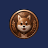    | KEEP [ ] / DROP [ ] |
| **Silver coin** `shiba_coin_silver`       | Shiba Coins screens: silver tier medallion     | 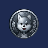    | KEEP [ ] / DROP [ ] |
| **Gold coin** `shiba_coin_gold`           | Shiba Coins screens: gold tier medallion       | 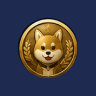      | KEEP [ ] / DROP [ ] |
| **Platinum coin** `shiba_coin_platinum`   | Shiba Coins screens: platinum tier medallion   | 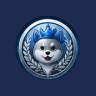  | KEEP [ ] / DROP [ ] |

## Status strip (Drop Customizing this whole strip. Just leave it in the preview)

| Icon name                                              | Where it links to                                                                                               | Icon image                                                                                                                | Keep / Drop          |
| ------------------------------------------------------ | --------------------------------------------------------------------------------------------------------------- | ------------------------------------------------------------------------------------------------------------------------- | -------------------- |
| **Notifications bell** `status_notifications`       | Status strip, right group (first)                                                                               |                                                                        | KEEP [ ] / DROP [X ] |
| **Controller** `status_controller`                  | Status strip, while a controller is connected                                                                   |                                                                           | KEEP [ ] / DROP [X ] |
| **Bluetooth** `status_bluetooth`                    | Status strip, while Bluetooth is on                                                                             | 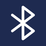                                                                           | KEEP [ ] / DROP [ X] |
| **Wi-Fi ⚠️** `status_wifi`                          | Status strip, while Wi-Fi is connected. **App draws a live meter; Studio shows Material Wi-Fi**                 |  App:                          | KEEP [ ] / DROP [X ] |
| **Cellular signal ⚠️** `status_signal`              | Status strip, with cellular service. **App draws live bars; Studio shows Material signal**                      |  App:                      | KEEP [ ] / DROP [ X] |
| **Battery (full)** `status_battery_full`            | Status strip, 76–100 %                                                                                          | 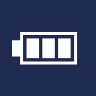                                                                        | KEEP [ ] / DROP [X ] |
| **Battery (high)** `status_battery_high`            | Status strip, 51–75 %                                                                                           | 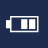                                                                        | KEEP [ ] / DROP [X ] |
| **Battery (medium)** `status_battery_medium`        | Status strip, 26–50 %                                                                                           | 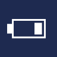                                                                      | KEEP [ ] / DROP [X ] |
| **Battery (low)** `status_battery_low`              | Status strip, 0–25 % (red at 20 % or less, unplugged)                                                           |                                                                          | KEEP [ ] / DROP [ X] |
| **Battery (charging) ⚠️** `status_battery_charging` | Status strip while charging. **App cycles the fill tiers plus a bolt; this icon only shows if a theme sets it** | 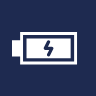 App: 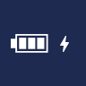 | KEEP [ ] / DROP [X ] |

## Consoles (Keep All Replace with CP with choice C)

| Icon name                                        | Where it links to                                                                           | Icon image                                             | Keep / Drop         |
| ------------------------------------------------ | ------------------------------------------------------------------------------------------- | ------------------------------------------------------ | ------------------- |
| **allgames** `sysicon_allgames`               | Game › All Games                                                                            |         | KEEP [ ] / DROP [ ] |
| **favorites** `sysicon_favorites`             | Game › Favorites                                                                            |        | KEEP [ ] / DROP [ ] |
| **android** `sysicon_android`                 | Game › android memory card, its sibling chip, and everywhere that console art shows         |          | KEEP [ ] / DROP [ ] |
| **desktop** `sysicon_desktop`                 | Desktop bucket                                                                              |          | KEEP [ ] / DROP [ ] |
| **default** `sysicon_default`                 | Fallback for any console without its own art                                                |          | KEEP [ ] / DROP [ ] |
| **atari2600** `sysicon_atari2600`             | Game › atari2600 memory card, its sibling chip, and everywhere that console art shows       |        | KEEP [ ] / DROP [ ] |
| **atari5200** `sysicon_atari5200`             | Game › atari5200 memory card, its sibling chip, and everywhere that console art shows       | 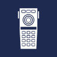       | KEEP [ ] / DROP [ ] |
| **atari7800** `sysicon_atari7800`             | Game › atari7800 memory card, its sibling chip, and everywhere that console art shows       |        | KEEP [ ] / DROP [ ] |
| **atarilynx** `sysicon_atarilynx`             | Game › atarilynx memory card, its sibling chip, and everywhere that console art shows       |        | KEEP [ ] / DROP [ ] |
| **c64** `sysicon_c64`                         | Game › c64 memory card, its sibling chip, and everywhere that console art shows             |              | KEEP [ ] / DROP [ ] |
| **dreamcast** `sysicon_dreamcast`             | Game › dreamcast memory card, its sibling chip, and everywhere that console art shows       |        | KEEP [ ] / DROP [ ] |
| **gamegear** `sysicon_gamegear`               | Game › gamegear memory card, its sibling chip, and everywhere that console art shows        |         | KEEP [ ] / DROP [ ] |
| **gb** `sysicon_gb`                           | Game › gb memory card, its sibling chip, and everywhere that console art shows              | 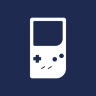              | KEEP [ ] / DROP [ ] |
| **gba** `sysicon_gba`                         | Game › gba memory card, its sibling chip, and everywhere that console art shows             |              | KEEP [ ] / DROP [ ] |
| **gbc** `sysicon_gbc`                         | Game › gbc memory card, its sibling chip, and everywhere that console art shows             |              | KEEP [ ] / DROP [ ] |
| **gc** `sysicon_gc`                           | Game › gc memory card, its sibling chip, and everywhere that console art shows              |               | KEEP [ ] / DROP [ ] |
| **mame** `sysicon_mame`                       | Game › mame memory card, its sibling chip, and everywhere that console art shows            |             | KEEP [ ] / DROP [ ] |
| **mastersystem** `sysicon_mastersystem`       | Game › mastersystem memory card, its sibling chip, and everywhere that console art shows    |     | KEEP [ ] / DROP [ ] |
| **megadrive** `sysicon_megadrive`             | Game › megadrive memory card, its sibling chip, and everywhere that console art shows       |        | KEEP [ ] / DROP [ ] |
| **n3ds** `sysicon_n3ds`                       | Game › n3ds memory card, its sibling chip, and everywhere that console art shows            | 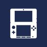            | KEEP [ ] / DROP [ ] |
| **n64** `sysicon_n64`                         | Game › n64 memory card, its sibling chip, and everywhere that console art shows             |              | KEEP [ ] / DROP [ ] |
| **nds** `sysicon_nds`                         | Game › nds memory card, its sibling chip, and everywhere that console art shows             |              | KEEP [ ] / DROP [ ] |
| **neogeo** `sysicon_neogeo`                   | Game › neogeo memory card, its sibling chip, and everywhere that console art shows          |           | KEEP [ ] / DROP [ ] |
| **nes** `sysicon_nes`                         | Game › nes memory card, its sibling chip, and everywhere that console art shows             | 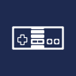             | KEEP [ ] / DROP [ ] |
| **ngp** `sysicon_ngp`                         | Game › ngp memory card, its sibling chip, and everywhere that console art shows             |              | KEEP [ ] / DROP [ ] |
| **pcengine** `sysicon_pcengine`               | Game › pcengine memory card, its sibling chip, and everywhere that console art shows        |         | KEEP [ ] / DROP [ ] |
| **ps2** `sysicon_ps2`                         | Game › ps2 memory card, its sibling chip, and everywhere that console art shows             |              | KEEP [ ] / DROP [ ] |
| **ps3** `sysicon_ps3`                         | Game › ps3 memory card, its sibling chip, and everywhere that console art shows             |              | KEEP [ ] / DROP [ ] |
| **psp** `sysicon_psp`                         | Game › psp memory card, its sibling chip, and everywhere that console art shows             |              | KEEP [ ] / DROP [ ] |
| **psvita** `sysicon_psvita`                   | Game › psvita memory card, its sibling chip, and everywhere that console art shows          |           | KEEP [ ] / DROP [ ] |
| **psx** `sysicon_psx`                         | Game › psx memory card, its sibling chip, and everywhere that console art shows             |              | KEEP [ ] / DROP [ ] |
| **saturn** `sysicon_saturn`                   | Game › saturn memory card, its sibling chip, and everywhere that console art shows          |           | KEEP [ ] / DROP [ ] |
| **sega32x** `sysicon_sega32x`                 | Game › sega32x memory card, its sibling chip, and everywhere that console art shows         |          | KEEP [ ] / DROP [ ] |
| **segacd** `sysicon_segacd`                   | Game › segacd memory card, its sibling chip, and everywhere that console art shows          |           | KEEP [ ] / DROP [ ] |
| **snes** `sysicon_snes`                       | Game › snes memory card, its sibling chip, and everywhere that console art shows            |             | KEEP [ ] / DROP [ ] |
| **switch** `sysicon_switch`                   | Game › switch memory card, its sibling chip, and everywhere that console art shows          | 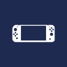          | KEEP [ ] / DROP [ ] |
| **virtualboy** `sysicon_virtualboy`           | Game › virtualboy memory card, its sibling chip, and everywhere that console art shows      |       | KEEP [ ] / DROP [ ] |
| **wii** `sysicon_wii`                         | Game › wii memory card, its sibling chip, and everywhere that console art shows             | 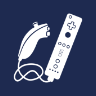             | KEEP [ ] / DROP [ ] |
| **wiiu** `sysicon_wiiu`                       | Game › wiiu memory card, its sibling chip, and everywhere that console art shows            | 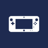            | KEEP [ ] / DROP [ ] |
| **windows** `sysicon_windows`                 | Game › windows memory card, its sibling chip, and everywhere that console art shows         |          | KEEP [ ] / DROP [ ] |
| **wonderswan** `sysicon_wonderswan`           | Game › wonderswan memory card, its sibling chip, and everywhere that console art shows      | 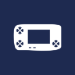      | KEEP [ ] / DROP [ ] |
| **wonderswancolor** `sysicon_wonderswancolor` | Game › wonderswancolor memory card, its sibling chip, and everywhere that console art shows | 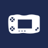 | KEEP [ ] / DROP [ ] |
| **x360** `sysicon_x360`                       | Game › x360 memory card, its sibling chip, and everywhere that console art shows            |             | KEEP [ ] / DROP [ ] |
| **xbox** `sysicon_xbox`                       | Xbox cards (**borrows the Xbox 360 art**)                                                   |             | KEEP [ ] / DROP [ ] |
| **CPS1 ⚠️** `sysicon_cps1`                    | Game › CPS memory card. **No arcade art in the app: falls back to the default controller**  |             | KEEP [ ] / DROP [ ] |
| **CPS2 ⚠️** `sysicon_cps2`                    | Game › CPS memory card. **No arcade art in the app: falls back to the default controller**  |             | KEEP [ ] / DROP [ ] |
| **CPS3 ⚠️** `sysicon_cps3`                    | Game › CPS memory card. **No arcade art in the app: falls back to the default controller**  |             | KEEP [ ] / DROP [ ] |

### CPS1–3: pick one (the app has no arcade-machine art)

| Option | What it is                                      | Icon image                                     | Choose |
| ------ | ----------------------------------------------- | ---------------------------------------------- | ------ |
| A      | Keep the default controller (today)             |  | [ ]    |
| B      | MAME logo (`sysicon_mame`)                      |     | [ ]    |
| C      | CP System disc badge (`physical-media/cps.png`) |     | [X ]   |
| D      | Supply a new arcade-cabinet icon                | —                                              | [ ]    |

## Media controls (Drop customizing )

| Icon name                         | Where it links to              | Icon image                                  | Keep / Drop         |
| --------------------------------- | ------------------------------ | ------------------------------------------- | ------------------- |
| **Play** `media_play`          | Music / video player transport |    | KEEP [ ] / DROP [ ] |
| **Pause** `media_pause`        | Music / video player transport |   | KEEP [ ] / DROP [ ] |
| **Previous** `media_prev`      | Music player transport         |    | KEEP [ ] / DROP [ ] |
| **Next** `media_next`          | Music player transport         |    | KEEP [ ] / DROP [ ] |
| **Back 10 s** `media_back10`   | Video player transport         |  | KEEP [ ] / DROP [ ] |
| **Forward 10 s** `media_fwd10` | Video player transport         |   | KEEP [ ] / DROP [ ] |

## Game Detail (Drop Customizing)

| Icon name                            | Where it links to                                                                 | Icon image                                                                                                    | Keep / Drop         |
| ------------------------------------ | --------------------------------------------------------------------------------- | ------------------------------------------------------------------------------------------------------------- | ------------------- |
| **Play** `detail_play`            | Game Detail action row                                                            |                                                                     | KEEP [ ] / DROP [ ] |
| **Favorite ⚠️** `detail_favorite` | Game Detail action row. **App switches filled / outline; Studio only has filled** |  App:  | KEEP [ ] / DROP [ ] |
| **Artwork** `detail_artwork`      | Game Detail action row                                                            |                                                                  | KEEP [ ] / DROP [ ] |
| **Manual** `detail_manual`        | Game Detail action row                                                            |                                                                   | KEEP [ ] / DROP [ ] |
| **More ⚠️** `detail_more`         | Game Detail action row. **App draws vertical dots; Studio horizontal**            |  App:              | KEEP [ ] / DROP [ ] |

## Notifications (Drop Customizing )

| Icon name                             | Where it links to                       | Icon image                                    | Keep / Drop         |
| ------------------------------------- | --------------------------------------- | --------------------------------------------- | ------------------- |
| **Scan** `notif_album`             | Notification panel: scan entries        |     | KEEP [ ] / DROP [ ] |
| **Artwork** `notif_image`          | Notification panel: artwork entries     |     | KEEP [ ] / DROP [ ] |
| **Metadata** `notif_tag`           | Notification panel: metadata entries    |       | KEEP [ ] / DROP [ ] |
| **Achievement** `notif_coin`       | Notification panel: achievement entries |      | KEEP [ ] / DROP [ ] |
| **Launch blocked** `notif_blocked` | Notification panel: blocked launches    |   | KEEP [ ] / DROP [ ] |
| **System** `notif_settings`        | Notification panel: system entries      |  | KEEP [ ] / DROP [ ] |
| **Download** `notif_download`      | Notification panel: downloads           |  | KEEP [ ] / DROP [ ] |
| **Feed** `notif_feed`              | Notification panel: feed entries        |      | KEEP [ ] / DROP [ ] |

## Menus (Drop Customizing)

| Icon name                         | Where it links to                                                                              | Icon image                                                                                      | Keep / Drop         |
| --------------------------------- | ---------------------------------------------------------------------------------------------- | ----------------------------------------------------------------------------------------------- | ------------------- |
| **Check mark ⚠️** `menu_check` | Options menus: checked rows. **App draws its own tick; Studio shows Material check**           |  App:  | KEEP [ ] / DROP [ ] |
| **Back arrow ⚠️** `menu_back`  | Touch back button / detail headers. **App draws the ◀ character; Studio shows Material arrow** |  App:    | KEEP [ ] / DROP [ ] |

